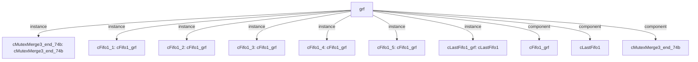

# 模块 `grf`

- 源文件：`rtl/rtl/GRF/grf.v`。
- 职责：AI 推断：通用寄存器文件模块，为处理器流水线各阶段提供寄存器读写访问与数据转发路径。。
- 说明：模块接收来自执行、异常、访存、写回和发射阶段的驱动事件与数据，通过内部FIFO和互斥合并组件实现寄存器写入仲裁，并通过地址索引选择器将寄存器值分发到各阶段。

## 1. 层级位置

- Parents：`cpu_top_all`。
- Children：无。
- Component children：`cFifo1_grf`, `cLastFifo1`, `cMutexMerge3_end_74b`。
- Upstream modules：无。
- Downstream modules：无。

### 1.1 本模块结构图



```text
grf
|-- cMutexMerge3_end_74b: cMutexMerge3_end_74b
|-- cFifo1_1: cFifo1_grf
|-- cFifo1_2: cFifo1_grf
|-- cFifo1_3: cFifo1_grf
|-- cFifo1_4: cFifo1_grf
|-- cFifo1_5: cFifo1_grf
|-- cLastFifo1_grf: cLastFifo1
|-- cFifo1_grf
|-- cLastFifo1
`-- cMutexMerge3_end_74b
```

## 2. 输入/输出接口摘要

- 接收：drive 输入：`i_driveFromExe_1`, `i_driveFromExp_1`, `i_driveFromLsu_1`, `i_driveFromWb_1`, `... +4`；数据输入：`i_expAddr_8`, `i_expDataToGrf_64`, `i_lsuAddr_8`, `i_lsuDataToGrf_64`, `... +6`；控制输入：`i_expWen_2`, `i_lsuWen_2`, `i_wbWen_2`；free 输入：`i_grfFreeFromExe_1`, `i_grfFreeFromExp_1`, `i_grfFreeFromLaunch_1`, `i_grfFreeFromLsu_1`, `... +1`。
- 输出：drive 输出：`o_grfDriveToExe_1`, `o_grfDriveToExp_1`, `o_grfDriveToLaunch_1`, `o_grfDriveToLsu_1`, `... +1`；数据输出：`o_grfDataToExe_64`, `o_grfDataToExp_192`, `o_grfDataToLaunch_64`, `o_grfDataToLsu_64`, `... +1`；free 输出：`o_grfFreeToExe_1`, `o_grfFreeToExp_1`, `o_grfFreeToLaunch_1`, `o_grfFreeToLsu_1`, `... +4`。

### 2.1 端口分组

| 端口组 | 方向统计 | 代表信号 |
| --- | --- | --- |
| `drive_event` | input:8, output:5 | `i_driveFromExe_1`, `i_driveFromExp_1`, `i_driveFromLsu_1`, `i_driveFromWb_1`, `i_grfDriveFromLaunch_1`, `i_grfwDriveFromExp_1`, `i_grfwDriveFromLsu_1`, `i_grfwDriveFromWB_1`, `o_grfDriveToExe_1`, `o_grfDriveToExp_1`, `... +3` |
| `free_backpressure` | input:5, output:8 | `i_grfFreeFromExe_1`, `i_grfFreeFromExp_1`, `i_grfFreeFromLaunch_1`, `i_grfFreeFromLsu_1`, `i_grfFreeFromWb_1`, `o_grfFreeToExe_1`, `o_grfFreeToExp_1`, `o_grfFreeToLaunch_1`, `o_grfFreeToLsu_1`, `o_grfFreeToWb_1`, `... +3` |
| `other_ports` | input:13, output:5 | `i_expAddr_8`, `i_expDataToGrf_64`, `i_lsuAddr_8`, `i_lsuDataToGrf_64`, `i_rs2Addr_8`, `i_rs3Addr_8`, `i_rs4Addr_8`, `i_rsAddr_8`, `i_wbAddr_8`, `i_wbDataToGrf_64`, `... +8` |

## 3. Drive/Data/Free 契约

| Interface | 方向 | Event | Payload | Free/backpressure |
| --- | --- | --- | --- | --- |
| `i_driveFromExe_1` | input | `i_driveFromExe_1` | 未记录 | `o_grfFreeToExe_1` |
| `i_driveFromExp_1` | input | `i_driveFromExp_1` | `i_expAddr_8 [7:0]`, `i_expDataToGrf_64 [63:0]` | `o_grfFreeToExp_1` |
| `i_driveFromLsu_1` | input | `i_driveFromLsu_1` | `i_lsuAddr_8 [7:0]`, `i_lsuDataToGrf_64 [63:0]` | `o_grfFreeToLsu_1` |
| `i_driveFromWb_1` | input | `i_driveFromWb_1` | `i_wbAddr_8 [7:0]`, `i_wbDataToGrf_64 [63:0]` | `o_grfFreeToWb_1` |
| `i_grfDriveFromLaunch_1` | input | `i_grfDriveFromLaunch_1` | `i_expDataToGrf_64 [63:0]`, `i_lsuDataToGrf_64 [63:0]`, `i_wbDataToGrf_64 [63:0]` | `o_grfFreeToLaunch_1` |
| `i_grfwDriveFromExp_1` | input | `i_grfwDriveFromExp_1` | `i_expDataToGrf_64 [63:0]` | `o_grfFreeToExp_1` |
| `i_grfwDriveFromLsu_1` | input | `i_grfwDriveFromLsu_1` | `i_lsuDataToGrf_64 [63:0]` | `o_grfFreeToLsu_1` |
| `i_grfwDriveFromWB_1` | input | `i_grfwDriveFromWB_1` | `i_wbDataToGrf_64 [63:0]` | `o_grfFreeToWb_1` |
| `o_grfDriveToExe_1` | output | `o_grfDriveToExe_1` | `o_grfDataToExe_64 [63:0]` | `i_grfFreeFromExe_1` |
| `o_grfDriveToExp_1` | output | `o_grfDriveToExp_1` | `o_grfDataToExp_192 [191:0]` | `i_grfFreeFromExp_1` |
| `o_grfDriveToLaunch_1` | output | `o_grfDriveToLaunch_1` | `o_grfDataToLaunch_64 [63:0]` | `i_grfFreeFromLaunch_1` |
| `o_grfDriveToLsu_1` | output | `o_grfDriveToLsu_1` | `o_grfDataToLsu_64 [63:0]` | `i_grfFreeFromLsu_1` |

## 4. 主要 Drive-centered Flow

### `i_driveFromExe_1`

- 确定性事实：`i_driveFromExe_1 to o_grfDriveToExe_1`；flow_id=`flow_000_grf_i_driveFromExe_1`。
- Payload：`o_grfDriveToExe_1` -> `o_grfDataToExe_64 [63:0]`。
- 输出/影响：`o_grfDriveToExe_1`。
- 结构复杂度：branch=0，join=0，blocking=1。
- AI 推断：强调单级FIFO缓冲路径，数据负载与事件分离，背压机制需RTL确认

### `i_driveFromExp_1`

- 确定性事实：`i_driveFromExp_1 to o_grfDriveToExp_1`；flow_id=`flow_001_grf_i_driveFromExp_1`。
- Payload：`i_driveFromExp_1` -> `i_expAddr_8 [7:0]`, `i_driveFromExp_1` -> `i_expDataToGrf_64 [63:0]`, `o_grfDriveToExp_1` -> `o_grfDataToExp_192 [191:0]`。
- 输出/影响：`o_grfDriveToExp_1`。
- 结构复杂度：branch=0，join=0，blocking=1。
- AI 推断：手册应强调该流为单级FIFO直通路径，并说明载荷分离处理

### `i_driveFromLsu_1`

- 确定性事实：`i_driveFromLsu_1 to o_grfDriveToLsu_1`；flow_id=`flow_002_grf_i_driveFromLsu_1`。
- Payload：`i_driveFromLsu_1` -> `i_lsuAddr_8 [7:0]`, `i_driveFromLsu_1` -> `i_lsuDataToGrf_64 [63:0]`, `o_grfDriveToLsu_1` -> `o_grfDataToLsu_64 [63:0]`。
- 输出/影响：`o_grfDriveToLsu_1`。
- 结构复杂度：branch=0，join=0，blocking=1。
- AI 推断：最终手册应强调驱动事件流路径与数据载荷路径在结构上是分离的，但通过接口契约相关联

### `i_driveFromWb_1`

- 确定性事实：`i_driveFromWb_1 to o_grfDriveToWb_1`；flow_id=`flow_003_grf_i_driveFromWb_1`。
- Payload：`i_driveFromWb_1` -> `i_wbAddr_8 [7:0]`, `i_driveFromWb_1` -> `i_wbDataToGrf_64 [63:0]`, `o_grfDriveToWb_1` -> `o_grfDataToWb_64 [63:0]`。
- 输出/影响：`o_grfDriveToWb_1`。
- 结构复杂度：branch=0，join=0，blocking=1。
- AI 推断：文档应强调该流为简单的单级Fifo1直通路径，数据与事件路径解耦

### `i_grfDriveFromLaunch_1`

- 确定性事实：`i_grfDriveFromLaunch_1 to o_grfDriveToLaunch_1`；flow_id=`flow_004_grf_i_grfDriveFromLaunch_1`。
- Payload：`i_grfDriveFromLaunch_1` -> `i_expDataToGrf_64 [63:0]`, `i_grfDriveFromLaunch_1` -> `i_lsuDataToGrf_64 [63:0]`, `i_grfDriveFromLaunch_1` -> `i_wbDataToGrf_64 [63:0]`, `o_grfDriveToLaunch_1` -> `o_grfDataToLaunch_64 [63:0]`。
- 输出/影响：`o_grfDriveToLaunch_1`。
- 结构复杂度：branch=0，join=0，blocking=1。
- AI 推断：数据载荷通过独立的MutexMerge3路径汇聚，与驱动事件流并行但不直接耦合

### `i_grfwDriveFromExp_1`

- 确定性事实：`grf flow from i_grfwDriveFromExp_1`；flow_id=`flow_005_grf_i_grfwDriveFromExp_1`。
- Payload：`i_grfwDriveFromExp_1` -> `i_expDataToGrf_64 [63:0]`。
- 输出/影响：证据不足：Knowledge IR did not find a module output endpoint for this flow.。
- 结构复杂度：branch=0，join=1，blocking=2。
- AI 推断：写请求驱动信号i_grfwDriveFromExp_1携带其对应的写数据载荷i_expDataToGrf_64。

### `i_grfwDriveFromLsu_1`

- 确定性事实：`grf flow from i_grfwDriveFromLsu_1`；flow_id=`flow_006_grf_i_grfwDriveFromLsu_1`。
- Payload：`i_grfwDriveFromLsu_1` -> `i_lsuDataToGrf_64 [63:0]`。
- 输出/影响：证据不足：Knowledge IR did not find a module output endpoint for this flow.。
- 结构复杂度：branch=0，join=1，blocking=2。
- AI 推断：LSU写数据作为事件驱动流的伴随负载，与写事件信号同步传递

### `i_grfwDriveFromWB_1`

- 确定性事实：`grf flow from i_grfwDriveFromWB_1`；flow_id=`flow_007_grf_i_grfwDriveFromWB_1`。
- Payload：`i_grfwDriveFromWB_1` -> `i_wbDataToGrf_64 [63:0]`。
- 输出/影响：证据不足：Knowledge IR did not find a module output endpoint for this flow.。
- 结构复杂度：branch=0，join=1，blocking=2。


## 5. 内部组件与 assign 影响

### 5.1 内部组件

| 实例 | 类型 | 输入事件 | 输出事件 |
| --- | --- | --- | --- |
| `cMutexMerge3_end_74b` | `cMutexMerge3_end_74b` | `i_grfwDriveFromExp_1`, `i_grfwDriveFromLsu_1`, `i_grfwDriveFromWB_1` | `w_driveToWrite` |
| `cFifo1_1` | `cFifo1_grf` | `i_grfDriveFromLaunch_1` | 无 |
| `cFifo1_2` | `cFifo1_grf` | `i_driveFromExe_1` | `o_grfDriveToExe_1` |
| `cFifo1_3` | `cFifo1_grf` | `i_driveFromLsu_1` | 无 |
| `cFifo1_4` | `cFifo1_grf` | `i_driveFromWb_1` | `o_grfDriveToWb_1` |
| `cFifo1_5` | `cFifo1_grf` | `i_driveFromExp_1` | `o_grfDriveToExp_1` |
| `cLastFifo1_grf` | `cLastFifo1` | `w_driveToWrite` | 无 |

### 5.2 assign 影响

| Assign | Impact area | LHS | RHS 摘要 | 解释状态 |
| --- | --- | --- | --- | --- |
| `assign_1` | unknown | `w_lauindex2_4` | i_rsAddr_8[7:4] | 证据不足：No Semantic Layer assignment interpretation is available. |
| `assign_2` | data_path | `o_grfDataToLaunch_64` | {r_rsValue_32[1], r_rsValue_32[0]} | AI 推断：从r_rsValue_32中按固定位置提取寄存器值，组合成64位数据输出到各阶段。 |
| `assign_3` | unknown | `w_exeindex1_4` | i_rs2Addr_8[3:0] | 证据不足：No Semantic Layer assignment interpretation is available. |
| `assign_4` | unknown | `w_exeindex2_4` | i_rs2Addr_8[7:4] | 证据不足：No Semantic Layer assignment interpretation is available. |
| `assign_5` | data_path | `o_grfDataToExe_64` | {r_rsValue_32[3], r_rsValue_32[2]} | AI 推断：从r_rsValue_32中按固定位置提取寄存器值，组合成64位数据输出到各阶段。 |
| `assign_6` | unknown | `w_lsuindex1_4` | i_rs3Addr_8[3:0] | 证据不足：No Semantic Layer assignment interpretation is available. |
| `assign_7` | unknown | `w_lsuindex2_4` | i_rs3Addr_8[7:4] | 证据不足：No Semantic Layer assignment interpretation is available. |
| `assign_8` | data_path | `o_grfDataToLsu_64` | {r_rsValue_32[5], r_rsValue_32[4]} | AI 推断：从r_rsValue_32中按固定位置提取寄存器值，组合成64位数据输出到各阶段。 |
| `assign_9` | unknown | `w_wbindex1_4` | i_rs4Addr_8[3:0] | 证据不足：No Semantic Layer assignment interpretation is available. |
| `assign_10` | unknown | `w_wbindex2_4` | i_rs4Addr_8[7:4] | 证据不足：No Semantic Layer assignment interpretation is available. |
| `assign_11` | data_path | `o_grfDataToWb_64` | {r_rsValue_32[7], r_rsValue_32[6]} | AI 推断：从r_rsValue_32中按固定位置提取寄存器值，组合成64位数据输出到各阶段。 |
| `assign_12` | data_path | `o_grfDataToExp_192` | r_rsValue_192 | AI 推断：将r_rsValue_192直接输出到异常阶段，提供6个寄存器的同时读取能力。 |
| ... | ... | ... | ... | 其余 1 条 assign 省略 |
