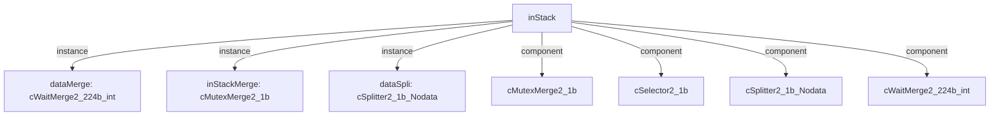

# 模块 `inStack`

- 源文件：`rtl/rtl/int/inStack.v`。
- 职责：AI 推断：入栈数据合并与选择模块，负责将来自RGRF和RPSR的驱动事件及数据合并，并依据选择逻辑输出到SPDec或回送至RGRF/RPSR。。
- 说明：模块通过dataMerge合并来自RGRF和RPSR的驱动事件与数据，生成224位栈数据；再通过inStackSele和dataSpli进行选择分发，最终输出到SPDec或回送至RGRF/RPSR。同时管理多个自由信号以协调模块间握手。

## 1. 层级位置

- Parents：`intAndExc`。
- Children：无。
- Component children：`cMutexMerge2_1b`, `cSelector2_1b`, `cSplitter2_1b_Nodata`, `cWaitMerge2_224b_int`。
- Upstream modules：无。
- Downstream modules：无。

### 1.1 本模块结构图



```text
inStack
|-- dataMerge: cWaitMerge2_224b_int
|-- inStackMerge: cMutexMerge2_1b
|-- dataSpli: cSplitter2_1b_Nodata
|-- cMutexMerge2_1b
|-- cSelector2_1b
|-- cSplitter2_1b_Nodata
`-- cWaitMerge2_224b_int
```

## 2. 输入/输出接口摘要

- 接收：drive 输入：`i_driveFromRGRF_1`, `i_driveFromRPSR_1`；数据输入：`i_SP_32`, `i_grfData_192`, `i_inOutDriToDataSpli_1`, `i_pc_32`, `... +1`；free 输入：`i_freeFromDR_1`, `i_freeFromRGRF_1`, `i_freeFromRPSR_1`, `i_freeFromSPDec`；其他输入：`i_DRSeleDriToinStackSele_1`。
- 输出：drive 输出：`o_driveFromSPDec`, `o_driveToRGRF_1`, `o_driveToRPSR_1`；数据输出：`o_SP_32`, `o_data_96`；free 输出：`o_freeFromInStack`, `o_freeFrominStackSele_1`, `o_freeToRGRF_1`, `o_freeToRPSR_1`；其他输出：`o_w_inStackDriToDR_1`。

### 2.1 端口分组

| 端口组 | 方向统计 | 代表信号 |
| --- | --- | --- |
| `drive_event` | input:2, output:3 | `i_driveFromRGRF_1`, `i_driveFromRPSR_1`, `o_driveFromSPDec`, `o_driveToRGRF_1`, `o_driveToRPSR_1` |
| `free_backpressure` | input:4, output:4 | `i_freeFromDR_1`, `i_freeFromRGRF_1`, `i_freeFromRPSR_1`, `i_freeFromSPDec`, `o_freeFromInStack`, `o_freeFrominStackSele_1`, `o_freeToRGRF_1`, `o_freeToRPSR_1` |
| `other_ports` | input:6, output:3 | `i_SP_32`, `i_grfData_192`, `i_inOutDriToDataSpli_1`, `i_pc_32`, `i_psrData_32`, `o_SP_32`, `o_data_96`, `i_DRSeleDriToinStackSele_1`, `o_w_inStackDriToDR_1` |

## 3. Drive/Data/Free 契约

| Interface | 方向 | Event | Payload | Free/backpressure |
| --- | --- | --- | --- | --- |
| `i_driveFromRGRF_1` | input | `i_driveFromRGRF_1` | 未记录 | `o_freeToRGRF_1` |
| `i_driveFromRPSR_1` | input | `i_driveFromRPSR_1` | 未记录 | `o_freeToRPSR_1` |
| `o_driveFromSPDec` | output | `o_driveFromSPDec` | 未记录 | `i_freeFromSPDec` |
| `o_driveToRGRF_1` | output | `o_driveToRGRF_1` | 未记录 | `i_freeFromRGRF_1` |
| `o_driveToRPSR_1` | output | `o_driveToRPSR_1` | 未记录 | `i_freeFromRPSR_1` |

## 4. 主要 Drive-centered Flow

### `i_driveFromRGRF_1`

- 确定性事实：`inStack flow from i_driveFromRGRF_1`；flow_id=`flow_000_inStack_i_driveFromRGRF_1`。
- Payload：未记录。
- 输出/影响：证据不足：Knowledge IR did not find a module output endpoint for this flow.。
- 结构复杂度：branch=0，join=2，blocking=2。
- AI 推断：最终手册应强调该流无明确端点，需RTL源码确认

### `i_driveFromRPSR_1`

- 确定性事实：`inStack flow from i_driveFromRPSR_1`；flow_id=`flow_001_inStack_i_driveFromRPSR_1`。
- Payload：未记录。
- 输出/影响：证据不足：Knowledge IR did not find a module output endpoint for this flow.。
- 结构复杂度：branch=0，join=2，blocking=2。
- AI 推断：该驱动事件无关联数据负载，仅作为控制事件传播


## 5. 内部组件与 assign 影响

### 5.1 内部组件

| 实例 | 类型 | 输入事件 | 输出事件 |
| --- | --- | --- | --- |
| `dataMerge` | `cWaitMerge2_224b_int` | `i_driveFromRGRF_1`, `i_driveFromRPSR_1` | `w_dataMerDriveToInMer_1` |
| `inStackMerge` | `cMutexMerge2_1b` | `w_dataMerDriveToInMer_1` | 无 |
| `dataSpli` | `cSplitter2_1b_Nodata` | 无 | `o_driveToRGRF_1`, `o_driveToRPSR_1` |

### 5.2 assign 影响

| Assign | Impact area | LHS | RHS 摘要 | 解释状态 |
| --- | --- | --- | --- | --- |
| `assign_4` | data_path | `w_inData0Addr_32` | i_SP_32 - 8 | AI 推断：基于当前SP值计算四个入栈数据项的地址，分别对应SP-8、SP-16、SP-24、SP-32。 |
| `assign_5` | data_path | `w_inData1Addr_32` | i_SP_32 - 16 | AI 推断：基于当前SP值计算四个入栈数据项的地址，分别对应SP-8、SP-16、SP-24、SP-32。 |
| `assign_6` | data_path | `w_inData2Addr_32` | i_SP_32 - 24 | AI 推断：基于当前SP值计算四个入栈数据项的地址，分别对应SP-8、SP-16、SP-24、SP-32。 |
| `assign_7` | data_path | `w_inData3Addr_32` | i_SP_32 - 32 | AI 推断：基于当前SP值计算四个入栈数据项的地址，分别对应SP-8、SP-16、SP-24、SP-32。 |
| `assign_10` | data_path | `o_data_96` | (w_inNum_2==2'b00)?({w_inData0_64,w_inData0Addr_32}): (w_inNum_2==2'b01)?({w_inData1_64,w_inD... | AI 推断：根据w_inNum_2选择一组64位数据+32位地址输出，实现入栈数据的选择输出。 |
| `assign_11` | data_path | `o_SP_32` | r_SP_32 | 证据不足：No Semantic Layer assignment interpretation is available. |
| `assign_0` | data_path | `w_inData0_64` | {i_pc_32, w_stackData_224[223:192]} | 证据不足：No Semantic Layer assignment interpretation is available. |
