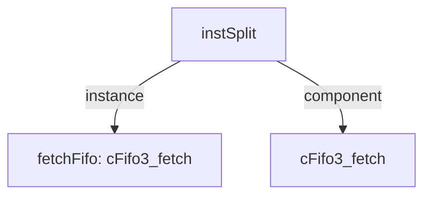

# 模块 `instSplit`

- 源文件：`rtl\rtl\IF\instSplit.v`。
- 职责：AI 推断：取指指令拆分模块——将指令缓存输出的一包指令拆解为多条独立指令，同时为其分配对应的 PC，并管理取指阶段的流控。
- 说明：模块接收 64 位取指数据 `i_inst_64`，结合基址 `i_basePC_32`，通过内部拆分逻辑产生最多 4 条输出指令（`o_inst0_33` ～ `o_inst3_33`）及各自对应的 PC；同时提供有效指令计数 `o_instCount` 和下一顺序 PC `o_normNextPc_32`。事件驱动信号 `i_drvFICache` 与 `o_drv2Merge` 构成取指有效握手，free 信号 `i_freeFMerge` 与 `o_free2ICache` 形成反压流控。该模块将预取指令包向后级译码/发射传递，符合取指阶段的典型职责。

## 1. 层级位置

- Parents：`fetch`。
- Children：无。
- Component children：`cFifo3_fetch`。
- Upstream modules：无。
- Downstream modules：无。

### 1.1 本模块结构图



```text
instSplit
|-- fetchFifo: cFifo3_fetch
`-- cFifo3_fetch
```

## 2. 输入/输出接口摘要

- **接收**：  
  - 驱动/事件输入：`i_drvFICache`  
  - 数据输入：`i_basePC_32`、`i_inst_64`  
  - 控制输入：`w_intExcpBranchValid`  
  - free/反压输入：`i_freeFMerge`
- **输出**：  
  - 驱动/事件输出：`o_drv2Merge`  
  - 数据输出：`o_inst0PC_32`、`o_inst0_33`、`o_inst1PC_32`、`o_inst1_33`、`o_inst2PC_32`、`o_inst2_33`、`o_inst3PC_32`、`o_inst3_33`、`o_instCount`、`o_normNextPc_32`  
  - free/反压输出：`o_free2ICache`

### 2.1 端口分组

| 端口组               | 方向统计      | 包含信号                                                                                                                                                                                                                                         |
| -------------------- | ------------- | ------------------------------------------------------------------------------------------------------------------------------------------------------------------------------------------------------------------------------------------------ |
| `drive_event`        | input:1, output:1 | `i_drvFICache`，`o_drv2Merge`                                                                                                                                                                                                                     |
| `free_backpressure`  | input:1, output:1 | `i_freeFMerge`，`o_free2ICache`                                                                                                                                                                                                                   |
| `other_ports`        | input:3, output:10 | `i_basePC_32`，`i_inst_64`，`w_intExcpBranchValid`，`o_inst0PC_32`，`o_inst0_33`，`o_inst1PC_32`，`o_inst1_33`，`o_inst2PC_32`，`o_inst2_33`，`o_inst3PC_32`，`o_inst3_33`，`o_instCount`，`o_normNextPc_32` |

## 3. Drive/Data/Free 契约

| Interface          | 方向   | Event               | Payload | Free/backpressure |
| ------------------ | ------ | ------------------- | ------- | ----------------- |
| `i_drvFICache`     | input  | `i_drvFICache`      | 未记录  | 未记录            |
| `o_drv2Merge`      | output | `o_drv2Merge`       | 未记录  | 未记录            |

## 4. 主要 Drive-centered Flow

### `i_drvFICache`

- 确定性事实：`i_drvFICache` → `o_drv2Merge`；flow_id：`flow_000_instSplit_i_drvFICache`。
- Payload：未记录。
- 输出/影响：`o_drv2Merge`。
- 结构复杂度：branch=0，join=0，blocking=1。
- AI 推断：手册应突出该流为一条固定延迟的事件路径；描述延迟节拍数和 FIFO 缓冲作用，淡化数据内容。

## 5. 内部组件与 assign 影响

### 5.1 内部组件

| 实例         | 类型            | 输入事件         | 输出事件         |
| ------------ | --------------- | ---------------- | ---------------- |
| `fetchFifo`  | `cFifo3_fetch`  | `w_drvFICache`   | `w_drv2Merge`    |

### 5.2 assign 影响

| Assign       | Impact area  | LHS          | RHS 摘要                         | 解释状态                                                                 |
| ------------ | ------------ | ------------ | -------------------------------- | ------------------------------------------------------------------------ |
| `assign_1`   | control_path | `w_state`    | ~w_intExcpBranchValid & r_preState | AI 推断：根据异常/分支有效信号克制内部状态推进。                        |
| `assign_2`   | data_path    | `w_part1_16` | i_inst_64[15:0]                  | AI 推断：将 64 位取指数据切割为四个 16 位片段，作为指令拼装的基础。      |
| `assign_3`   | data_path    | `w_part2_16` | i_inst_64[31:16]                 | AI 推断：将 64 位取指数据切割为四个 16 位片段，作为指令拼装的基础。      |
| `assign_4`   | data_path    | `w_part3_16` | i_inst_64[47:32]                 | AI 推断：将 64 位取指数据切割为四个 16 位片段，作为指令拼装的基础。      |
| `assign_5`   | data_path    | `w_part4_16` | i_inst_64[63:48]                 | AI 推断：将 64 位取指数据切割为四个 16 位片段，作为指令拼装的基础。      |
| `assign_10`  | unknown      | `o_inst0_33` | r_inst0_33                      | AI 推断：将内部寄存的指令和 PC 值直接驱动至模块输出。                    |
| ...           | ...          | ...          | ...                              | 其余 9 条 assign 从略                                                    |
