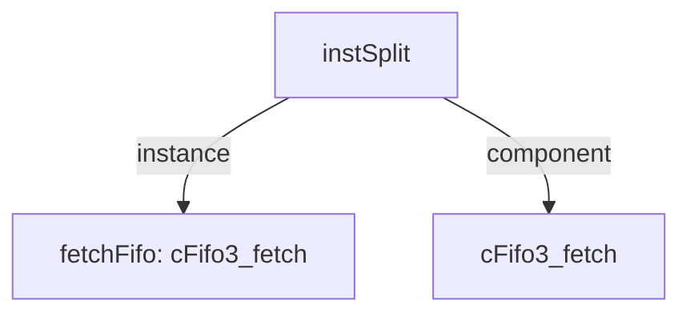

# 模块 `instSplit`

- 源文件：`rtl/rtl/IF/instSplit.v`。
- 职责：AI 推断：指令拆分与分发单元，将64位指令包拆分为最多4条32位指令，并管理指令流控制。。
- 说明：模块接收来自FICache的驱动事件和64位指令包，根据基地址和异常分支条件，将指令包拆分为最多4条32位指令及其对应的PC，并通过FIFO组件进行流控和事件同步后，将拆分后的指令和计数发送给Merge单元。

## 1. 层级位置

- Parents：`fetch`。
- Children：无。
- Component children：`cFifo3_fetch`。
- Upstream modules：无。
- Downstream modules：无。

### 1.1 本模块结构图



```text
instSplit
|-- fetchFifo: cFifo3_fetch
`-- cFifo3_fetch
```

## 2. 输入/输出接口摘要

- 接收：drive 输入：`i_drvFICache`；数据输入：`i_basePC_32`, `i_inst_64`；控制输入：`w_intExcpBranchValid`；free 输入：`i_freeFMerge`。
- 输出：drive 输出：`o_drv2Merge`；数据输出：`o_inst0PC_32`, `o_inst0_33`, `o_inst1PC_32`, `o_inst1_33`, `... +6`；free 输出：`o_free2ICache`。

### 2.1 端口分组

| 端口组 | 方向统计 | 代表信号 |
| --- | --- | --- |
| `drive_event` | input:1, output:1 | `i_drvFICache`, `o_drv2Merge` |
| `free_backpressure` | input:1, output:1 | `i_freeFMerge`, `o_free2ICache` |
| `other_ports` | input:3, output:10 | `i_basePC_32`, `i_inst_64`, `o_inst0PC_32`, `o_inst0_33`, `o_inst1PC_32`, `o_inst1_33`, `o_inst2PC_32`, `o_inst2_33`, `o_inst3PC_32`, `o_inst3_33`, `... +3` |

## 3. Drive/Data/Free 契约

| Interface | 方向 | Event | Payload | Free/backpressure |
| --- | --- | --- | --- | --- |
| `i_drvFICache` | input | `i_drvFICache` | 未记录 | 未记录 |
| `o_drv2Merge` | output | `o_drv2Merge` | 未记录 | 未记录 |

## 4. 主要 Drive-centered Flow

### `i_drvFICache`

- 确定性事实：`i_drvFICache to o_drv2Merge`；flow_id=`flow_000_instSplit_i_drvFICache`。
- Payload：未记录。
- 输出/影响：`o_drv2Merge`。
- 结构复杂度：branch=0，join=0，blocking=1。
- AI 推断：手册应重点描述该流的三级延迟缓冲加FIFO的流水线结构，以及其作为纯事件驱动的单向传递特性。


## 5. 内部组件与 assign 影响

### 5.1 内部组件

| 实例 | 类型 | 输入事件 | 输出事件 |
| --- | --- | --- | --- |
| `fetchFifo` | `cFifo3_fetch` | `w_drvFICache` | `w_drv2Merge` |

### 5.2 assign 影响

| Assign | Impact area | LHS | RHS 摘要 | 解释状态 |
| --- | --- | --- | --- | --- |
| `assign_1` | control_path | `w_state` | ~w_intExcpBranchValid & r_preState | AI 推断：异常分支条件对指令流状态的控制。 |
| `assign_2` | data_path | `w_part1_16` | i_inst_64[15:0] | 证据不足：No Semantic Layer assignment interpretation is available. |
| `assign_3` | data_path | `w_part2_16` | i_inst_64[31:16] | 证据不足：No Semantic Layer assignment interpretation is available. |
| `assign_4` | data_path | `w_part3_16` | i_inst_64[47:32] | 证据不足：No Semantic Layer assignment interpretation is available. |
| `assign_5` | data_path | `w_part4_16` | i_inst_64[63:48] | 证据不足：No Semantic Layer assignment interpretation is available. |
| `assign_10` | unknown | `o_inst0_33` | r_inst0_33 | 证据不足：No Semantic Layer assignment interpretation is available. |
| ... | ... | ... | ... | 其余 9 条 assign 省略 |
