# 模块 `intAndExc`

- 源文件：`rtl\rtl\int\intAndExc.v`。
- **职责（AI 推断）**：中断与异常仲裁、分发及上下文保存/恢复控制模块。
- 说明：接口信号名称包含 `intDrive`/`excDrive` 表明接收中断/异常事件。内部组件 `cmpMerge` 合并多个流水线阶段的请求，`intAndExeSele` 进行仲裁，`u_inStack`/`u_outStack` 处理寄存器堆栈的保存与恢复，`vectorSpli` 和 `WbtopcMerge` 生成 PC 和向量地址，整体符合中断异常处理器的结构。

## 1. 层级位置

- Parents：`cpu_top_all`。
- Children：`contTap`, `inStack`, `intAndExc_pop`。
- Component children：`cMutexMerge2_32b_int`, `cMutexMerge3_104b_int`, `cSelector2_181b_int`, `cSelector2_34b_int`, `cSelector3_66b_int`, `cSplitter2_1b`, `cSplitter2_32b_int`, `cWaitMerge2_1b`, `cWaitMerge3_1b`, `cWaitMerge5_180b_int`。
- Upstream modules：无。
- Downstream modules：无。

### 1.1 本模块结构图

```mermaid
flowchart TB
  intAndExc["intAndExc"] -->|instance| WbMerge_cWaitMerge3_1b["WbMerge: cWaitMerge3_1b"]
  intAndExc["intAndExc"] -->|instance| WbtopcMerge_cWaitMerge2_1b["WbtopcMerge: cWaitMerge2_1b"]
  intAndExc["intAndExc"] -->|instance| cmpMerge_cWaitMerge5_180b_int["cmpMerge: cWaitMerge5_180b_int"]
  intAndExc["intAndExc"] -->|instance| SRMerge_cMutexMerge2_32b_int["SRMerge: cMutexMerge2_32b_int"]
  intAndExc["intAndExc"] -->|instance| dataRoteMerge_cMutexMerge3_104b_int["dataRoteMerge: cMutexMerge3_104b_int"]
  intAndExc["intAndExc"] -->|instance| DRSelector_cSelector3_66b_int["DRSelector: cSelector3_66b_int"]
  intAndExc["intAndExc"] -->|instance| inOutSele_cSelector2_34b_int["inOutSele: cSelector2_34b_int"]
  intAndExc["intAndExc"] -->|instance| intAndExeSele_cSelector2_181b_int["intAndExeSele: cSelector2_181b_int"]
  intAndExc["intAndExc"] -->|instance| preStackSpli_cSplitter2_1b["preStackSpli: cSplitter2_1b"]
  intAndExc["intAndExc"] -->|instance| vectorSpli_cSplitter2_32b_int["vectorSpli: cSplitter2_32b_int"]
  intAndExc["intAndExc"] -->|instance| SRDriveTap_contTap["SRDriveTap: contTap"]
  intAndExc["intAndExc"] -->|instance| firstTap_contTap["firstTap: contTap"]
  intAndExc["intAndExc"] -->|instance| u_inStack_inStack["u_inStack: inStack"]
  intAndExc["intAndExc"] -->|instance| u_outStack_intAndExc_pop["u_outStack: intAndExc_pop"]
  intAndExc["intAndExc"] --> contTap["contTap"]
  intAndExc["intAndExc"] --> inStack["inStack"]
  intAndExc["intAndExc"] --> intAndExc_pop["intAndExc_pop"]
  intAndExc["intAndExc"] -->|component| cMutexMerge2_32b_int["cMutexMerge2_32b_int"]
  intAndExc["intAndExc"] -->|component| cMutexMerge3_104b_int["cMutexMerge3_104b_int"]
  intAndExc["intAndExc"] -->|component| cSelector2_181b_int["cSelector2_181b_int"]
  intAndExc["intAndExc"] -->|component| cSelector2_34b_int["cSelector2_34b_int"]
  intAndExc["intAndExc"] -->|component| cSelector3_66b_int["cSelector3_66b_int"]
  intAndExc["intAndExc"] -->|component| cSplitter2_1b["cSplitter2_1b"]
  intAndExc["intAndExc"] -->|component| cSplitter2_32b_int["cSplitter2_32b_int"]
```



```text
intAndExc
|-- WbMerge: cWaitMerge3_1b
|-- WbtopcMerge: cWaitMerge2_1b
|-- cmpMerge: cWaitMerge5_180b_int
|-- SRMerge: cMutexMerge2_32b_int
|-- dataRoteMerge: cMutexMerge3_104b_int
|-- DRSelector: cSelector3_66b_int
|-- inOutSele: cSelector2_34b_int
|-- intAndExeSele: cSelector2_181b_int
|-- preStackSpli: cSplitter2_1b
|-- vectorSpli: cSplitter2_32b_int
|-- SRDriveTap: contTap
|-- firstTap: contTap
|-- u_inStack: inStack
|-- u_outStack: intAndExc_pop
|-- contTap
|-- inStack
|-- intAndExc_pop
|-- cMutexMerge2_32b_int
|-- cMutexMerge3_104b_int
|-- cSelector2_181b_int
|-- cSelector2_34b_int
|-- cSelector3_66b_int
|-- cSplitter2_1b
`-- cSplitter2_32b_int
```

- 图中仅展示前 24 个结构节点，其余 3 个节点见层级字段或组件表。

## 2. 端口概览

- 接收：drive 输入 9 路：`i_driveFromDR_1`, `i_driveFromRGRF_1`, `i_driveFromRPSR_1`, `i_driveFromWB`, `i_excDriveFromDec`, `i_excDriveFromExe`, `i_excDriveFromIF`, `i_excDriveFromLsu`, `i_intDriveFromIF`；数据输入 8 路：`i_DRdata_64`, `i_decPCAndNum_36`, `i_exePCAndNum_36`, `i_grfData_192`, `i_ifPCAndNum_36`, `i_intPCAndIntNum_38`, `i_lsuPCAndNum_36`, `i_psrData_32`；free 输入 6 路：`i_freeFromDataRoute_1`, `i_freeFromIf_1`, `i_freeFromRGRF_1`, `i_freeFromRPSR_1`, `i_freeFromWGRF_1`, `i_freeFromWPSR_1`。
- 输出：drive 输出 6 路：`o_DriveToIf_1`, `o_driveToDataRoute_1`, `o_driveToRGRF_1`, `o_driveToRPSR_1`, `o_driveToWGRF_1`, `o_driveToWPSR_1`；数据输出 5 路：`o_dataRouteData_104`, `o_dataToWGRF_72`, `o_dataToWPSR_32`, `o_intAndExc_cnt`, `o_intPC_32`；控制输出：`o_intNewType_6`, `o_intIsGo_1`；free 输出 9 路：`o_excFreeToDec`, `o_excFreeToExe`, `o_excFreeToIf`, `o_excFreeToLsu`, `o_freeToDR_1`, `o_freeToRGRF_1`, `o_freeToRPSR_1`, `o_freeToWB`, `o_intFreeToIF`。

### 2.1 端口分组

| 端口组 | 方向统计 | 代表信号 |
| --- | --- | --- |
| `drive_event` | input:9, output:6 | `i_driveFromDR_1`, `i_driveFromRGRF_1`, `i_driveFromRPSR_1`, `i_driveFromWB`, `i_excDriveFromDec`, `i_excDriveFromExe`, `i_excDriveFromIF`, `i_excDriveFromLsu`, `i_intDriveFromIF`, `o_DriveToIf_1`, `o_driveToDataRoute_1`, `o_driveToRGRF_1`, `o_driveToRPSR_1`, `o_driveToWGRF_1`, `o_driveToWPSR_1` |
| `free_backpressure` | input:6, output:9 | `i_freeFromDataRoute_1`, `i_freeFromIf_1`, `i_freeFromRGRF_1`, `i_freeFromRPSR_1`, `i_freeFromWGRF_1`, `i_freeFromWPSR_1`, `o_excFreeToDec`, `o_excFreeToExe`, `o_excFreeToIf`, `o_excFreeToLsu`, `o_freeToDR_1`, `o_freeToRGRF_1`, `o_freeToRPSR_1`, `o_freeToWB`, `o_intFreeToIF` |
| `other_ports` | input:8, output:7 | `i_DRdata_64`, `i_decPCAndNum_36`, `i_exePCAndNum_36`, `i_grfData_192`, `i_ifPCAndNum_36`, `i_intPCAndIntNum_38`, `i_lsuPCAndNum_36`, `i_psrData_32`, `o_dataRouteData_104`, `o_dataToWGRF_72`, `o_dataToWPSR_32`, `o_intAndExc_cnt`, `o_intPC_32`, `o_intNewType_6`, `o_intIsGo_1` |

## 3. Drive/Data/Free 契约

| Interface | 方向 | Event | Payload | Free/backpressure |
| --- | --- | --- | --- | --- |
| `i_driveFromDR_1` | input | `i_driveFromDR_1` | 未记录 | `o_freeToDR_1` |
| `i_driveFromRGRF_1` | input | `i_driveFromRGRF_1` | 未记录 | `o_freeToRGRF_1` |
| `i_driveFromRPSR_1` | input | `i_driveFromRPSR_1` | 未记录 | `o_freeToRPSR_1` |
| `i_driveFromWB` | input | `i_driveFromWB` | 未记录 | `o_freeToWB` |
| `i_excDriveFromDec` | input | `i_excDriveFromDec` | `i_decPCAndNum_36 [35:0]` | `o_excFreeToDec` |
| `i_excDriveFromExe` | input | `i_excDriveFromExe` | `i_exePCAndNum_36 [35:0]` | `o_excFreeToExe` |
| `i_excDriveFromIF` | input | `i_excDriveFromIF` | `i_ifPCAndNum_36 [35:0]` | `o_excFreeToIf` |
| `i_excDriveFromLsu` | input | `i_excDriveFromLsu` | `i_lsuPCAndNum_36 [35:0]` | `o_excFreeToLsu` |
| `i_intDriveFromIF` | input | `i_intDriveFromIF` | `i_ifPCAndNum_36 [35:0]`, `i_intPCAndIntNum_38 [37:0]` | `o_intFreeToIF` |
| `o_DriveToIf_1` | output | `o_DriveToIf_1` | 未记录 | `i_freeFromIf_1` |
| `o_driveToDataRoute_1` | output | `o_driveToDataRoute_1` | `o_dataRouteData_104 [103:0]` | `i_freeFromDataRoute_1` |
| `o_driveToRGRF_1` | output | `o_driveToRGRF_1` | 未记录 | `i_freeFromRGRF_1` |

## 4. 主要 Drive-centered Flow

### `i_driveFromDR_1`

- 确定性事实：`i_driveFromDR_1 to o_driveToWGRF_1, o_driveToWPSR_1, o_DriveToIf_1`；flow_id=`flow_002_intAndExc_i_driveFromDR_1`。
- Payload：`o_driveToDataRoute_1` → `o_dataRouteData_104 [103:0]`, `o_driveToWGRF_1` → `o_dataToWGRF_72 [71:0]`, `o_driveToWPSR_1` → `o_dataToWPSR_32 [31:0]`。
- 输出/影响：`o_driveToWGRF_1`, `o_driveToWPSR_1`, `o_DriveToIf_1`, `o_driveToDataRoute_1`。
- 结构复杂度：branch=6，join=8，blocking=4。
- **AI 推断**：手册应突出 DR 事件的分流逻辑和并行激活特性，弱化内部延迟与辅助合并路径的细节。

### `i_driveFromRGRF_1`

- 确定性事实：`i_driveFromRGRF_1 to o_driveToRGRF_1, o_driveToRPSR_1, o_driveToDataRoute_1`；flow_id=`flow_000_intAndExc_i_driveFromRGRF_1`。
- Payload：`o_driveToDataRoute_1` → `o_dataRouteData_104 [103:0]`, `o_driveToWGRF_1` → `o_dataToWGRF_72 [71:0]`, `o_driveToWPSR_1` → `o_dataToWPSR_32 [31:0]`。
- 输出/影响：`o_driveToRGRF_1`, `o_driveToRPSR_1`, `o_driveToDataRoute_1`, `o_driveToWGRF_1`, `o_driveToWPSR_1`。
- 结构复杂度：branch=5，join=8，blocking=4。
- **AI 推断**：堆栈指针信号 `w_SP_32` 和使能信号 `w_en_DRValid` 联合决定数据路由的触发时机和内容。

### `i_driveFromRPSR_1`

- 确定性事实：`i_driveFromRPSR_1 to o_driveToRGRF_1, o_driveToRPSR_1, o_driveToDataRoute_1`；flow_id=`flow_001_intAndExc_i_driveFromRPSR_1`。
- Payload：`o_driveToDataRoute_1` → `o_dataRouteData_104 [103:0]`, `o_driveToWGRF_1` → `o_dataToWGRF_72 [71:0]`, `o_driveToWPSR_1` → `o_dataToWPSR_32 [31:0]`。
- 输出/影响：`o_driveToRGRF_1`, `o_driveToRPSR_1`, `o_driveToDataRoute_1`, `o_driveToWGRF_1`, `o_driveToWPSR_1`。
- 结构复杂度：branch=5，join=8，blocking=4。
- **AI 推断**：流程主要传递事件令牌本身，有效载荷（如 `o_dataRouteData_104`）由流程中后期阶段（`dataRoteMerge`）根据其它数据连接输出，但启用条件由 `w_en_DRValid` 等控制信号决定，体现事件驱动数据输出的范式。

### `i_driveFromWB`

- 确定性事实：`i_driveFromWB to o_driveToDataRoute_1, o_driveToWGRF_1, o_driveToWPSR_1`；flow_id=`flow_008_intAndExc_i_driveFromWB`。
- Payload：`o_driveToDataRoute_1` → `o_dataRouteData_104 [103:0]`, `o_driveToWGRF_1` → `o_dataToWGRF_72 [71:0]`, `o_driveToWPSR_1` → `o_dataToWPSR_32 [31:0]`。
- 输出/影响：`o_driveToDataRoute_1`, `o_driveToWGRF_1`, `o_driveToWPSR_1`。
- 结构复杂度：branch=4，join=7，blocking=4。
- **AI 推断**：写回事件触发后，三个输出端点分别携带 104 位、72 位、32 位数据；控制上由 `w_en_DRValid` 启动数据路由有效，`w_SP_32` 决定数据/栈分支。

### `i_excDriveFromDec`

- 确定性事实：`i_excDriveFromDec to o_driveToDataRoute_1, o_driveToWGRF_1, o_driveToWPSR_1`；flow_id=`flow_003_intAndExc_i_excDriveFromDec`。
- Payload：`i_excDriveFromDec` → `i_decPCAndNum_36 [35:0]`, `o_driveToDataRoute_1` → `o_dataRouteData_104 [103:0]`, `o_driveToWGRF_1` → `o_dataToWGRF_72 [71:0]`, `o_driveToWPSR_1` → `o_dataToWPSR_32 [31:0]`。
- 输出/影响：`o_driveToDataRoute_1`, `o_driveToWGRF_1`, `o_driveToWPSR_1`。
- 结构复杂度：branch=4，join=8，blocking=5。
- **AI 推断**：手册应突出该流从解码异常到数据路由和写回的分支结构，以及各合并器的多源特性。

### `i_excDriveFromExe`

- 确定性事实：`i_excDriveFromExe to o_driveToDataRoute_1, o_driveToWGRF_1, o_driveToWPSR_1`；flow_id=`flow_004_intAndExc_i_excDriveFromExe`。
- Payload：`i_excDriveFromExe` → `i_exePCAndNum_36 [35:0]`, `o_driveToDataRoute_1` → `o_dataRouteData_104 [103:0]`, `o_driveToWGRF_1` → `o_dataToWGRF_72 [71:0]`, `o_driveToWPSR_1` → `o_dataToWPSR_32 [31:0]`。
- 输出/影响：`o_driveToDataRoute_1`, `o_driveToWGRF_1`, `o_driveToWPSR_1`。
- 结构复杂度：branch=4，join=8，blocking=5。
- **AI 推断**：应强调异常事件从执行阶段合并到两个主要输出通路（数据路由和寄存器写），以及 `intAndExeSele` 根据堆栈状态分流的作用；延迟单元仅作时序标注，无需详述。

### `i_excDriveFromIF`

- 确定性事实：`i_excDriveFromIF to o_driveToDataRoute_1, o_driveToWGRF_1, o_driveToWPSR_1`；flow_id=`flow_005_intAndExc_i_excDriveFromIF`。
- Payload：`i_excDriveFromIF` → `i_ifPCAndNum_36 [35:0]`, `o_driveToDataRoute_1` → `o_dataRouteData_104 [103:0]`, `o_driveToWGRF_1` → `o_dataToWGRF_72 [71:0]`, `o_driveToWPSR_1` → `o_dataToWPSR_32 [31:0]`。
- 输出/影响：`o_driveToDataRoute_1`, `o_driveToWGRF_1`, `o_driveToWPSR_1`。
- 结构复杂度：branch=4，join=8，blocking=5。
- **AI 推断**：`i_excDriveFromIF` 事件携带的 `i_ifPCAndNum_36` 数据经过拆分，为异常向量生成和选择器控制提供依据；同时，使能信号 `w_en_DRValid` 根据流路径上的中间驱动信号产生，门控数据路由的有效性。

### `i_excDriveFromLsu`

- 确定性事实：`i_excDriveFromLsu to o_driveToDataRoute_1, o_driveToWGRF_1, o_driveToWPSR_1`；flow_id=`flow_006_intAndExc_i_excDriveFromLsu`。
- Payload：`i_excDriveFromLsu` → `i_lsuPCAndNum_36 [35:0]`, `o_driveToDataRoute_1` → `o_dataRouteData_104 [103:0]`, `o_driveToWGRF_1` → `o_dataToWGRF_72 [71:0]`, `o_driveToWPSR_1` → `o_dataToWPSR_32 [31:0]`。
- 输出/影响：`o_driveToDataRoute_1`, `o_driveToWGRF_1`, `o_driveToWPSR_1`。
- 结构复杂度：branch=4，join=8，blocking=5。
- **AI 推断**：应强调 LSU 异常事件的合并、仲裁和分发过程，特别是 `cmpMerge` 的多源仲裁、`intAndExeSele` 的分支逻辑，以及最终写到 WGRF/WPSR 的数据生成。需要淡化内部延迟单元的作用，将其视为时序对齐。

### `i_intDriveFromIF`

- 确定性事实：`i_intDriveFromIF to o_driveToDataRoute_1, o_driveToWGRF_1, o_driveToWPSR_1`；flow_id=`flow_007_intAndExc_i_intDriveFromIF`。
- Payload：`i_intDriveFromIF` → `i_ifPCAndNum_36 [35:0]`, `i_intDriveFromIF` → `i_intPCAndIntNum_38 [37:0]`, `o_driveToDataRoute_1` → `o_dataRouteData_104 [103:0]`, `o_driveToWGRF_1` → `o_dataToWGRF_72 [71:0]`, `o_driveToWPSR_1` → `o_dataToWPSR_32 [31:0]`。
- 输出/影响：`o_driveToDataRoute_1`, `o_driveToWGRF_1`, `o_driveToWPSR_1`。
- 结构复杂度：branch=4，join=8，blocking=5。
- **AI 推断**：手册应突出从中断事件入口到三个出口的多路合并、分叉和选择架构，弱化简单延迟元件的描述。

## 5. 内部组件与 assign 影响

### 5.1 内部组件

| 实例 | 类型 | 输入事件 | 输出事件 |
| --- | --- | --- | --- |
| `WbMerge` | `cWaitMerge3_1b` | `i_driveFromWB` | 无 |
| `WbtopcMerge` | `cWaitMerge2_1b` | `i_driveFromWB`, `w_vecDriveToDataRoute_1` | `w_pcDriveToDataRoute_1` |
| `cmpMerge` | `cWaitMerge5_180b_int` | `i_excDriveFromDec`, `i_excDriveFromExe`, `i_excDriveFromIF`, `i_excDriveFromLsu`, `i_intDriveFromIF`, `w_intAndExeSeleDriveToMe \| o_DriveToIf_1` | `w_cmpMerDrive_1` |
| `SRMerge` | `cMutexMerge2_32b_int` | `w_driveFrominStackSP`, `w_driveFromoutStackSP` | `w_SRDrive_1` |
| `dataRoteMerge` | `cMutexMerge3_104b_int` | `w_pcDriveToDataRoute_1` | `o_driveToDataRoute_1` |
| `DRSelector` | `cSelector3_66b_int` | `i_driveFromDR_1` | 无 |
| `inOutSele` | `cSelector2_34b_int` | 无 | 无 |
| `intAndExeSele` | `cSelector2_181b_int` | `w_SRDrive_1`, `w_cmpMerDrive1_1` | `w_intAndExeSeleDriveToMe`, `w_intSeleDrive_1` |
| `preStackSpli` | `cSplitter2_1b` | `w_intSeleDrive1_1` | `w_vecDriveToDataRoute_1` |
| `vectorSpli` | `cSplitter2_32b_int` | 无 | `o_DriveToIf_1` |
| `SRDriveTap` | `contTap` | `w_SRDrive_1 \| w_SRDriveDelay_1` | `w_SRDriveReq_1` |
| `firstTap` | `contTap` | `w_intSeleDrive_1 \| w_SRDrive_1` | 无 |
| ... | ... | ... | ... | 其余 2 个组件省略 |

### 5.2 assign 影响

| Assign | Impact area | LHS | RHS 摘要 | 解释状态 |
| --- | --- | --- | --- | --- |
| `assign_1` | unknown | `o_intNewType_6` | `w_intNewType_6` | 证据不足：No Semantic Layer assignment interpretation is available. |
| `assign_2` | data_path | `{w_intPC_32,w_intType_6}` | `i_intPCAndIntNum_38` | 证据不足：No Semantic Layer assignment interpretation is available. |
| `assign_3` | data_path | `{w_ifPC_32,w_ifExcNum_4}` | `i_ifPCAndNum_36` | 证据不足：No Semantic Layer assignment interpretation is available. |
| `assign_4` | data_path | `{w_decPC_32,w_decExcNum_4}` | `i_decPCAndNum_36` | 证据不足：No Semantic Layer assignment interpretation is available. |
| `assign_5` | data_path | `{w_exePC_32,w_exeExcNum_4}` | `i_exePCAndNum_36` | 证据不足：No Semantic Layer assignment interpretation is available. |
| `assign_6` | data_path | `{w_lsuPC_32,w_lsuExcNum_4}` | `i_lsuPCAndNum_36` | 证据不足：No Semantic Layer assignment interpretation is available. |
| `assign_18` | unknown | `o_intAndExc_cnt` | `r_intAndExc_cnt` | 证据不足：No Semantic Layer assignment interpretation is available. |
