# 模块 `intAndExc_pop`

- 源文件：`rtl/rtl/int/intAndExc_pop.v`。
- 职责：AI 推断：中断与异常出栈调度器，负责将来自DR和Top的驱动事件分发为指向SP、DR、WGRF、WPSR的出栈操作，并管理对应的数据地址生成与释放反馈。。
- 说明：模块接收两个输入驱动事件（i_driveFromDR和i_driveFromTop），通过内部组件链（Splitter、Selector、MutexMerge）将其路由到四个输出驱动事件，同时基于输入SP值计算DR地址和更新SP值，并处理来自下游的释放信号以完成握手。

## 1. 层级位置

- Parents：`intAndExc`。
- Children：无。
- Component children：`cMutexMerge2_NoData_intAndExc_pop`, `cSelector2_1b_intAndExc_pop`, `cSelector2_73b_intAndExc_pop`, `cSplitter2_NoData_intAndExc_pop`。
- Upstream modules：无。
- Downstream modules：无。

### 1.1 本模块结构图

```mermaid
flowchart TB
  intAndExc_pop["intAndExc_pop"] -->|instance| u0_cMutexMerge2_NoData_intAndExc_pop["u0_cMutexMerge2_NoData_intAndExc_pop: cMutexMerge2_NoData_intAndExc_pop"]
  intAndExc_pop -->|instance| u0_cSelector2_1b_intAndExc_pop["u0_cSelector2_1b_intAndExc_pop: cSelector2_1b_intAndExc_pop"]
  intAndExc_pop -->|instance| u0_cSelector2_73b_intAndExc_pop["u0_cSelector2_73b_intAndExc_pop: cSelector2_73b_intAndExc_pop"]
  intAndExc_pop -->|instance| u0_cSplitter2_NoData_intAndExc_pop["u0_cSplitter2_NoData_intAndExc_pop: cSplitter2_NoData_intAndExc_pop"]
  intAndExc_pop -->|component| cMutexMerge2_NoData_intAndExc_pop["cMutexMerge2_NoData_intAndExc_pop"]
  intAndExc_pop -->|component| cSelector2_1b_intAndExc_pop["cSelector2_1b_intAndExc_pop"]
  intAndExc_pop -->|component| cSelector2_73b_intAndExc_pop["cSelector2_73b_intAndExc_pop"]
  intAndExc_pop -->|component| cSplitter2_NoData_intAndExc_pop["cSplitter2_NoData_intAndExc_pop"]
```



```text
intAndExc_pop
|-- u0_cMutexMerge2_NoData_intAndExc_pop: cMutexMerge2_NoData_intAndExc_pop
|-- u0_cSelector2_1b_intAndExc_pop: cSelector2_1b_intAndExc_pop
|-- u0_cSelector2_73b_intAndExc_pop: cSelector2_73b_intAndExc_pop
|-- u0_cSplitter2_NoData_intAndExc_pop: cSplitter2_NoData_intAndExc_pop
|-- cMutexMerge2_NoData_intAndExc_pop
|-- cSelector2_1b_intAndExc_pop
|-- cSelector2_73b_intAndExc_pop
`-- cSplitter2_NoData_intAndExc_pop
```

## 2. 输入/输出接口摘要

- 接收：drive 输入：`i_driveFromDR`, `i_driveFromTop`；数据输入：`i_DRdata_64`, `i_SP_32`；free 输入：`i_freeFromDR`, `i_freeFromSP`, `i_freeFromWGRF`, `i_freeFromWPSR`。
- 输出：drive 输出：`o_driveToDR`, `o_driveToSP`, `o_driveToWGRF`, `o_driveToWPSR`；数据输出：`o_SP_32`, `o_addrToDR_32`, `o_dataToWGRF_72`, `o_dataToWPSR_32`；free 输出：`o_freeToDR`, `o_freeToTop`。

### 2.1 端口分组

| 端口组 | 方向统计 | 代表信号 |
| --- | --- | --- |
| `drive_event` | input:2, output:4 | `i_driveFromDR`, `i_driveFromTop`, `o_driveToDR`, `o_driveToSP`, `o_driveToWGRF`, `o_driveToWPSR` |
| `free_backpressure` | input:4, output:2 | `i_freeFromDR`, `i_freeFromSP`, `i_freeFromWGRF`, `i_freeFromWPSR`, `o_freeToDR`, `o_freeToTop` |
| `other_ports` | input:2, output:4 | `i_DRdata_64`, `i_SP_32`, `o_SP_32`, `o_addrToDR_32`, `o_dataToWGRF_72`, `o_dataToWPSR_32` |

## 3. Drive/Data/Free 契约

| Interface | 方向 | Event | Payload | Free/backpressure |
| --- | --- | --- | --- | --- |
| `i_driveFromDR` | input | `i_driveFromDR` | 未记录 | `o_freeToDR` |
| `i_driveFromTop` | input | `i_driveFromTop` | 未记录 | `o_freeToTop` |
| `o_driveToDR` | output | `o_driveToDR` | `o_addrToDR_32 [31:0]` | `i_freeFromDR` |
| `o_driveToSP` | output | `o_driveToSP` | `o_SP_32 [31:0]` | `i_freeFromSP` |
| `o_driveToWGRF` | output | `o_driveToWGRF` | `o_dataToWGRF_72 [71:0]` | `i_freeFromWGRF` |
| `o_driveToWPSR` | output | `o_driveToWPSR` | `o_dataToWPSR_32 [31:0]` | `i_freeFromWPSR` |

## 4. 主要 Drive-centered Flow

### `i_driveFromDR`

- 确定性事实：`i_driveFromDR to o_driveToSP, o_driveToDR, o_driveToWGRF`；flow_id=`flow_000_intAndExc_pop_i_driveFromDR`。
- Payload：`o_driveToDR` -> `o_addrToDR_32 [31:0]`, `o_driveToSP` -> `o_SP_32 [31:0]`, `o_driveToWGRF` -> `o_dataToWGRF_72 [71:0]`, `o_driveToWPSR` -> `o_dataToWPSR_32 [31:0]`。
- 输出/影响：`o_driveToSP`, `o_driveToDR`, `o_driveToWGRF`, `o_driveToWPSR`。
- 结构复杂度：branch=3，join=1，blocking=1。
- AI 推断：事件路径与数据路径在末级选择器处耦合。

### `i_driveFromTop`

- 确定性事实：`i_driveFromTop to o_driveToDR`；flow_id=`flow_001_intAndExc_pop_i_driveFromTop`。
- Payload：`o_driveToDR` -> `o_addrToDR_32 [31:0]`。
- 输出/影响：`o_driveToDR`。
- 结构复杂度：branch=0，join=1，blocking=1。
- AI 推断：手册应重点描述合并器如何仲裁两路事件输入，以及事件流与地址载荷的并行关系


## 5. 内部组件与 assign 影响

### 5.1 内部组件

| 实例 | 类型 | 输入事件 | 输出事件 |
| --- | --- | --- | --- |
| `u0_cMutexMerge2_NoData_intAndExc_pop` | `cMutexMerge2_NoData_intAndExc_pop` | `i_driveFromTop`, `w_drive2` | `o_driveToDR` |
| `u0_cSelector2_1b_intAndExc_pop` | `cSelector2_1b_intAndExc_pop` | `w_drive1` | `o_driveToSP`, `w_drive2` |
| `u0_cSelector2_73b_intAndExc_pop` | `cSelector2_73b_intAndExc_pop` | `w_drive0Delay1` | `o_driveToWGRF`, `o_driveToWPSR` |
| `u0_cSplitter2_NoData_intAndExc_pop` | `cSplitter2_NoData_intAndExc_pop` | `i_driveFromDR` | `w_drive0`, `w_drive1` |

### 5.2 assign 影响

| Assign | Impact area | LHS | RHS 摘要 | 解释状态 |
| --- | --- | --- | --- | --- |
| `assign_1` | data_path | `w_addrToDR0_32` | i_SP_32 | AI 推断：基于r_outNum_2从四个候选地址中选择DR出栈的目标地址，候选地址由i_SP_32加上固定偏移（0/8/16/24）生成。 |
| `assign_2` | data_path | `w_addrToDR1_32` | i_SP_32 + 8 | AI 推断：基于r_outNum_2从四个候选地址中选择DR出栈的目标地址，候选地址由i_SP_32加上固定偏移（0/8/16/24）生成。 |
| `assign_3` | data_path | `w_addrToDR2_32` | i_SP_32 + 16 | AI 推断：基于r_outNum_2从四个候选地址中选择DR出栈的目标地址，候选地址由i_SP_32加上固定偏移（0/8/16/24）生成。 |
| `assign_4` | data_path | `w_addrToDR3_32` | i_SP_32 + 24 | AI 推断：基于r_outNum_2从四个候选地址中选择DR出栈的目标地址，候选地址由i_SP_32加上固定偏移（0/8/16/24）生成。 |
| `assign_5` | data_path | `o_addrToDR_32` | (r_outNum_2 == 2'b00)? w_addrToDR0_32: (r_outNum_2 == 2'b01)? w_addrToDR1_32: (r_outNum_2 == ... | AI 推断：基于r_outNum_2从四个候选地址中选择DR出栈的目标地址，候选地址由i_SP_32加上固定偏移（0/8/16/24）生成。 |
| `assign_9` | data_path | `o_SP_32` | i_SP_32 + 32 | AI 推断：出栈操作后更新栈指针，将输入SP值增加32字节。 |
| `assign_0` | control_path | `w_fire0` | i_driveFromTop \| w_drive2 | AI 推断：组合逻辑，将来自Top的驱动事件与SP出栈反馈事件合并为DR出栈的触发条件。 |
