# 模块 `intAndExc_pop`

- 源文件：`rtl\rtl\int\intAndExc_pop.v`。
- 职责：AI 推断：中断/异常返回（pop）模块，负责恢复处理器状态：弹出栈帧，更新栈指针（SP），恢复工作寄存器（WGRF）和处理器状态寄存器（WPSR），并支持从特权模式（Top）触发的直接数据通路（DR）访问。
- 说明：输入事件 `i_driveFromDR` 启动弹出序列，`i_driveFromTop` 可能用于更高优先级的直接 DR 操作。地址计算以 `i_SP` 为基准生成 4 个偏移地址（+0, +8, +16, +24），由 `r_outNum` 选择输出到 `o_addrToDR_32`；`o_SP_32` 更新为 `i_SP_32 + 32`，对应弹出 4 个 8 字节项。数据输出 `o_dataToWGRF_72` 和 `o_dataToWPSR_32` 表明恢复寄存器和状态。内部通过 Splitter → Selector/Delay/MutexMerge 链实现顺序控制与互斥合并。

## 1. 层级位置

- Parents：`intAndExc`。
- Children：无。
- Component children：
  - `cMutexMerge2_NoData_intAndExc_pop`
  - `cSelector2_1b_intAndExc_pop`
  - `cSelector2_73b_intAndExc_pop`
  - `cSplitter2_NoData_intAndExc_pop`

### 1.1 本模块结构图

```mermaid
flowchart TB
  intAndExc_pop["intAndExc_pop"] -->|instance| u0_cMutexMerge2_NoData_intAndExc_pop["u0_cMutexMerge2_NoData_intAndExc_pop: cMutexMerge2_NoData_intAndExc_pop"]
  intAndExc_pop -->|instance| u0_cSelector2_1b_intAndExc_pop["u0_cSelector2_1b_intAndExc_pop: cSelector2_1b_intAndExc_pop"]
  intAndExc_pop -->|instance| u0_cSelector2_73b_intAndExc_pop["u0_cSelector2_73b_intAndExc_pop: cSelector2_73b_intAndExc_pop"]
  intAndExc_pop -->|instance| u0_cSplitter2_NoData_intAndExc_pop["u0_cSplitter2_NoData_intAndExc_pop: cSplitter2_NoData_intAndExc_pop"]
  intAndExc_pop -->|component| cMutexMerge2_NoData_intAndExc_pop["cMutexMerge2_NoData_intAndExc_pop"]
  intAndExc_pop -->|component| cSelector2_1b_intAndExc_pop["cSelector2_1b_intAndExc_pop"]
  intAndExc_pop -->|component| cSelector2_73b_intAndExc_pop["cSelector2_73b_intAndExc_pop"]
  intAndExc_pop -->|component| cSplitter2_NoData_intAndExc_pop["cSplitter2_NoData_intAndExc_pop"]
```



```text
intAndExc_pop
|-- u0_cMutexMerge2_NoData_intAndExc_pop: cMutexMerge2_NoData_intAndExc_pop
|-- u0_cSelector2_1b_intAndExc_pop: cSelector2_1b_intAndExc_pop
|-- u0_cSelector2_73b_intAndExc_pop: cSelector2_73b_intAndExc_pop
|-- u0_cSplitter2_NoData_intAndExc_pop: cSplitter2_NoData_intAndExc_pop
|-- cMutexMerge2_NoData_intAndExc_pop
|-- cSelector2_1b_intAndExc_pop
|-- cSelector2_73b_intAndExc_pop
`-- cSplitter2_NoData_intAndExc_pop
```

## 2. 端口

### 2.1 端口摘要

| 端口组 | 方向统计 | 代表信号 |
| --- | --- | --- |
| `drive_event` | input:2, output:4 | `i_driveFromDR`, `i_driveFromTop`, `o_driveToDR`, `o_driveToSP`, `o_driveToWGRF`, `o_driveToWPSR` |
| `free_backpressure` | input:4, output:2 | `i_freeFromDR`, `i_freeFromSP`, `i_freeFromWGRF`, `i_freeFromWPSR`, `o_freeToDR`, `o_freeToTop` |
| `other_ports` | input:2, output:4 | `i_DRdata_64`, `i_SP_32`, `o_SP_32`, `o_addrToDR_32`, `o_dataToWGRF_72`, `o_dataToWPSR_32` |

- 接收：drive 输入 `i_driveFromDR`, `i_driveFromTop`；数据输入 `i_DRdata_64`, `i_SP_32`；free 输入 `i_freeFromDR`, `i_freeFromSP`, `i_freeFromWGRF`, `i_freeFromWPSR`。
- 输出：drive 输出 `o_driveToDR`, `o_driveToSP`, `o_driveToWGRF`, `o_driveToWPSR`；数据输出 `o_SP_32`, `o_addrToDR_32`, `o_dataToWGRF_72`, `o_dataToWPSR_32`；free 输出 `o_freeToDR`, `o_freeToTop`。

## 3. Drive/Data/Free 契约

| Interface | 方向 | Event | Payload | Free/backpressure |
| --- | --- | --- | --- | --- |
| `i_driveFromDR` | input | `i_driveFromDR` | 未记录 | `o_freeToDR` |
| `i_driveFromTop` | input | `i_driveFromTop` | 未记录 | `o_freeToTop` |
| `o_driveToDR` | output | `o_driveToDR` | `o_addrToDR_32 [31:0]` | `i_freeFromDR` |
| `o_driveToSP` | output | `o_driveToSP` | `o_SP_32 [31:0]` | `i_freeFromSP` |
| `o_driveToWGRF` | output | `o_driveToWGRF` | `o_dataToWGRF_72 [71:0]` | `i_freeFromWGRF` |
| `o_driveToWPSR` | output | `o_driveToWPSR` | `o_dataToWPSR_32 [31:0]` | `i_freeFromWPSR` |

## 4. 主要 Drive-centered Flow

### `i_driveFromDR`

- 确定性事实：`i_driveFromDR to o_driveToSP, o_driveToDR, o_driveToWGRF`；flow_id=`flow_000_intAndExc_pop_i_driveFromDR`。
- Payload：
  - `o_driveToDR` → `o_addrToDR_32 [31:0]`
  - `o_driveToSP` → `o_SP_32 [31:0]`
  - `o_driveToWGRF` → `o_dataToWGRF_72 [71:0]`
  - `o_driveToWPSR` → `o_dataToWPSR_32 [31:0]`
- 输出/影响：`o_driveToSP`, `o_driveToDR`, `o_driveToWGRF`, `o_driveToWPSR`。
- 结构复杂度：branch=3，join=1，blocking=1。
- AI 推断：重点阐述 `i_driveFromDR` 事件如何扇出至四个目标，以及 SP/DR 分支与另一源 `i_driveFromTop` 的互斥合并逻辑；强调各输出通道附带的数据负载契约。

### `i_driveFromTop`

- 确定性事实：`i_driveFromTop to o_driveToDR`；flow_id=`flow_001_intAndExc_pop_i_driveFromTop`。
- Payload：`o_driveToDR` → `o_addrToDR_32 [31:0]`。
- 输出/影响：`o_driveToDR`。
- 结构复杂度：branch=0，join=1，blocking=1。
- AI 推断：强调 `i_driveFromTop` 作为顶层输入如何通过互斥合并器进入输出通道，突出仲裁行为与阻塞可能，避免过度解释内部选择器或地址逻辑。

## 5. 内部组件与 assign 影响

### 5.1 内部组件

| 实例 | 类型 | 输入事件 | 输出事件 |
| --- | --- | --- | --- |
| `u0_cMutexMerge2_NoData_intAndExc_pop` | `cMutexMerge2_NoData_intAndExc_pop` | `i_driveFromTop`, `w_drive2` | `o_driveToDR` |
| `u0_cSelector2_1b_intAndExc_pop` | `cSelector2_1b_intAndExc_pop` | `w_drive1` | `o_driveToSP`, `w_drive2` |
| `u0_cSelector2_73b_intAndExc_pop` | `cSelector2_73b_intAndExc_pop` | `w_drive0Delay1` | `o_driveToWGRF`, `o_driveToWPSR` |
| `u0_cSplitter2_NoData_intAndExc_pop` | `cSplitter2_NoData_intAndExc_pop` | `i_driveFromDR` | `w_drive0`, `w_drive1` |

### 5.2 assign 影响

| Assign | 影响范围 | LHS | RHS 摘要 | 解释状态 |
| --- | --- | --- | --- | --- |
| `assign_1` | data_path | `w_addrToDR0_32` | `i_SP_32` | AI 推断：基于输入栈指针生成四个 8 字节对齐的地址候选值，供后续选择后输出到 DR。 |
| `assign_2` | data_path | `w_addrToDR1_32` | `i_SP_32 + 8` | AI 推断：基于输入栈指针生成四个 8 字节对齐的地址候选值，供后续选择后输出到 DR。 |
| `assign_3` | data_path | `w_addrToDR2_32` | `i_SP_32 + 16` | AI 推断：基于输入栈指针生成四个 8 字节对齐的地址候选值，供后续选择后输出到 DR。 |
| `assign_4` | data_path | `w_addrToDR3_32` | `i_SP_32 + 24` | AI 推断：基于输入栈指针生成四个 8 字节对齐的地址候选值，供后续选择后输出到 DR。 |
| `assign_5` | data_path | `o_addrToDR_32` | `(r_outNum_2 == 2'b00)? w_addrToDR0_32: (r_outNum_2 == ...` | AI 推断：基于输入栈指针生成四个 8 字节对齐的地址候选值，供后续选择后输出到 DR。 |
| `assign_9` | data_path | `o_SP_32` | `i_SP_32 + 32` | 证据不足：No Semantic Layer assignment interpretation is available. |
| `assign_0` | control_path | `w_fire0` | `i_driveFromTop \| w_drive2` | 证据不足：No Semantic Layer assignment interpretation is available. |
