# 模块 `launch`

- 源文件：`rtl\rtl\launch\launch.v`。
- 职责：AI 推断：指令发射与数据准备中心，负责收集来自译码、执行、加载、通用寄存器、系统寄存器等多个功能单元的驱动事件，仲裁并合并数据，最终向执行、通用寄存器、程序计数器、程序状态寄存器、系统寄存器等目标单元发射指令操作数和控制信息。。
- 说明：模块接收来自译码器、执行单元、加载存储单元、通用寄存器组、系统寄存器组和程序状态寄存器的驱动事件，通过内部复杂的合并、选择、延迟和FIFO组件网络，将指令的立即数、寄存器数据、PC值、条件码等操作数进行准备和路由，最终生成发射到执行单元、通用寄存器、程序计数器、程序状态寄存器和系统寄存器的驱动事件和数据。其核心是数据流和事件流的同步与分发。

## 1. 层级位置

- Parents：`cpu_top_all`。
- Children：无。
- Component children：`cFifo1`, `cFifo1_1b_launch`, `cFifo1_32b_launch`, `cFifo1_96b_launch`, `cMutexMerge2_1b`, `cMutexMerge2_32b_launch`, `cMutexMerge2_64b_launch`, `cMutexMerge3_32b_launch`, `cMutexMerge4_32b_launch`, `cSelector2_17b_launch`, `cSelector2_1b`, `cSelector2_1b_launch`, `cSelector2_33b_launch`, `cSelector2_9b_launch`, `cSelector3_28b_launch`, `cSelector4_26b_launch`, `cSplitter2_16b_launch`, `cSplitter2_18_6_12b_launch`, `cSplitter2_1b`, `cSplitter2_64b_launch`, `cSplitter2_7_3_4b_launch`, `cSplitter2_96b_launch`, `cSplitter3_185_16_26_143b_launch`, `cSplitter3_3b_launch`, `cSplitter6_6b_launch`, `cWaitMerge2_1b_launch`, `cWaitMerge2_32_1_33b_launch`, `cWaitMerge2_64b_launch`, `cWaitMerge2_96b_launch`, `cWaitMerge3_104_99_4_207b_launch`。
- Upstream modules：无。
- Downstream modules：无。

### 1.1 本模块结构图

```mermaid
flowchart TB
  launch["launch"] -->|instance| bAndOpMerge_cWaitMerge2_1b_launch["bAndOpMerge: cWaitMerge2_1b_launch"]
  launch["launch"] -->|instance| exeMerge2_cWaitMerge3_104_99_4_207b_launch["exeMerge2: cWaitMerge3_104_99_4_207b_launch"]
  launch["launch"] -->|instance| psrRele0Merge_cWaitMerge2_32_1_33b_launch["psrRele0Merge: cWaitMerge2_32_1_33b_launch"]
  launch["launch"] -->|instance| psrRele1Merge_cWaitMerge2_32_1_33b_launch["psrRele1Merge: cWaitMerge2_32_1_33b_launch"]
  launch["launch"] -->|instance| regImmMerge_cWaitMerge2_96b_launch["regImmMerge: cWaitMerge2_96b_launch"]
  launch["launch"] -->|instance| regMerge_cWaitMerge2_64b_launch["regMerge: cWaitMerge2_64b_launch"]
  launch["launch"] -->|instance| rele0Merge_cWaitMerge2_32_1_33b_launch["rele0Merge: cWaitMerge2_32_1_33b_launch"]
  launch["launch"] -->|instance| rele1Merge_cWaitMerge2_32_1_33b_launch["rele1Merge: cWaitMerge2_32_1_33b_launch"]
  launch["launch"] -->|instance| rele2Merge_cWaitMerge2_32_1_33b_launch["rele2Merge: cWaitMerge2_32_1_33b_launch"]
  launch["launch"] -->|instance| rele3Merge_cWaitMerge2_32_1_33b_launch["rele3Merge: cWaitMerge2_32_1_33b_launch"]
  launch["launch"] -->|instance| rele4Merge_cWaitMerge2_32_1_33b_launch["rele4Merge: cWaitMerge2_32_1_33b_launch"]
  launch["launch"] -->|instance| rele5Merge_cWaitMerge2_32_1_33b_launch["rele5Merge: cWaitMerge2_32_1_33b_launch"]
  launch["launch"] -->|instance| exeMerge_cMutexMerge2_1b["exeMerge: cMutexMerge2_1b"]
  launch["launch"] -->|instance| grfSrfMerge_cMutexMerge2_64b_launch["grfSrfMerge: cMutexMerge2_64b_launch"]
  launch["launch"] -->|instance| immExeMerge_cMutexMerge3_32b_launch["immExeMerge: cMutexMerge3_32b_launch"]
  launch["launch"] -->|instance| immMerge_cMutexMerge4_32b_launch["immMerge: cMutexMerge4_32b_launch"]
  launch["launch"] -->|instance| lsuMerge_cMutexMerge2_1b["lsuMerge: cMutexMerge2_1b"]
  launch["launch"] -->|instance| psrDataMerge_cMutexMerge2_32b_launch["psrDataMerge: cMutexMerge2_32b_launch"]
  launch["launch"] -->|instance| rs1Merge_cMutexMerge3_32b_launch["rs1Merge: cMutexMerge3_32b_launch"]
  launch["launch"] -->|instance| rs2Merge_cMutexMerge3_32b_launch["rs2Merge: cMutexMerge3_32b_launch"]
  launch["launch"] -->|component| cFifo1["cFifo1"]
  launch["launch"] -->|component| cFifo1_1b_launch["cFifo1_1b_launch"]
  launch["launch"] -->|component| cFifo1_32b_launch["cFifo1_32b_launch"]
  launch["launch"] -->|component| cFifo1_96b_launch["cFifo1_96b_launch"]
```



```text
launch
|-- bAndOpMerge: cWaitMerge2_1b_launch
|-- exeMerge2: cWaitMerge3_104_99_4_207b_launch
|-- psrRele0Merge: cWaitMerge2_32_1_33b_launch
|-- psrRele1Merge: cWaitMerge2_32_1_33b_launch
|-- regImmMerge: cWaitMerge2_96b_launch
|-- regMerge: cWaitMerge2_64b_launch
|-- rele0Merge: cWaitMerge2_32_1_33b_launch
|-- rele1Merge: cWaitMerge2_32_1_33b_launch
|-- rele2Merge: cWaitMerge2_32_1_33b_launch
|-- rele3Merge: cWaitMerge2_32_1_33b_launch
|-- rele4Merge: cWaitMerge2_32_1_33b_launch
|-- rele5Merge: cWaitMerge2_32_1_33b_launch
|-- exeMerge: cMutexMerge2_1b
|-- grfSrfMerge: cMutexMerge2_64b_launch
|-- immExeMerge: cMutexMerge3_32b_launch
|-- immMerge: cMutexMerge4_32b_launch
|-- lsuMerge: cMutexMerge2_1b
|-- psrDataMerge: cMutexMerge2_32b_launch
|-- rs1Merge: cMutexMerge3_32b_launch
|-- rs2Merge: cMutexMerge3_32b_launch
|-- cFifo1
|-- cFifo1_1b_launch
|-- cFifo1_32b_launch
`-- cFifo1_96b_launch
```
- 图中仅展示前 24 个结构节点，其余 26 个节点见层级字段或组件表。

## 2. 输入/输出接口摘要

- 接收：drive 输入：`i_ExeDriveToLunch_1`, `i_GrfDriveToLaunch_1`, `i_LsuDriveToLunch_1`, `i_PSRDriveToLaunch_1`, `... +4`；数据输入：`i_ExeData_96`, `i_blImm9_9`, `i_decoderData_185`, `i_lsuData_64`, `... +3`；控制输入：`i_excToIfFlag_1`, `i_wen_2`；free 输入：`i_ExeFreeToLaunch_1`, `i_IfFreeToLaunch_1`, `i_PSRFreeToLaunch_1`, `i_bFreeFromIf`, `... +2`；其他输入：`i_isInInt`, `i_s_1`。
- 输出：drive 输出：`o_launchDriveToExe_1`, `o_launchDriveToGrf_1`, `o_launchDriveToIf_1`, `o_launchDriveToPsr_1`, `... +1`；数据输出：`o_SRegAddr_8`, `o_branchPc_32`, `o_launchDataToExe_207`, `o_pc_32`, `... +1`；free 输出：`o_launchFree1ToDecoder_1`, `o_launchFreeToDecoder_1`, `o_launchFreeToExe_1`, `o_launchFreeToGrf_1`, `... +3`；其他输出：`o_bDriToIf`, `o_b_1`。

### 2.1 端口分组

| 端口组 | 方向统计 | 代表信号 |
| --- | --- | --- |
| `drive_event` | input:8, output:5 | `i_ExeDriveToLunch_1`, `i_GrfDriveToLaunch_1`, `i_LsuDriveToLunch_1`, `i_PSRDriveToLaunch_1`, `i_SrfDriveToLaunch_1`, `i_decoDrive1ToLaunch_1`, `i_decoderDriveToLaunch_1`, `i_driveFExcToIf_1`, `o_launchDriveToExe_1`, `o_launchDriveToGrf_1`, `... +3` |
| `free_backpressure` | input:6, output:7 | `i_ExeFreeToLaunch_1`, `i_IfFreeToLaunch_1`, `i_PSRFreeToLaunch_1`, `i_bFreeFromIf`, `i_grfFreeTolaunch_1`, `i_srfFreeTolaunch_1`, `o_launchFree1ToDecoder_1`, `o_launchFreeToDecoder_1`, `o_launchFreeToExe_1`, `o_launchFreeToGrf_1`, `... +3` |
| `other_ports` | input:11, output:7 | `i_ExeData_96`, `i_blImm9_9`, `i_decoderData_185`, `i_lsuData_64`, `i_psrData_32`, `i_rsData_64`, `i_sRsData_32`, `o_SRegAddr_8`, `o_branchPc_32`, `o_launchDataToExe_207`, `... +8` |

## 3. Drive/Data/Free 契约

| Interface | 方向 | Event | Payload | Free/backpressure |
| --- | --- | --- | --- | --- |
| `i_ExeDriveToLunch_1` | input | `i_ExeDriveToLunch_1` | `i_ExeData_96 [95:0]` | `o_launchFreeToExe_1` |
| `i_GrfDriveToLaunch_1` | input | `i_GrfDriveToLaunch_1` | 未记录 | `o_launchFreeToGrf_1` |
| `i_LsuDriveToLunch_1` | input | `i_LsuDriveToLunch_1` | `i_lsuData_64 [63:0]` | `o_launchFreeToLsu_1` |
| `i_PSRDriveToLaunch_1` | input | `i_PSRDriveToLaunch_1` | 未记录 | `o_launchFree1ToDecoder_1` |
| `i_SrfDriveToLaunch_1` | input | `i_SrfDriveToLaunch_1` | 未记录 | `o_launchFreeToSrf_1` |
| `i_decoDrive1ToLaunch_1` | input | `i_decoDrive1ToLaunch_1` | `i_decoderData_185 [184:0]` | `o_launchFree1ToDecoder_1` |
| `i_decoderDriveToLaunch_1` | input | `i_decoderDriveToLaunch_1` | `i_decoderData_185 [184:0]` | `o_launchFree1ToDecoder_1` |
| `i_driveFExcToIf_1` | input | `i_driveFExcToIf_1` | 未记录 | 未记录 |
| `o_launchDriveToExe_1` | output | `o_launchDriveToExe_1` | `o_launchDataToExe_207 [206:0]` | `i_ExeFreeToLaunch_1` |
| `o_launchDriveToGrf_1` | output | `o_launchDriveToGrf_1` | `o_launchDataToExe_207 [206:0]` | `i_ExeFreeToLaunch_1` |
| `o_launchDriveToIf_1` | output | `o_launchDriveToIf_1` | `o_launchDataToExe_207 [206:0]` | `i_IfFreeToLaunch_1` |
| `o_launchDriveToPsr_1` | output | `o_launchDriveToPsr_1` | `o_launchDataToExe_207 [206:0]` | `i_ExeFreeToLaunch_1` |

## 4. 主要 Drive-centered Flow

### `i_ExeDriveToLunch_1`

- 确定性事实：`i_ExeDriveToLunch_1 to o_launchDriveToGrf_1, o_launchDriveToSrf_1, o_launchDriveToExe_1`；flow_id=`flow_003_launch_i_ExeDriveToLunch_1`。
- Payload：`i_ExeDriveToLunch_1` -> `i_ExeData_96 [95:0]`, `o_launchDriveToExe_1` -> `o_launchDataToExe_207 [206:0]`, `o_launchDriveToGrf_1` -> `o_launchDataToExe_207 [206:0]`, `o_launchDriveToSrf_1` -> `o_launchDataToExe_207 [206:0]`。
- 输出/影响：`o_launchDriveToGrf_1`, `o_launchDriveToSrf_1`, `o_launchDriveToExe_1`。
- 结构复杂度：branch=12，join=21，blocking=16。
- AI 推断：最终手册应重点描述执行驱动事件如何通过释放选择器网络分发到三个终点，以及 96 位数据如何被解析为 32 位数据块。

### `i_GrfDriveToLaunch_1`

- 确定性事实：`i_GrfDriveToLaunch_1 to o_launchDriveToGrf_1, o_launchDriveToSrf_1, o_launchDriveToExe_1`；flow_id=`flow_001_launch_i_GrfDriveToLaunch_1`。
- Payload：`o_launchDriveToExe_1` -> `o_launchDataToExe_207 [206:0]`, `o_launchDriveToGrf_1` -> `o_launchDataToExe_207 [206:0]`, `o_launchDriveToSrf_1` -> `o_launchDataToExe_207 [206:0]`。
- 输出/影响：`o_launchDriveToGrf_1`, `o_launchDriveToSrf_1`, `o_launchDriveToExe_1`。
- 结构复杂度：branch=13，join=20，blocking=15。
- AI 推断：操作数数据与控制信号在发射流中并行传播，最终在exeMerge2处与指令信息结合。

### `i_LsuDriveToLunch_1`

- 确定性事实：`i_LsuDriveToLunch_1 to o_launchDriveToGrf_1, o_launchDriveToSrf_1, o_launchDriveToExe_1`；flow_id=`flow_004_launch_i_LsuDriveToLunch_1`。
- Payload：`i_LsuDriveToLunch_1` -> `i_lsuData_64 [63:0]`, `o_launchDriveToExe_1` -> `o_launchDataToExe_207 [206:0]`, `o_launchDriveToGrf_1` -> `o_launchDataToExe_207 [206:0]`, `o_launchDriveToSrf_1` -> `o_launchDataToExe_207 [206:0]`。
- 输出/影响：`o_launchDriveToGrf_1`, `o_launchDriveToSrf_1`, `o_launchDriveToExe_1`。
- 结构复杂度：branch=12，join=20，blocking=15。
- AI 推断：文档应重点解释rele0Selector/rele4Selector的选择逻辑和反馈延迟路径，这是流中实现释放等待的关键结构。

### `i_PSRDriveToLaunch_1`

- 确定性事实：`launch flow from i_PSRDriveToLaunch_1`；flow_id=`flow_006_launch_i_PSRDriveToLaunch_1`。
- Payload：未记录。
- 输出/影响：证据不足：Knowledge IR did not find a module output endpoint for this flow.。
- 结构复杂度：branch=0，join=1，blocking=1。
- AI 推断：文档应强调该流作为事件合并路径的输入分支，其传播被合并器阻断，且缺乏 payload 和赋值信息，需要 RTL 源审查以确认完整行为。

### `i_SrfDriveToLaunch_1`

- 确定性事实：`i_SrfDriveToLaunch_1 to o_launchDriveToGrf_1, o_launchDriveToSrf_1, o_launchDriveToExe_1`；flow_id=`flow_002_launch_i_SrfDriveToLaunch_1`。
- Payload：`o_launchDriveToExe_1` -> `o_launchDataToExe_207 [206:0]`, `o_launchDriveToGrf_1` -> `o_launchDataToExe_207 [206:0]`, `o_launchDriveToSrf_1` -> `o_launchDataToExe_207 [206:0]`。
- 输出/影响：`o_launchDriveToGrf_1`, `o_launchDriveToSrf_1`, `o_launchDriveToExe_1`。
- 结构复杂度：branch=13，join=20，blocking=15。
- AI 推断：输入驱动经过流处理后，输出到GRF和SRF的驱动信号携带了寄存器地址信息。

### `i_decoDrive1ToLaunch_1`

- 确定性事实：`i_decoDrive1ToLaunch_1 to o_launchDriveToPsr_1`；flow_id=`flow_005_launch_i_decoDrive1ToLaunch_1`。
- Payload：`i_decoDrive1ToLaunch_1` -> `i_decoderData_185 [184:0]`, `o_launchDriveToPsr_1` -> `o_launchDataToExe_207 [206:0]`。
- 输出/影响：`o_launchDriveToPsr_1`。
- 结构复杂度：branch=2，join=2，blocking=2。
- AI 推断：最终手册应强调该流从解码器输入到PSR输出的两级扇出和两处合并，以及直接输出路径与内部释放路径的并行性。

### `i_decoderDriveToLaunch_1`

- 确定性事实：`i_decoderDriveToLaunch_1 to o_launchDriveToGrf_1, o_launchDriveToSrf_1, o_launchDriveToExe_1`；flow_id=`flow_000_launch_i_decoderDriveToLaunch_1`。
- Payload：`i_decoderDriveToLaunch_1` -> `i_decoderData_185 [184:0]`, `o_launchDriveToExe_1` -> `o_launchDataToExe_207 [206:0]`, `o_launchDriveToGrf_1` -> `o_launchDataToExe_207 [206:0]`, `o_launchDriveToSrf_1` -> `o_launchDataToExe_207 [206:0]`。
- 输出/影响：`o_launchDriveToGrf_1`, `o_launchDriveToSrf_1`, `o_launchDriveToExe_1`。
- 结构复杂度：branch=14，join=24，blocking=17。
- AI 推断：最终手册应重点描述解码器事件如何通过launchSplitter、exeSele0、lsuSele1等组件进行路径选择，以及如何通过exeMerge2、grfSrfSele等组件合并输出。

### `i_driveFExcToIf_1`

- 确定性事实：`launch flow from i_driveFExcToIf_1`；flow_id=`flow_007_launch_i_driveFExcToIf_1`。
- Payload：未记录。
- 输出/影响：证据不足：Knowledge IR did not find a module output endpoint for this flow.。
- 结构复杂度：branch=0，join=0，blocking=0。
- AI 推断：该流的事件信号 i_driveFExcToIf_1 无显式数据载荷，仅作为控制事件传递，最终参与逻辑或合并。


## 5. 内部组件与 assign 影响

### 5.1 内部组件

| 实例 | 类型 | 输入事件 | 输出事件 |
| --- | --- | --- | --- |
| `bAndOpMerge` | `cWaitMerge2_1b_launch` | 无 | 无 |
| `exeMerge2` | `cWaitMerge3_104_99_4_207b_launch` | `w_launchForkDrive1ToExeMergeDelay1_1`, `w_regSeleDriveToExeMerge_1` | `o_launchDriveToExe_1` |
| `psrRele0Merge` | `cWaitMerge2_32_1_33b_launch` | `w_ExeDriveToLunch_1`, `w_psrReleSpliDriveToPsrRele0Merge` | 无 |
| `psrRele1Merge` | `cWaitMerge2_32_1_33b_launch` | `i_PSRDriveToLaunch_1`, `w_psrReleSpliDriveToPsrRele1Merge` | 无 |
| `regImmMerge` | `cWaitMerge2_96b_launch` | 无 | 无 |
| `regMerge` | `cWaitMerge2_64b_launch` | `w_rs1MergeDriveToRegMerge_1`, `w_rs2MergeDriveToRegMerge_1` | `w_regMergeDriveToRegSelector_1` |
| `rele0Merge` | `cWaitMerge2_32_1_33b_launch` | `w_LsuDriveToLunch_1`, `w_rele6SplitterDriveToRelo0Merge_1` | `w_rele0MergeDriveToRele0Selector_1` |
| `rele1Merge` | `cWaitMerge2_32_1_33b_launch` | `w_ExeDriveToLunch_1`, `w_rele6SplitterDriveToRelo1Merge_1` | `w_rele1MergeDriveToRele1Selector_1` |
| `rele2Merge` | `cWaitMerge2_32_1_33b_launch` | `w_grfSplitterDriveToRele2Merge_1`, `w_rele6SplitterDriveToRelo2Merge_1` | `w_rele2MergeDriveToRele2Selector_1` |
| `rele3Merge` | `cWaitMerge2_32_1_33b_launch` | `w_grfSplitterDriveToRele3Merge_1`, `w_rele6SplitterDriveToRelo3Merge_1` | `w_rele3MergeDriveToRele3Selector_1` |
| `rele4Merge` | `cWaitMerge2_32_1_33b_launch` | `w_LsuDriveToLunch_1`, `w_rele6SplitterDriveToRelo4Merge_1` | `w_rele4MergeDriveToRele4Selector_1` |
| `rele5Merge` | `cWaitMerge2_32_1_33b_launch` | `w_ExeDriveToLunch_1`, `w_rele6SplitterDriveToRelo5Merge_1` | `w_rele5MergeDriveToRele5Selector_1` |
| ... | ... | ... | ... | 其余 8 个组件省略 |

### 5.2 assign 影响

| Assign | Impact area | LHS | RHS 摘要 | 解释状态 |
| --- | --- | --- | --- | --- |
| `assign_15` | data_path | `w_exeData_32` | (w_rele_6[1] == 1'b1 \| w_rele_6[5] == 1'b1) ? (w_exeDataFromHigh_1 ? i_ExeData_96[63:32] : i_... | 证据不足：No Semantic Layer assignment interpretation is available. |
| `assign_17` | data_path | `w_lsuData_32` | (w_rele_6[0] == 1'b1 \| w_rele_6[4] == 1'b1) ? (w_lsuDataFromHigh_1 ? i_lsuData_64[63:32] : i_... | 证据不足：No Semantic Layer assignment interpretation is available. |
| `assign_36` | data_path | `o_pc_32` | w_is16_1 ? w_pc1_32 + 2 : w_pc1_32 + 4 | 证据不足：No Semantic Layer assignment interpretation is available. |
| `assign_49` | data_path | `w_immSign_32` | {{32{w_signimm5_1 & ~w_bl_1 & ~w_ucb32Bit_1}} & {{28{w_signImm_16[4]}}, w_signImm_16[4:0]}} \|... | 证据不足：No Semantic Layer assignment interpretation is available. |
| `assign_0` | unknown | `o_b_1` | w_b_1 | 证据不足：No Semantic Layer assignment interpretation is available. |
