# 模块 `launch`

- 源文件：`rtl\rtl\launch\launch.v`
- 职责（AI 推断）：`launch` 是处理器流水线中负责指令发射与操作数准备的调度级。它接收多个来源的解码数据、执行结果和寄存器值，经内部分发、合并与握手逻辑后，向执行单元（Exe）、GRF、SRF、IF、PSR 等流水级发送指令驱动事件及有效载荷。
- 说明：从接口事件命名和内部流图可见，模块同时接收解码器（`i_decoderDriveToLaunch_1`、`i_decoDrive1ToLaunch_1`）、执行单元（`i_ExeDriveToLunch_1`）、GRF、SRF、LSU、PSR 等驱动事件，并产生五个输出驱动（Exe、GRF、IF、PSR、SRF）。内部组件以大量的 SelSplit、MutexMerge、WaitMerge、Fifo1 搭建，表明其核心职责为仲裁多个请求、对齐数据和控制信号、组装最终发射包并确保握手协议（event/free）的正确执行。代码中 assign 语句含大量控制字段重组和操作数选择，进一步确认模块是典型的高性能超流水线发射级。

## 1. 层级位置

- Parents：`cpu_top_all`
- Children：无
- Component children：`cFifo1`、`cFifo1_1b_launch`、`cFifo1_32b_launch`、`cFifo1_96b_launch`、`cMutexMerge2_1b`、`cMutexMerge2_32b_launch`、`cMutexMerge2_64b_launch`、`cMutexMerge3_32b_launch`、`cMutexMerge4_32b_launch`、`cSelector2_17b_launch`、`cSelector2_1b`、`cSelector2_1b_launch`、`cSelector2_33b_launch`、`cSelector2_9b_launch`、`cSelector3_28b_launch`、`cSelector4_26b_launch`、`cSplitter2_16b_launch`、`cSplitter2_18_6_12b_launch`、`cSplitter2_1b`、`cSplitter2_64b_launch`、`cSplitter2_7_3_4b_launch`、`cSplitter2_96b_launch`、`cSplitter3_185_16_26_143b_launch`、`cSplitter3_3b_launch`、`cSplitter6_6b_launch`、`cWaitMerge2_1b_launch`、`cWaitMerge2_32_1_33b_launch`、`cWaitMerge2_64b_launch`、`cWaitMerge2_96b_launch`、`cWaitMerge3_104_99_4_207b_launch`
- Upstream modules：无
- Downstream modules：无

### 1.1 本模块结构图

```mermaid
flowchart TB
  launch["launch"] -->|instance| bAndOpMerge_cWaitMerge2_1b_launch["bAndOpMerge: cWaitMerge2_1b_launch"]
  launch["launch"] -->|instance| exeMerge2_cWaitMerge3_104_99_4_207b_launch["exeMerge2: cWaitMerge3_104_99_4_207b_launch"]
  launch["launch"] -->|instance| psrRele0Merge_cWaitMerge2_32_1_33b_launch["psrRele0Merge: cWaitMerge2_32_1_33b_launch"]
  launch["launch"] -->|instance| psrRele1Merge_cWaitMerge2_32_1_33b_launch["psrRele1Merge: cWaitMerge2_32_1_33b_launch"]
  launch["launch"] -->|instance| regImmMerge_cWaitMerge2_96b_launch["regImmMerge: cWaitMerge2_96b_launch"]
  launch["launch"] -->|instance| regMerge_cWaitMerge2_64b_launch["regMerge: cWaitMerge2_64b_launch"]
  launch["launch"] -->|instance| rele0Merge_cWaitMerge2_32_1_33b_launch["rele0Merge: cWaitMerge2_32_1_33b_launch"]
  launch["launch"] -->|instance| rele1Merge_cWaitMerge2_32_1_33b_launch["rele1Merge: cWaitMerge2_32_1_33b_launch"]
  launch["launch"] -->|instance| rele2Merge_cWaitMerge2_32_1_33b_launch["rele2Merge: cWaitMerge2_32_1_33b_launch"]
  launch["launch"] -->|instance| rele3Merge_cWaitMerge2_32_1_33b_launch["rele3Merge: cWaitMerge2_32_1_33b_launch"]
  launch["launch"] -->|instance| rele4Merge_cWaitMerge2_32_1_33b_launch["rele4Merge: cWaitMerge2_32_1_33b_launch"]
  launch["launch"] -->|instance| rele5Merge_cWaitMerge2_32_1_33b_launch["rele5Merge: cWaitMerge2_32_1_33b_launch"]
  launch["launch"] -->|instance| exeMerge_cMutexMerge2_1b["exeMerge: cMutexMerge2_1b"]
  launch["launch"] -->|instance| grfSrfMerge_cMutexMerge2_64b_launch["grfSrfMerge: cMutexMerge2_64b_launch"]
  launch["launch"] -->|instance| immExeMerge_cMutexMerge3_32b_launch["immExeMerge: cMutexMerge3_32b_launch"]
  launch["launch"] -->|instance| immMerge_cMutexMerge4_32b_launch["immMerge: cMutexMerge4_32b_launch"]
  launch["launch"] -->|instance| lsuMerge_cMutexMerge2_1b["lsuMerge: cMutexMerge2_1b"]
  launch["launch"] -->|instance| psrDataMerge_cMutexMerge2_32b_launch["psrDataMerge: cMutexMerge2_32b_launch"]
  launch["launch"] -->|instance| rs1Merge_cMutexMerge3_32b_launch["rs1Merge: cMutexMerge3_32b_launch"]
  launch["launch"] -->|instance| rs2Merge_cMutexMerge3_32b_launch["rs2Merge: cMutexMerge3_32b_launch"]
  launch["launch"] -->|component| cFifo1["cFifo1"]
  launch["launch"] -->|component| cFifo1_1b_launch["cFifo1_1b_launch"]
  launch["launch"] -->|component| cFifo1_32b_launch["cFifo1_32b_launch"]
  launch["launch"] -->|component| cFifo1_96b_launch["cFifo1_96b_launch"]
```



```text
launch
|-- bAndOpMerge: cWaitMerge2_1b_launch
|-- exeMerge2: cWaitMerge3_104_99_4_207b_launch
|-- psrRele0Merge: cWaitMerge2_32_1_33b_launch
|-- psrRele1Merge: cWaitMerge2_32_1_33b_launch
|-- regImmMerge: cWaitMerge2_96b_launch
|-- regMerge: cWaitMerge2_64b_launch
|-- rele0Merge: cWaitMerge2_32_1_33b_launch
|-- rele1Merge: cWaitMerge2_32_1_33b_launch
|-- rele2Merge: cWaitMerge2_32_1_33b_launch
|-- rele3Merge: cWaitMerge2_32_1_33b_launch
|-- rele4Merge: cWaitMerge2_32_1_33b_launch
|-- rele5Merge: cWaitMerge2_32_1_33b_launch
|-- exeMerge: cMutexMerge2_1b
|-- grfSrfMerge: cMutexMerge2_64b_launch
|-- immExeMerge: cMutexMerge3_32b_launch
|-- immMerge: cMutexMerge4_32b_launch
|-- lsuMerge: cMutexMerge2_1b
|-- psrDataMerge: cMutexMerge2_32b_launch
|-- rs1Merge: cMutexMerge3_32b_launch
|-- rs2Merge: cMutexMerge3_32b_launch
|-- cFifo1
|-- cFifo1_1b_launch
|-- cFifo1_32b_launch
`-- cFifo1_96b_launch
```

- 图中仅展示前 24 个结构节点，其余 26 个节点见层级字段或组件表。

## 2. 输入/输出接口摘要

- 接收：
  - Drive 输入：`i_ExeDriveToLunch_1`、`i_GrfDriveToLaunch_1`、`i_LsuDriveToLunch_1`、`i_PSRDriveToLaunch_1`、`i_SrfDriveToLaunch_1`、`i_decoDrive1ToLaunch_1`、`i_decoderDriveToLaunch_1`、`i_driveFExcToIf_1`
  - 数据输入：`i_ExeData_96`、`i_blImm9_9`、`i_decoderData_185`、`i_lsuData_64`、`i_psrData_32`、`i_rsData_64`、`i_sRsData_32`
  - 控制输入：`i_excToIfFlag_1`、`i_wen_2`
  - Free 输入：`i_ExeFreeToLaunch_1`、`i_IfFreeToLaunch_1`、`i_PSRFreeToLaunch_1`、`i_bFreeFromIf`、`i_grfFreeTolaunch_1`、`i_srfFreeTolaunch_1`
  - 其他输入：`i_isInInt`、`i_s_1`
- 输出：
  - Drive 输出：`o_launchDriveToExe_1`、`o_launchDriveToGrf_1`、`o_launchDriveToIf_1`、`o_launchDriveToPsr_1`、`o_launchDriveToSrf_1`
  - 数据输出：`o_SRegAddr_8`、`o_branchPc_32`、`o_launchDataToExe_207`、`o_pc_32`、`o_regAddr_8`
  - Free 输出：`o_launchFree1ToDecoder_1`、`o_launchFreeToDecoder_1`、`o_launchFreeToExe_1`、`o_launchFreeToGrf_1`、`o_launchFreeToLsu_1`、`o_launchFreeToPSR_1`、`o_launchFreeToSrf_1`
  - 其他输出：`o_bDriToIf`、`o_b_1`

### 2.1 端口分组

| 端口组 | 方向统计 | 代表信号 |
| --- | --- | --- |
| `drive_event` | input:8, output:5 | `i_ExeDriveToLunch_1`、`i_GrfDriveToLaunch_1`、`i_LsuDriveToLunch_1`、`i_PSRDriveToLaunch_1`、`i_SrfDriveToLaunch_1`、`i_decoDrive1ToLaunch_1`、`i_decoderDriveToLaunch_1`、`i_driveFExcToIf_1`、`o_launchDriveToExe_1`、`o_launchDriveToGrf_1`、`o_launchDriveToIf_1`、`o_launchDriveToPsr_1`、`o_launchDriveToSrf_1` |
| `free_backpressure` | input:6, output:7 | `i_ExeFreeToLaunch_1`、`i_IfFreeToLaunch_1`、`i_PSRFreeToLaunch_1`、`i_bFreeFromIf`、`i_grfFreeTolaunch_1`、`i_srfFreeTolaunch_1`、`o_launchFree1ToDecoder_1`、`o_launchFreeToDecoder_1`、`o_launchFreeToExe_1`、`o_launchFreeToGrf_1`、`o_launchFreeToLsu_1`、`o_launchFreeToPSR_1`、`o_launchFreeToSrf_1` |
| `other_ports` | input:11, output:7 | `i_ExeData_96`、`i_blImm9_9`、`i_decoderData_185`、`i_lsuData_64`、`i_psrData_32`、`i_rsData_64`、`i_sRsData_32`、`i_excToIfFlag_1`、`i_wen_2`、`i_isInInt`、`i_s_1`、`o_SRegAddr_8`、`o_branchPc_32`、`o_launchDataToExe_207`、`o_pc_32`、`o_regAddr_8`、`o_bDriToIf`、`o_b_1` |

## 3. Drive/Data/Free 契约

| Interface | 方向 | Event | Payload | Free/backpressure |
| --- | --- | --- | --- | --- |
| `i_ExeDriveToLunch_1` | input | `i_ExeDriveToLunch_1` | `i_ExeData_96 [95:0]` | `o_launchFreeToExe_1` |
| `i_GrfDriveToLaunch_1` | input | `i_GrfDriveToLaunch_1` | 未记录 | `o_launchFreeToGrf_1` |
| `i_LsuDriveToLunch_1` | input | `i_LsuDriveToLunch_1` | `i_lsuData_64 [63:0]` | `o_launchFreeToLsu_1` |
| `i_PSRDriveToLaunch_1` | input | `i_PSRDriveToLaunch_1` | 未记录 | `o_launchFree1ToDecoder_1` |
| `i_SrfDriveToLaunch_1` | input | `i_SrfDriveToLaunch_1` | 未记录 | `o_launchFreeToSrf_1` |
| `i_decoDrive1ToLaunch_1` | input | `i_decoDrive1ToLaunch_1` | `i_decoderData_185 [184:0]` | `o_launchFree1ToDecoder_1` |
| `i_decoderDriveToLaunch_1` | input | `i_decoderDriveToLaunch_1` | `i_decoderData_185 [184:0]` | `o_launchFree1ToDecoder_1` |
| `i_driveFExcToIf_1` | input | `i_driveFExcToIf_1` | 未记录 | 未记录 |
| `o_launchDriveToExe_1` | output | `o_launchDriveToExe_1` | `o_launchDataToExe_207 [206:0]` | `i_ExeFreeToLaunch_1` |
| `o_launchDriveToGrf_1` | output | `o_launchDriveToGrf_1` | `o_launchDataToExe_207 [206:0]` | `i_ExeFreeToLaunch_1` |
| `o_launchDriveToIf_1` | output | `o_launchDriveToIf_1` | `o_launchDataToExe_207 [206:0]` | `i_IfFreeToLaunch_1` |
| `o_launchDriveToPsr_1` | output | `o_launchDriveToPsr_1` | `o_launchDataToExe_207 [206:0]` | `i_ExeFreeToLaunch_1` |

## 4. 主要 Drive-centered Flow

### `i_ExeDriveToLunch_1`

- 确定性事实：`i_ExeDriveToLunch_1 → o_launchDriveToGrf_1, o_launchDriveToSrf_1, o_launchDriveToExe_1`；flow_id=`flow_003_launch_i_ExeDriveToLunch_1`
- Payload：`i_ExeDriveToLunch_1` → `i_ExeData_96 [95:0]`；`o_launchDriveToExe_1` → `o_launchDataToExe_207 [206:0]`；`o_launchDriveToGrf_1` → `o_launchDataToExe_207 [206:0]`；`o_launchDriveToSrf_1` → `o_launchDataToExe_207 [206:0]`
- 输出/影响：`o_launchDriveToGrf_1`、`o_launchDriveToSrf_1`、`o_launchDriveToExe_1`
- 结构复杂度：branch=12，join=21，blocking=16
- AI 推断：应强调从执行驱动到寄存器文件和执行输出的事件-数据耦合路径，特别是释放等待机制如何确保写后读（RAW）依赖顺序；可淡化具体延迟元件和细粒度分支选择条件的内部细节。

### `i_GrfDriveToLaunch_1`

- 确定性事实：`i_GrfDriveToLaunch_1 → o_launchDriveToGrf_1, o_launchDriveToSrf_1, o_launchDriveToExe_1`；flow_id=`flow_001_launch_i_GrfDriveToLaunch_1`
- Payload：`o_launchDriveToExe_1` → `o_launchDataToExe_207 [206:0]`；`o_launchDriveToGrf_1` → `o_launchDataToExe_207 [206:0]`；`o_launchDriveToSrf_1` → `o_launchDataToExe_207 [206:0]`
- 输出/影响：`o_launchDriveToGrf_1`、`o_launchDriveToSrf_1`、`o_launchDriveToExe_1`
- 结构复杂度：branch=13，join=20，blocking=15
- AI 推断：手册应强调 GRF 启动请求的多路合并与分裂结构、释放环的时序行为、以及通过译码融合生成执行/寄存器输出的路径，不宜过度描述内部延迟细节。

### `i_LsuDriveToLunch_1`

- 确定性事实：`i_LsuDriveToLunch_1 → o_launchDriveToGrf_1, o_launchDriveToSrf_1, o_launchDriveToExe_1`；flow_id=`flow_004_launch_i_LsuDriveToLunch_1`
- Payload：`i_LsuDriveToLunch_1` → `i_lsuData_64 [63:0]`；`o_launchDriveToExe_1` → `o_launchDataToExe_207 [206:0]`；`o_launchDriveToGrf_1` → `o_launchDataToExe_207 [206:0]`；`o_launchDriveToSrf_1` → `o_launchDataToExe_207 [206:0]`
- 输出/影响：`o_launchDriveToGrf_1`、`o_launchDriveToSrf_1`、`o_launchDriveToExe_1`
- 结构复杂度：branch=12，join=20，blocking=15
- AI 推断：64位 LS 有效载荷 `i_lsuData_64` 通过 `w_rele_6` 和 `w_lsuDataFromHigh_1` 的控制被裁剪为32位，再与其他立即数等信息组合成最终207位执行有效载荷。

### `i_PSRDriveToLaunch_1`

- 确定性事实：`launch flow from i_PSRDriveToLaunch_1`；flow_id=`flow_006_launch_i_PSRDriveToLaunch_1`
- Payload：未记录
- 输出/影响：证据不足：Knowledge IR did not find a module output endpoint for this flow.
- 结构复杂度：branch=0，join=1，blocking=1
- AI 推断：最终手册应突出 `psrRele1Merge` 对两个驱动源的合并角色，说明该流程为内部握手路径而非直接输出到模块端口；避免声称有明确端点或可观察的模块级行为。

### `i_SrfDriveToLaunch_1`

- 确定性事实：`i_SrfDriveToLaunch_1 → o_launchDriveToGrf_1, o_launchDriveToSrf_1, o_launchDriveToExe_1`；flow_id=`flow_002_launch_i_SrfDriveToLaunch_1`
- Payload：`o_launchDriveToExe_1` → `o_launchDataToExe_207 [206:0]`；`o_launchDriveToGrf_1` → `o_launchDataToExe_207 [206:0]`；`o_launchDriveToSrf_1` → `o_launchDataToExe_207 [206:0]`
- 输出/影响：`o_launchDriveToGrf_1`、`o_launchDriveToSrf_1`、`o_launchDriveToExe_1`
- 结构复杂度：branch=13，join=20，blocking=15
- AI 推断：手册应突出该流作为 SRF 触发时的指令发射、寄存器重命名释放和操作数就绪同步的协调机制，而非简单数据路由。

### `i_decoDrive1ToLaunch_1`

- 确定性事实：`i_decoDrive1ToLaunch_1 → o_launchDriveToPsr_1`；flow_id=`flow_005_launch_i_decoDrive1ToLaunch_1`
- Payload：`i_decoDrive1ToLaunch_1` → `i_decoderData_185 [184:0]`；`o_launchDriveToPsr_1` → `o_launchDataToExe_207 [206:0]`
- 输出/影响：`o_launchDriveToPsr_1`
- 结构复杂度：branch=2，join=2，blocking=2
- AI 推断：手册应强调该流为 decode→PSR 直通和 decode→释放合并的双路结构，突出一次解码事件同时驱动外部输出和内部释放协调。

### `i_decoderDriveToLaunch_1`

- 确定性事实：`i_decoderDriveToLaunch_1 → o_launchDriveToGrf_1, o_launchDriveToSrf_1, o_launchDriveToExe_1`；flow_id=`flow_000_launch_i_decoderDriveToLaunch_1`
- Payload：`i_decoderDriveToLaunch_1` → `i_decoderData_185 [184:0]`；`o_launchDriveToExe_1` → `o_launchDataToExe_207 [206:0]`；`o_launchDriveToGrf_1` → `o_launchDataToExe_207 [206:0]`；`o_launchDriveToSrf_1` → `o_launchDataToExe_207 [206:0]`
- 输出/影响：`o_launchDriveToGrf_1`、`o_launchDriveToSrf_1`、`o_launchDriveToExe_1`
- 结构复杂度：branch=14，join=24，blocking=17
- AI 推断：手册应重点描述 launchSplitter 的多路分流逻辑、exeMerge2 的合并条件以及寄存器/立即数融合的依赖关系，弱化纯延迟和 FIFO 细节。

### `i_driveFExcToIf_1`

- 确定性事实：`launch flow from i_driveFExcToIf_1`；flow_id=`flow_007_launch_i_driveFExcToIf_1`
- Payload：未记录
- 输出/影响：证据不足：Knowledge IR did not find a module output endpoint for this flow.
- 结构复杂度：branch=0，join=0，blocking=0
- AI 推断：该事件流通过线 `w_driveFExcToIf_1` 直接影响合并选择器，无伴随数据载荷。

## 5. 内部组件与 assign 影响

### 5.1 内部组件

| 实例 | 类型 | 输入事件 | 输出事件 |
| --- | --- | --- | --- |
| `bAndOpMerge` | `cWaitMerge2_1b_launch` | 无 | 无 |
| `exeMerge2` | `cWaitMerge3_104_99_4_207b_launch` | `w_launchForkDrive1ToExeMergeDelay1_1`、`w_regSeleDriveToExeMerge_1` | `o_launchDriveToExe_1` |
| `psrRele0Merge` | `cWaitMerge2_32_1_33b_launch` | `w_ExeDriveToLunch_1`、`w_psrReleSpliDriveToPsrRele0Merge` | 无 |
| `psrRele1Merge` | `cWaitMerge2_32_1_33b_launch` | `i_PSRDriveToLaunch_1`、`w_psrReleSpliDriveToPsrRele1Merge` | 无 |
| `regImmMerge` | `cWaitMerge2_96b_launch` | 无 | 无 |
| `regMerge` | `cWaitMerge2_64b_launch` | `w_rs1MergeDriveToRegMerge_1`、`w_rs2MergeDriveToRegMerge_1` | `w_regMergeDriveToRegSelector_1` |
| `rele0Merge` | `cWaitMerge2_32_1_33b_launch` | `w_LsuDriveToLunch_1`、`w_rele6SplitterDriveToRelo0Merge_1` | `w_rele0MergeDriveToRele0Selector_1` |
| `rele1Merge` | `cWaitMerge2_32_1_33b_launch` | `w_ExeDriveToLunch_1`、`w_rele6SplitterDriveToRelo1Merge_1` | `w_rele1MergeDriveToRele1Selector_1` |
| `rele2Merge` | `cWaitMerge2_32_1_33b_launch` | `w_grfSplitterDriveToRele2Merge_1`、`w_rele6SplitterDriveToRelo2Merge_1` | `w_rele2MergeDriveToRele2Selector_1` |
| `rele3Merge` | `cWaitMerge2_32_1_33b_launch` | `w_grfSplitterDriveToRele3Merge_1`、`w_rele6SplitterDriveToRelo3Merge_1` | `w_rele3MergeDriveToRele3Selector_1` |
| `rele4Merge` | `cWaitMerge2_32_1_33b_launch` | `w_LsuDriveToLunch_1`、`w_rele6SplitterDriveToRelo4Merge_1` | `w_rele4MergeDriveToRele4Selector_1` |
| `rele5Merge` | `cWaitMerge2_32_1_33b_launch` | `w_ExeDriveToLunch_1`、`w_rele6SplitterDriveToRelo5Merge_1` | `w_rele5MergeDriveToRele5Selector_1` |
| ... | ... | ... | ... | 其余 8 个组件省略 |

### 5.2 assign 影响

| Assign | Impact area | LHS | RHS 摘要 | 解释状态 |
| --- | --- | --- | --- | --- |
| `assign_15` | data_path | `w_exeData_32` | (w_rele_6[1] == 1'b1 \| w_rele_6[5] == 1'b1) ? (w_exeDataFromHigh_1 ? i_ExeData_96[63:32] : i_... | 证据不足：No Semantic Layer assignment interpretation is available. |
| `assign_17` | data_path | `w_lsuData_32` | (w_rele_6[0] == 1'b1 \| w_rele_6[4] == 1'b1) ? (w_lsuDataFromHigh_1 ? i_lsuData_64[63:32] : i_... | 证据不足：No Semantic Layer assignment interpretation is available. |
| `assign_36` | data_path | `o_pc_32` | w_is16_1 ? w_pc1_32 + 2 : w_pc1_32 + 4 | 证据不足：No Semantic Layer assignment interpretation is available. |
| `assign_49` | data_path | `w_immSign_32` | {{32{w_signimm5_1 & ~w_bl_1 & ~w_ucb32Bit_1}} & {{28{w_signImm_16[4]}}, w_signImm_16[4:0]}} \|... | 证据不足：No Semantic Layer assignment interpretation is available. |
| `assign_63` | data_path | `w_op1_32` | w_rnOp1 & !w_ALIGN_1 ? w_rnData_32 : (w_rmOp1 ? w_rmData_32 : w_ALIGN_1 ? w_pc_32 : w_thumbEx... | AI 推断：组合条件码标志（N、Z、C、V）和特定的指令条件码域，计算分支是否成立，同时支持 CBZ/CBNZ 指令的判断逻辑。 |
| `assign_69` | data_path | `w_v_1` | w_psrData_32[28] | AI 推断：组合条件码标志（N、Z、C、V）和特定的指令条件码域，计算分支是否成立，同时支持 CBZ/CBNZ 指令的判断逻辑。 |
| `assign_70` | data_path | `w_c_1` | w_psrData_32[29] | AI 推断：组合条件码标志（N、Z、C、V）和特定的指令条件码域，计算分支是否成立，同时支持 CBZ/CBNZ 指令的判断逻辑。 |
| `assign_71` | data_path | `w_z_1` | w_psrData_32[30] | AI 推断：组合条件码标志（N、Z、C、V）和特定的指令条件码域，计算分支是否成立，同时支持 CBZ/CBNZ 指令的判断逻辑。 |
| `assign_72` | data_path | `w_n_1` | w_psrData_32[31] | AI 推断：组合条件码标志（N、Z、C、V）和特定的指令条件码域，计算分支是否成立，同时支持 CBZ/CBNZ 指令的判断逻辑。 |
| `assign_0` | data_path | `o_b_1` | w_b_1 | AI 推断：将内部整理的 143 位宽控制信号组包为内部总线，但实际上是拆包的逆向表示（由解析器误标注），真正意图是从 launchSplitter 数据中解出各个控制字段，供后续 assign 使用。 |
