# 模块 `lsu`

- 源文件：`rtl\rtl\Lsu\lsu.v`。
- 职责：加载/存储单元（LSU），负责执行处理器中的加载和存储指令，处理地址生成、数据路由、多加载/多存储序列以及异常检测。【AI 推断】
- 说明：`lsu` 通过事件驱动接口与执行阶段（`exe`）、数据路由（`dataRout`）、寄存器文件（`GRF`）及指令高速缓存（`icache`）交互，并将结果输出至写回、发射、数据路由、异常等下游单元。内部集成 FIFO 缓冲、选择/合并网络，支持 load 流水操作和 store 数据更新，并区分多加载/多存储操作。例如，`i_exeDriveToLsu_1` 配合 `i_exeToLsuData_163` 传递指令信息，`o_lsuDriveToWriteBack_1` 驱动写回数据，表明其作为中央加载/存储控制器的角色。

## 1. 层级位置

- Parents：`cpu_top_all`
- Children：`contTap`, `dataUpdate`, `multiLoadDataUpate`, `multiStoreDataUpate`, `stateUpdate`
- Component children：`cFifo1`, `cFifo1_107b_lsu`, `cFifo1_43b_lsu`, `cMutexMerge2_48b_lsu`, `cMutexMerge2_49b_lsu`, `cMutexMerge2_64b_lsu`, `cMutexMerge2_76b_lsu`, `cMutexMerge2_8b_lsu`, `cMutexMerge3_104b_lsu`, `cMutexMerge3_74b_lsu`, `cSelector2_105b_lsu`, `cSelector2_12b_lsu`, `cSelector2_1b_lsu`, `cSelector2_2b_lsu`, `cSelector2_49b_lsu`, `cSelector2_65b_lsu`, `cSelector2_75b_lsu`, `cSelector2_76b_lsu`, `cSelector3_66b_lsu`, `cSelector5_5b_lsu`, `cSplitter2_107_74_33b_lsu`, `cSplitter2_1b`, `cSplitter2_64b_lsu`, `cWaitMerge2_76b_lsu`, `lsu_cFifo1_lsu`

### 1.1 模块内部结构图



```mermaid
flowchart TB
  lsu["lsu"] -->|instance| updateWaitMerge_cWaitMerge2_76b_lsu["updateWaitMerge: cWaitMerge2_76b_lsu"]
  lsu["lsu"] -->|instance| dataRoutMutexMerge_cMutexMerge3_104b_lsu["dataRoutMutexMerge: cMutexMerge3_104b_lsu"]
  lsu["lsu"] -->|instance| icacheOrDataRoutMutexMerge_cMutexMerge2_64b_lsu["icacheOrDataRoutMutexMerge: cMutexMerge2_64b_lsu"]
  lsu["lsu"] -->|instance| launchMutexMerge_cMutexMerge2_64b_lsu["launchMutexMerge: cMutexMerge2_64b_lsu"]
  lsu["lsu"] -->|instance| lsuMutexMerge_cMutexMerge2_76b_lsu["lsuMutexMerge: cMutexMerge2_76b_lsu"]
  lsu["lsu"] -->|instance| multiLoadMutexMerge_cMutexMerge2_49b_lsu["multiLoadMutexMerge: cMutexMerge2_49b_lsu"]
  lsu["lsu"] -->|instance| readGrfMutexMerge_cMutexMerge2_8b_lsu["readGrfMutexMerge: cMutexMerge2_8b_lsu"]
  lsu["lsu"] -->|instance| wbackMutexMerge_cMutexMerge3_74b_lsu["wbackMutexMerge: cMutexMerge3_74b_lsu"]
  lsu["lsu"] -->|instance| IcacheSelector_cSelector2_105b_lsu["IcacheSelector: cSelector2_105b_lsu"]
  lsu["lsu"] -->|instance| dataRoutSelector_cSelector3_66b_lsu["dataRoutSelector: cSelector3_66b_lsu"]
  lsu["lsu"] -->|instance| excSplitter_cSplitter2_1b["excSplitter: cSplitter2_1b"]
  lsu["lsu"] -->|instance| grfSelector_cSelector2_65b_lsu["grfSelector: cSelector2_65b_lsu"]
  lsu["lsu"] -->|instance| multiLoadSelector_cSelector2_49b_lsu["multiLoadSelector: cSelector2_49b_lsu"]
  lsu["lsu"] -->|instance| multiLoadSplitter_cSplitter2_107_74_33b_lsu["multiLoadSplitter: cSplitter2_107_74_33b_lsu"]
  lsu["lsu"] -->|instance| multiStoreSelector_cSelector2_1b_lsu["multiStoreSelector: cSelector2_1b_lsu"]
  lsu["lsu"] -->|instance| noLsSplitter_cSplitter2_64b_lsu["noLsSplitter: cSplitter2_64b_lsu"]
  lsu["lsu"] -->|instance| readGrfSelector_cSelector2_2b_lsu["readGrfSelector: cSelector2_2b_lsu"]
  lsu["lsu"] -->|instance| stateUpdateSelector_cSelector2_12b_lsu["stateUpdateSelector: cSelector2_12b_lsu"]
  lsu["lsu"] -->|instance| updateFinalSelector_cSelector2_76b_lsu["updateFinalSelector: cSelector2_76b_lsu"]
  lsu["lsu"] -->|instance| updateSplitter_cSplitter2_64b_lsu["updateSplitter: cSplitter2_64b_lsu"]
  lsu["lsu"] --> contTap["contTap"]
  lsu["lsu"] --> dataUpdate["dataUpdate"]
  lsu["lsu"] --> multiLoadDataUpate["multiLoadDataUpate"]
  lsu["lsu"] --> multiStoreDataUpate["multiStoreDataUpate"]
```

```text
lsu
|-- updateWaitMerge: cWaitMerge2_76b_lsu
|-- dataRoutMutexMerge: cMutexMerge3_104b_lsu
|-- icacheOrDataRoutMutexMerge: cMutexMerge2_64b_lsu
|-- launchMutexMerge: cMutexMerge2_64b_lsu
|-- lsuMutexMerge: cMutexMerge2_76b_lsu
|-- multiLoadMutexMerge: cMutexMerge2_49b_lsu
|-- readGrfMutexMerge: cMutexMerge2_8b_lsu
|-- wbackMutexMerge: cMutexMerge3_74b_lsu
|-- IcacheSelector: cSelector2_105b_lsu
|-- dataRoutSelector: cSelector3_66b_lsu
|-- excSplitter: cSplitter2_1b
|-- grfSelector: cSelector2_65b_lsu
|-- multiLoadSelector: cSelector2_49b_lsu
|-- multiLoadSplitter: cSplitter2_107_74_33b_lsu
|-- multiStoreSelector: cSelector2_1b_lsu
|-- noLsSplitter: cSplitter2_64b_lsu
|-- readGrfSelector: cSelector2_2b_lsu
|-- stateUpdateSelector: cSelector2_12b_lsu
|-- updateFinalSelector: cSelector2_76b_lsu
|-- updateSplitter: cSplitter2_64b_lsu
|-- contTap
|-- dataUpdate
|-- multiLoadDataUpate
\-- multiStoreDataUpate
```
- 图中仅展示前 24 个结构节点，其余 26 个节点见层级字段或组件表。

## 2. 输入/输出接口

### 2.1 端口列表

| 端口名 | 方向 |
| --- | --- |
| `i_dataRoutDriveToLsu_1` | input |
| `i_exeDriveToLsu_1` | input |
| `i_exeToLsuData_163` | input |
| `i_grfDriveToLsu_1` | input |
| `i_grfToLsuData_64` | input |
| `i_icacheData_64` | input |
| `i_icacheDriveToLsu_1` | input |
| `i_lsuFreeFromDataRout_1` | input |
| `i_lsuFreeFromExcp_1` | input |
| `i_lsuFreeFromIcache_1` | input |
| `i_lsuFreeFromLaunch_1` | input |
| `i_lsuFreeFromRGrf_1` | input |
| `i_lsuFreeFromWGrf_1` | input |
| `i_lsuFreeFromWriteBack_1` | input |
| `i_memData_64` | input |
| `i_wen_2` | input |
| `o_endFlag_1` | output |
| `o_exception_36` | output |
| `o_grfFreeFromLsu_1` | output |
| `o_loadEndDrive` | output |
| `o_loadEndFlag` | output |
| `o_lsuDriveToDataRout_1` | output |
| `o_lsuDriveToExcp_1` | output |
| `o_lsuDriveToIcache_1` | output |
| `o_lsuDriveToLaunch_1` | output |
| `o_lsuDriveToRGrf_1` | output |
| `o_lsuDriveToWGrf_1` | output |
| `o_lsuDriveToWriteBack_1` | output |
| `o_lsuFreeToDataRout_1` | output |
| `o_lsuFreeToExe_1` | output |
| `o_lsuFreeToIcache_1` | output |
| `o_lsuInUseFlag_1` | output |
| `o_lsuToDataRoutData_104` | output |
| `o_lsuToIcacheData_104` | output |
| `o_lsuToLaunchData_64` | output |
| `o_lsuToRGrfData_8` | output |
| `o_lsuToWriteBackData_103` | output |
| `o_multiLoadOrStoreOver` | output |
| `o_wGrfData_74` | output |

### 2.2 端口分组

| 端口组 | 方向统计 | 代表信号 |
| --- | --- | --- |
| `clock_reset_init` | output:1 | `o_multiLoadOrStoreOver` |
| `drive_event` | input:4, output:8 | `i_dataRoutDriveToLsu_1`, `i_exeDriveToLsu_1`, `i_grfDriveToLsu_1`, `i_icacheDriveToLsu_1`, `o_loadEndDrive`, `o_lsuDriveToDataRout_1`, `o_lsuDriveToExcp_1`, `o_lsuDriveToIcache_1`, `o_lsuDriveToLaunch_1`, `o_lsuDriveToRGrf_1`, `o_lsuDriveToWGrf_1`, `o_lsuDriveToWriteBack_1` |
| `free_backpressure` | input:7, output:4 | `i_lsuFreeFromDataRout_1`, `i_lsuFreeFromExcp_1`, `i_lsuFreeFromIcache_1`, `i_lsuFreeFromLaunch_1`, `i_lsuFreeFromRGrf_1`, `i_lsuFreeFromWGrf_1`, `i_lsuFreeFromWriteBack_1`, `o_grfFreeFromLsu_1`, `o_lsuFreeToDataRout_1`, `o_lsuFreeToExe_1`, `o_lsuFreeToIcache_1` |
| `other_ports` | input:5, output:9 | `i_exeToLsuData_163`, `i_grfToLsuData_64`, `i_icacheData_64`, `i_memData_64`, `i_wen_2`, `o_endFlag_1`, `o_exception_36`, `o_lsuInUseFlag_1`, `o_lsuToDataRoutData_104`, `o_lsuToIcacheData_104`, `o_lsuToLaunchData_64`, `o_lsuToRGrfData_8`, `o_lsuToWriteBackData_103`, `o_wGrfData_74` |

> 注：`o_loadEndFlag` 及 `o_loadEndDrive` 等端口的归组与原 draft 一致，具体功能请结合上下文理解。

## 3. Drive/Data/Free 契约

| Interface | 方向 | Event | Payload | Free/backpressure |
| --- | --- | --- | --- | --- |
| `i_dataRoutDriveToLsu_1` | input | `i_dataRoutDriveToLsu_1` | `i_exeToLsuData_163 [162:0]`, `i_grfToLsuData_64 [63:0]` | `o_lsuFreeToDataRout_1` |
| `i_exeDriveToLsu_1` | input | `i_exeDriveToLsu_1` | `i_exeToLsuData_163 [162:0]` | `o_lsuFreeToExe_1` |
| `i_grfDriveToLsu_1` | input | `i_grfDriveToLsu_1` | `i_grfToLsuData_64 [63:0]` | `o_grfFreeFromLsu_1` |
| `i_icacheDriveToLsu_1` | input | `i_icacheDriveToLsu_1` | `i_exeToLsuData_163 [162:0]`, `i_grfToLsuData_64 [63:0]`, `i_icacheData_64 [63:0]` | `o_lsuFreeToIcache_1` |
| `o_loadEndDrive` | output | `o_loadEndDrive` | 未记录 | 未记录 |
| `o_lsuDriveToDataRout_1` | output | `o_lsuDriveToDataRout_1` | `o_lsuToDataRoutData_104 [103:0]` | `i_lsuFreeFromDataRout_1` |
| `o_lsuDriveToExcp_1` | output | `o_lsuDriveToExcp_1` | `o_lsuToDataRoutData_104 [103:0]`, `o_lsuToIcacheData_104 [103:0]`, `o_lsuToLaunchData_64 [63:0]` | `i_lsuFreeFromExcp_1` |
| `o_lsuDriveToIcache_1` | output | `o_lsuDriveToIcache_1` | `o_lsuToIcacheData_104 [103:0]` | `i_lsuFreeFromIcache_1` |
| `o_lsuDriveToLaunch_1` | output | `o_lsuDriveToLaunch_1` | `o_lsuToLaunchData_64 [63:0]` | `i_lsuFreeFromLaunch_1` |
| `o_lsuDriveToRGrf_1` | output | `o_lsuDriveToRGrf_1` | `o_lsuToRGrfData_8 [7:0]` | `i_lsuFreeFromRGrf_1` |
| `o_lsuDriveToWGrf_1` | output | `o_lsuDriveToWGrf_1` | `o_lsuToDataRoutData_104 [103:0]`, `o_lsuToIcacheData_104 [103:0]`, `o_lsuToLaunchData_64 [63:0]` | `i_lsuFreeFromWGrf_1` |
| `o_lsuDriveToWriteBack_1` | output | `o_lsuDriveToWriteBack_1` | `o_lsuToWriteBackData_103 [102:0]` | `i_lsuFreeFromWriteBack_1` |

## 4. 主要 Drive‑Centered 数据流

### 4.1 `i_dataRoutDriveToLsu_1 → o_lsuDriveToLaunch_1`

- 确定性事实：`i_dataRoutDriveToLsu_1` 驱动至 `o_lsuDriveToLaunch_1`；flow_id=`flow_002_lsu_i_dataRoutDriveToLsu_1`。
- Payload：`i_dataRoutDriveToLsu_1` → `i_exeToLsuData_163 [162:0]`, `i_grfToLsuData_64 [63:0]`; `o_lsuDriveToLaunch_1` → `o_lsuToLaunchData_64 [63:0]`。
- 输出/影响：`o_lsuDriveToLaunch_1`。
- 结构复杂度：branch=4，join=5，blocking=5。
- 【AI 推断】数据路由事件经过互斥合并、分类选择与等待合并后转化为启动输出。

### 4.2 `i_exeDriveToLsu_1 → o_lsuDriveToExcp_1, o_lsuDriveToWGrf_1, o_lsuDriveToRGrf_1`

- 确定性事实：`i_exeDriveToLsu_1` 驱动至 `o_lsuDriveToExcp_1`, `o_lsuDriveToWGrf_1`, `o_lsuDriveToRGrf_1`；flow_id=`flow_000_lsu_i_exeDriveToLsu_1`。
- Payload：`i_exeDriveToLsu_1` → `i_exeToLsuData_163 [162:0]`; `o_lsuDriveToExcp_1` → `o_lsuToDataRoutData_104 [103:0]`, `o_lsuToIcacheData_104 [103:0]`, `o_lsuToLaunchData_64 [63:0]`; `o_lsuDriveToRGrf_1` → `o_lsuToRGrfData_8 [7:0]`; `o_lsuDriveToWGrf_1` → `o_lsuToDataRoutData_104 [103:0]`, `o_lsuToIcacheData_104 [103:0]`, `o_lsuToLaunchData_64 [63:0]`。
- 输出/影响：`o_lsuDriveToExcp_1`, `o_lsuDriveToWGrf_1`, `o_lsuDriveToRGrf_1`。
- 结构复杂度：branch=5，join=4，blocking=5。
- 【AI 推断】该流具备完整的反压链路，从输出端点经 FIFO 和各级合并器反向传递就绪状态，当下游未就绪时阻止新事件进入。

### 4.3 `i_grfDriveToLsu_1 → o_lsuDriveToDataRout_1, o_lsuDriveToIcache_1`

- 确定性事实：`i_grfDriveToLsu_1` 驱动至 `o_lsuDriveToDataRout_1` 和 `o_lsuDriveToIcache_1`；flow_id=`flow_001_lsu_i_grfDriveToLsu_1`。
- Payload：`i_grfDriveToLsu_1` → `i_grfToLsuData_64 [63:0]`; `o_lsuDriveToDataRout_1` → `o_lsuToDataRoutData_104 [103:0]`; `o_lsuDriveToIcache_1` → `o_lsuToIcacheData_104 [103:0]`。
- 输出/影响：`o_lsuDriveToDataRout_1`, `o_lsuDriveToIcache_1`。
- 结构复杂度：branch=2，join=2，blocking=2。
- 【AI 推断】该流展示 GRF 驱动如何通过两级选择器与合并器形成数据路由和 I‑cache 的并行输出；LASMutexMerge 分支不产生外部事件。

### 4.4 `i_icacheDriveToLsu_1 → o_lsuDriveToLaunch_1`

- 确定性事实：`i_icacheDriveToLsu_1` 驱动至 `o_lsuDriveToLaunch_1`；flow_id=`flow_003_lsu_i_icacheDriveToLsu_1`。
- Payload：`i_icacheDriveToLsu_1` → `i_exeToLsuData_163 [162:0]`, `i_grfToLsuData_64 [63:0]`, `i_icacheData_64 [63:0]`; `o_lsuDriveToLaunch_1` → `o_lsuToLaunchData_64 [63:0]`。
- 输出/影响：`o_lsuDriveToLaunch_1`。
- 结构复杂度：branch=4，join=5，blocking=5。
- 【AI 推断】ICache 驱动事件在 LSU 中经历分发、与 DataRout 竞争、多存储路径选择、等待合并协调状态更新，最终影响启动输出。

## 5. 内部组件与 assign 影响

### 5.1 内部组件

| 实例 | 类型 | 输入事件 | 输出事件 |
| --- | --- | --- | --- |
| `updateWaitMerge` | `cWaitMerge2_76b_lsu` | 无 | 无 |
| `dataRoutMutexMerge` | `cMutexMerge3_104b_lsu` | 无 | `w_dataRoutMutexMergeDriveToIcacheSelector_1` |
| `icacheOrDataRoutMutexMerge` | `cMutexMerge2_64b_lsu` | `i_dataRoutDriveToLsu_1`, `i_icacheDriveToLsu_1` | `w_icacheOrDataRoutMutexMergeDriveToLsu_1` |
| `launchMutexMerge` | `cMutexMerge2_64b_lsu` | 无 | `o_lsuDriveToLaunch_1` |
| `lsuMutexMerge` | `cMutexMerge2_76b_lsu` | 无 | 无 |
| `multiLoadMutexMerge` | `cMutexMerge2_49b_lsu` | 无 | 无 |
| `readGrfMutexMerge` | `cMutexMerge2_8b_lsu` | 无 | `o_lsuDriveToRGrf_1` |
| `wbackMutexMerge` | `cMutexMerge3_74b_lsu` | 无 | `w_lsuDriveToWriteBack_1` |
| `IcacheSelector` | `cSelector2_105b_lsu` | `w_dataRoutMutexMergeDriveToIcacheSelector1_1` | `o_lsuDriveToDataRout_1`, `o_lsuDriveToIcache_1` |
| `dataRoutSelector` | `cSelector3_66b_lsu` | `w_icacheOrDataRoutMutexMergeDriveToLsu1_1` | 无 |
| `excSplitter` | `cSplitter2_1b` | 无 | `o_lsuDriveToExcp_1` |
| `grfSelector` | `cSelector2_65b_lsu` | `i_grfDriveToLsu_1` | 无 |
| ... 其余 8 个组件省略 | | | |

### 5.2 assign 影响

| Assign | Impact area | LHS | RHS 摘要 | 解释状态 |
| --- | --- | --- | --- | --- |
| `assign_8` | control_path | `w_grfToLsuData_64` | `(w_isMultiLS_1 \| i_wen_2 == 2'b11) ? i_grfToLsuData_64 : {i_grfToLsuData_64[31:0],i_grfToLsuD...` | 【AI 推断】根据多加载/存储标志和写使能，对从 GRF 读取的数据进行高低字交换，以适配非多操作时的数据顺序 |
| `assign_14` | control_path | `w_dataTmp_64` | `i_wen_2 == 2'b11 ? w_data_64 : {w_data_64[31:0],w_data_64[63:32]}` | 【AI 推断】根据写使能信号对内部数据 `w_data_64` 进行字节序调整，用于后续写回数据组装和 store 数据准备 |
| `assign_15` | data_path | `o_lsuToWriteBackData_103` | `{w_dHi_4,w_dLo_4,r_lsuToWriteBackData_74,w_S_1,w_writeBackIdentifyData_15,w_nzcv_4,w_writeRd_1}` | 【证据不足】No Semantic Layer assignment interpretation is available. |
| `assign_18` | data_path | `o_exception_36` | `{w_currentPc_32,4'b1111}` | 【AI 推断】生成异常输出数据包，包含异常发生时的程序计数器地址和固定异常向量号（4'b1111） |
| `assign_19` | control_path | `o_endFlag_1` | `w_endLoadFlag_1 \| w_endStoreFlag_1` | 【AI 推断】组合加载结束标志和存储结束标志，生成总体结束信号 |
| `assign_20` | control_path | `o_multiLoadOrStoreOver` | `w_multiLoadSelectorOver1_1 \| w_multiStoreSelectorOver_1` | 【证据不足】No Semantic Layer assignment interpretation is available. |
| `assign_21` | control_path | `o_lsuFreeToExe_1` | `i_lsuFreeFromLaunch_1 \| o_multiLoadOrStoreOver \| w_stateUpdateSelectorOver_1 \| w_bitOpSelecto...` | 【AI 推断】当 launch 完成、多加载或存储序列结束、状态更新选择器溢出或位操作选择器溢出时，向执行单元返回就绪信号 |
| `assign_22` | control_path | `o_loadEndFlag` | `w_stateValid_12[11]` | 【证据不足】No Semantic Layer assignment interpretation is available. |
| `assign_23` | control_path | `o_loadEndDrive` | `w_loadOver_1` | 【证据不足】No Semantic Layer assignment interpretation is available. |
