# 模块 `lsu`

- 源文件：`rtl\rtl\Lsu\lsu.v`。
- 职责：AI 推断：加载存储单元，负责仲裁和执行来自执行单元、通用寄存器文件和缓存的数据加载/存储操作，并管理写回、异常和状态更新。。
- 说明：模块接收来自执行单元 (i_exeDriveToLsu_1)、通用寄存器文件 (i_grfDriveToLsu_1)、数据路由 (i_dataRoutDriveToLsu_1) 和指令缓存 (i_icacheDriveToLsu_1) 的驱动事件，并通过内部组件网络（如FIFO、MutexMerge、SelSplit）处理后，分发到写回、异常、数据路由、指令缓存、发射和通用寄存器文件等多个目标。其核心功能是协调多周期加载/存储操作，包括地址计算、数据对齐、多加载/存储拆分和状态更新。

## 1. 层级位置

- Parents：`cpu_top_all`。
- Children：`contTap`, `dataUpdate`, `multiLoadDataUpate`, `multiStoreDataUpate`, `stateUpdate`。
- Component children：`cFifo1`, `cFifo1_107b_lsu`, `cFifo1_43b_lsu`, `cMutexMerge2_48b_lsu`, `cMutexMerge2_49b_lsu`, `cMutexMerge2_64b_lsu`, `cMutexMerge2_76b_lsu`, `cMutexMerge2_8b_lsu`, `cMutexMerge3_104b_lsu`, `cMutexMerge3_74b_lsu`, `cSelector2_105b_lsu`, `cSelector2_12b_lsu`, `cSelector2_1b_lsu`, `cSelector2_2b_lsu`, `cSelector2_49b_lsu`, `cSelector2_65b_lsu`, `cSelector2_75b_lsu`, `cSelector2_76b_lsu`, `cSelector3_66b_lsu`, `cSelector5_5b_lsu`, `cSplitter2_107_74_33b_lsu`, `cSplitter2_1b`, `cSplitter2_64b_lsu`, `cWaitMerge2_76b_lsu`, `lsu_cFifo1_lsu`。
- Upstream modules：无。
- Downstream modules：无。

### 1.1 本模块结构图

```mermaid
flowchart TB
  lsu["lsu"] -->|instance| updateWaitMerge_cWaitMerge2_76b_lsu["updateWaitMerge: cWaitMerge2_76b_lsu"]
  lsu["lsu"] -->|instance| dataRoutMutexMerge_cMutexMerge3_104b_lsu["dataRoutMutexMerge: cMutexMerge3_104b_lsu"]
  lsu["lsu"] -->|instance| icacheOrDataRoutMutexMerge_cMutexMerge2_64b_lsu["icacheOrDataRoutMutexMerge: cMutexMerge2_64b_lsu"]
  lsu["lsu"] -->|instance| launchMutexMerge_cMutexMerge2_64b_lsu["launchMutexMerge: cMutexMerge2_64b_lsu"]
  lsu["lsu"] -->|instance| lsuMutexMerge_cMutexMerge2_76b_lsu["lsuMutexMerge: cMutexMerge2_76b_lsu"]
  lsu["lsu"] -->|instance| multiLoadMutexMerge_cMutexMerge2_49b_lsu["multiLoadMutexMerge: cMutexMerge2_49b_lsu"]
  lsu["lsu"] -->|instance| readGrfMutexMerge_cMutexMerge2_8b_lsu["readGrfMutexMerge: cMutexMerge2_8b_lsu"]
  lsu["lsu"] -->|instance| wbackMutexMerge_cMutexMerge3_74b_lsu["wbackMutexMerge: cMutexMerge3_74b_lsu"]
  lsu["lsu"] -->|instance| IcacheSelector_cSelector2_105b_lsu["IcacheSelector: cSelector2_105b_lsu"]
  lsu["lsu"] -->|instance| dataRoutSelector_cSelector3_66b_lsu["dataRoutSelector: cSelector3_66b_lsu"]
  lsu["lsu"] -->|instance| excSplitter_cSplitter2_1b["excSplitter: cSplitter2_1b"]
  lsu["lsu"] -->|instance| grfSelector_cSelector2_65b_lsu["grfSelector: cSelector2_65b_lsu"]
  lsu["lsu"] -->|instance| multiLoadSelector_cSelector2_49b_lsu["multiLoadSelector: cSelector2_49b_lsu"]
  lsu["lsu"] -->|instance| multiLoadSplitter_cSplitter2_107_74_33b_lsu["multiLoadSplitter: cSplitter2_107_74_33b_lsu"]
  lsu["lsu"] -->|instance| multiStoreSelector_cSelector2_1b_lsu["multiStoreSelector: cSelector2_1b_lsu"]
  lsu["lsu"] -->|instance| noLsSplitter_cSplitter2_64b_lsu["noLsSplitter: cSplitter2_64b_lsu"]
  lsu["lsu"] -->|instance| readGrfSelector_cSelector2_2b_lsu["readGrfSelector: cSelector2_2b_lsu"]
  lsu["lsu"] -->|instance| stateUpdateSelector_cSelector2_12b_lsu["stateUpdateSelector: cSelector2_12b_lsu"]
  lsu["lsu"] -->|instance| updateFinalSelector_cSelector2_76b_lsu["updateFinalSelector: cSelector2_76b_lsu"]
  lsu["lsu"] -->|instance| updateSplitter_cSplitter2_64b_lsu["updateSplitter: cSplitter2_64b_lsu"]
  lsu["lsu"] --> contTap["contTap"]
  lsu["lsu"] --> dataUpdate["dataUpdate"]
  lsu["lsu"] --> multiLoadDataUpate["multiLoadDataUpate"]
  lsu["lsu"] --> multiStoreDataUpate["multiStoreDataUpate"]
```



```text
lsu
|-- updateWaitMerge: cWaitMerge2_76b_lsu
|-- dataRoutMutexMerge: cMutexMerge3_104b_lsu
|-- icacheOrDataRoutMutexMerge: cMutexMerge2_64b_lsu
|-- launchMutexMerge: cMutexMerge2_64b_lsu
|-- lsuMutexMerge: cMutexMerge2_76b_lsu
|-- multiLoadMutexMerge: cMutexMerge2_49b_lsu
|-- readGrfMutexMerge: cMutexMerge2_8b_lsu
|-- wbackMutexMerge: cMutexMerge3_74b_lsu
|-- IcacheSelector: cSelector2_105b_lsu
|-- dataRoutSelector: cSelector3_66b_lsu
|-- excSplitter: cSplitter2_1b
|-- grfSelector: cSelector2_65b_lsu
|-- multiLoadSelector: cSelector2_49b_lsu
|-- multiLoadSplitter: cSplitter2_107_74_33b_lsu
|-- multiStoreSelector: cSelector2_1b_lsu
|-- noLsSplitter: cSplitter2_64b_lsu
|-- readGrfSelector: cSelector2_2b_lsu
|-- stateUpdateSelector: cSelector2_12b_lsu
|-- updateFinalSelector: cSelector2_76b_lsu
|-- updateSplitter: cSplitter2_64b_lsu
|-- contTap
|-- dataUpdate
|-- multiLoadDataUpate
`-- multiStoreDataUpate
```
- 图中仅展示前 24 个结构节点，其余 26 个节点见层级字段或组件表。

## 2. 输入/输出接口摘要

- 接收：drive 输入：`i_dataRoutDriveToLsu_1`, `i_exeDriveToLsu_1`, `i_grfDriveToLsu_1`, `i_icacheDriveToLsu_1`；数据输入：`i_exeToLsuData_163`, `i_grfToLsuData_64`, `i_icacheData_64`, `i_memData_64`；控制输入：`i_wen_2`；free 输入：`i_lsuFreeFromDataRout_1`, `i_lsuFreeFromExcp_1`, `i_lsuFreeFromIcache_1`, `i_lsuFreeFromLaunch_1`, `... +3`。
- 输出：drive 输出：`o_loadEndDrive`, `o_lsuDriveToDataRout_1`, `o_lsuDriveToExcp_1`, `o_lsuDriveToIcache_1`, `... +4`；数据输出：`o_exception_36`, `o_lsuToDataRoutData_104`, `o_lsuToIcacheData_104`, `o_lsuToLaunchData_64`, `... +3`；控制输出：`o_endFlag_1`, `o_loadEndFlag`, `o_lsuInUseFlag_1`；free 输出：`o_grfFreeFromLsu_1`, `o_lsuFreeToDataRout_1`, `o_lsuFreeToExe_1`, `o_lsuFreeToIcache_1`；其他输出：`o_multiLoadOrStoreOver`。

### 2.1 端口分组

| 端口组 | 方向统计 | 代表信号 |
| --- | --- | --- |
| `clock_reset_init` | output:1 | `o_multiLoadOrStoreOver` |
| `drive_event` | input:4, output:8 | `i_dataRoutDriveToLsu_1`, `i_exeDriveToLsu_1`, `i_grfDriveToLsu_1`, `i_icacheDriveToLsu_1`, `o_loadEndDrive`, `o_lsuDriveToDataRout_1`, `o_lsuDriveToExcp_1`, `o_lsuDriveToIcache_1`, `o_lsuDriveToLaunch_1`, `o_lsuDriveToRGrf_1`, `... +2` |
| `free_backpressure` | input:7, output:4 | `i_lsuFreeFromDataRout_1`, `i_lsuFreeFromExcp_1`, `i_lsuFreeFromIcache_1`, `i_lsuFreeFromLaunch_1`, `i_lsuFreeFromRGrf_1`, `i_lsuFreeFromWGrf_1`, `i_lsuFreeFromWriteBack_1`, `o_grfFreeFromLsu_1`, `o_lsuFreeToDataRout_1`, `o_lsuFreeToExe_1`, `... +1` |
| `other_ports` | input:5, output:10 | `i_exeToLsuData_163`, `i_grfToLsuData_64`, `i_icacheData_64`, `i_memData_64`, `o_exception_36`, `o_lsuToDataRoutData_104`, `o_lsuToIcacheData_104`, `o_lsuToLaunchData_64`, `o_lsuToRGrfData_8`, `o_lsuToWriteBackData_103`, `... +5` |

## 3. Drive/Data/Free 契约

| Interface | 方向 | Event | Payload | Free/backpressure |
| --- | --- | --- | --- | --- |
| `i_dataRoutDriveToLsu_1` | input | `i_dataRoutDriveToLsu_1` | `i_exeToLsuData_163 [162:0]`, `i_grfToLsuData_64 [63:0]` | `o_lsuFreeToDataRout_1` |
| `i_exeDriveToLsu_1` | input | `i_exeDriveToLsu_1` | `i_exeToLsuData_163 [162:0]` | `o_lsuFreeToExe_1` |
| `i_grfDriveToLsu_1` | input | `i_grfDriveToLsu_1` | `i_grfToLsuData_64 [63:0]` | `o_grfFreeFromLsu_1` |
| `i_icacheDriveToLsu_1` | input | `i_icacheDriveToLsu_1` | `i_exeToLsuData_163 [162:0]`, `i_grfToLsuData_64 [63:0]`, `i_icacheData_64 [63:0]` | `o_lsuFreeToIcache_1` |
| `o_loadEndDrive` | output | `o_loadEndDrive` | 未记录 | 未记录 |
| `o_lsuDriveToDataRout_1` | output | `o_lsuDriveToDataRout_1` | `o_lsuToDataRoutData_104 [103:0]` | `i_lsuFreeFromDataRout_1` |
| `o_lsuDriveToExcp_1` | output | `o_lsuDriveToExcp_1` | `o_lsuToDataRoutData_104 [103:0]`, `o_lsuToIcacheData_104 [103:0]`, `o_lsuToLaunchData_64 [63:0]` | `i_lsuFreeFromExcp_1` |
| `o_lsuDriveToIcache_1` | output | `o_lsuDriveToIcache_1` | `o_lsuToIcacheData_104 [103:0]` | `i_lsuFreeFromIcache_1` |
| `o_lsuDriveToLaunch_1` | output | `o_lsuDriveToLaunch_1` | `o_lsuToLaunchData_64 [63:0]` | `i_lsuFreeFromLaunch_1` |
| `o_lsuDriveToRGrf_1` | output | `o_lsuDriveToRGrf_1` | `o_lsuToRGrfData_8 [7:0]` | `i_lsuFreeFromRGrf_1` |
| `o_lsuDriveToWGrf_1` | output | `o_lsuDriveToWGrf_1` | `o_lsuToDataRoutData_104 [103:0]`, `o_lsuToIcacheData_104 [103:0]`, `o_lsuToLaunchData_64 [63:0]` | `i_lsuFreeFromWGrf_1` |
| `o_lsuDriveToWriteBack_1` | output | `o_lsuDriveToWriteBack_1` | `o_lsuToWriteBackData_103 [102:0]` | `i_lsuFreeFromWriteBack_1` |

## 4. 主要 Drive-centered Flow

### `i_dataRoutDriveToLsu_1`

- 确定性事实：`i_dataRoutDriveToLsu_1 to o_lsuDriveToLaunch_1`；flow_id=`flow_002_lsu_i_dataRoutDriveToLsu_1`。
- Payload：`i_dataRoutDriveToLsu_1` -> `i_exeToLsuData_163 [162:0]`, `i_dataRoutDriveToLsu_1` -> `i_grfToLsuData_64 [63:0]`, `o_lsuDriveToLaunch_1` -> `o_lsuToLaunchData_64 [63:0]`。
- 输出/影响：`o_lsuDriveToLaunch_1`。
- 结构复杂度：branch=4，join=5，blocking=5。
- AI 推断：文档应重点描述数据路由事件从入口到出口的完整路径，包括各分支点和合并点的作用。

### `i_exeDriveToLsu_1`

- 确定性事实：`i_exeDriveToLsu_1 to o_lsuDriveToExcp_1, o_lsuDriveToWGrf_1, o_lsuDriveToRGrf_1`；flow_id=`flow_000_lsu_i_exeDriveToLsu_1`。
- Payload：`i_exeDriveToLsu_1` -> `i_exeToLsuData_163 [162:0]`, `o_lsuDriveToExcp_1` -> `o_lsuToDataRoutData_104 [103:0]`, `o_lsuDriveToExcp_1` -> `o_lsuToIcacheData_104 [103:0]`, `o_lsuDriveToExcp_1` -> `o_lsuToLaunchData_64 [63:0]`, `o_lsuDriveToRGrf_1` -> `o_lsuToRGrfData_8 [7:0]`, `o_lsuDriveToWGrf_1` -> `o_lsuToDataRoutData_104 [103:0]`, `o_lsuDriveToWGrf_1` -> `o_lsuToIcacheData_104 [103:0]`, `o_lsuDriveToWGrf_1` -> `o_lsuToLaunchData_64 [63:0]`。
- 输出/影响：`o_lsuDriveToExcp_1`, `o_lsuDriveToWGrf_1`, `o_lsuDriveToRGrf_1`。
- 结构复杂度：branch=5，join=4，blocking=5。
- AI 推断：最终手册应重点描述事件从执行单元到三个终点的完整分发路径，以及各分支点和合并点的作用。

### `i_grfDriveToLsu_1`

- 确定性事实：`i_grfDriveToLsu_1 to o_lsuDriveToDataRout_1, o_lsuDriveToIcache_1`；flow_id=`flow_001_lsu_i_grfDriveToLsu_1`。
- Payload：`i_grfDriveToLsu_1` -> `i_grfToLsuData_64 [63:0]`, `o_lsuDriveToDataRout_1` -> `o_lsuToDataRoutData_104 [103:0]`, `o_lsuDriveToIcache_1` -> `o_lsuToIcacheData_104 [103:0]`。
- 输出/影响：`o_lsuDriveToDataRout_1`, `o_lsuDriveToIcache_1`。
- 结构复杂度：branch=2，join=2，blocking=2。
- AI 推断：数据负载在流入口处经过条件转换，影响后续所有数据路径。

### `i_icacheDriveToLsu_1`

- 确定性事实：`i_icacheDriveToLsu_1 to o_lsuDriveToLaunch_1`；flow_id=`flow_003_lsu_i_icacheDriveToLsu_1`。
- Payload：`i_icacheDriveToLsu_1` -> `i_exeToLsuData_163 [162:0]`, `i_icacheDriveToLsu_1` -> `i_grfToLsuData_64 [63:0]`, `i_icacheDriveToLsu_1` -> `i_icacheData_64 [63:0]`, `o_lsuDriveToLaunch_1` -> `o_lsuToLaunchData_64 [63:0]`。
- 输出/影响：`o_lsuDriveToLaunch_1`。
- 结构复杂度：branch=4，join=5，blocking=5。
- AI 推断：icache数据信号i_icacheData_64作为payload，与事件信号i_icacheDriveToLsu_1同步进入流中。


## 5. 内部组件与 assign 影响

### 5.1 内部组件

| 实例 | 类型 | 输入事件 | 输出事件 |
| --- | --- | --- | --- |
| `updateWaitMerge` | `cWaitMerge2_76b_lsu` | 无 | 无 |
| `dataRoutMutexMerge` | `cMutexMerge3_104b_lsu` | 无 | `w_dataRoutMutexMergeDriveToIcacheSelector_1` |
| `icacheOrDataRoutMutexMerge` | `cMutexMerge2_64b_lsu` | `i_dataRoutDriveToLsu_1`, `i_icacheDriveToLsu_1` | `w_icacheOrDataRoutMutexMergeDriveToLsu_1` |
| `launchMutexMerge` | `cMutexMerge2_64b_lsu` | 无 | `o_lsuDriveToLaunch_1` |
| `lsuMutexMerge` | `cMutexMerge2_76b_lsu` | 无 | 无 |
| `multiLoadMutexMerge` | `cMutexMerge2_49b_lsu` | 无 | 无 |
| `readGrfMutexMerge` | `cMutexMerge2_8b_lsu` | 无 | `o_lsuDriveToRGrf_1` |
| `wbackMutexMerge` | `cMutexMerge3_74b_lsu` | 无 | `w_lsuDriveToWriteBack_1` |
| `IcacheSelector` | `cSelector2_105b_lsu` | `w_dataRoutMutexMergeDriveToIcacheSelector1_1` | `o_lsuDriveToDataRout_1`, `o_lsuDriveToIcache_1` |
| `dataRoutSelector` | `cSelector3_66b_lsu` | `w_icacheOrDataRoutMutexMergeDriveToLsu1_1` | 无 |
| `excSplitter` | `cSplitter2_1b` | 无 | `o_lsuDriveToExcp_1` |
| `grfSelector` | `cSelector2_65b_lsu` | `i_grfDriveToLsu_1` | 无 |
| ... | ... | ... | ... | 其余 8 个组件省略 |

### 5.2 assign 影响

| Assign | Impact area | LHS | RHS 摘要 | 解释状态 |
| --- | --- | --- | --- | --- |
| `assign_8` | control_path | `w_grfToLsuData_64` | (w_isMultiLS_1 \| i_wen_2 == 2'b11) ? i_grfToLsuData_64 : {i_grfToLsuData_64[31:0],i_grfToLsuD... | AI 推断：根据多加载/存储标志和写使能信号，对来自通用寄存器文件的数据进行字节交换或保持原样。 |
| `assign_14` | control_path | `w_dataTmp_64` | i_wen_2 == 2'b11 ? w_data_64 : {w_data_64[31:0],w_data_64[63:32]} | 证据不足：No Semantic Layer assignment interpretation is available. |
| `assign_15` | data_path | `o_lsuToWriteBackData_103` | {w_dHi_4,w_dLo_4,r_lsuToWriteBackData_74,w_S_1,w_writeBackIdentifyData_15,w_nzcv_4,w_writeRd_1} | 证据不足：No Semantic Layer assignment interpretation is available. |
| `assign_18` | data_path | `o_exception_36` | {w_currentPc_32,4'b1111} | 证据不足：No Semantic Layer assignment interpretation is available. |
| `assign_19` | control_path | `o_endFlag_1` | w_endLoadFlag_1 \| w_endStoreFlag_1 | 证据不足：No Semantic Layer assignment interpretation is available. |
| `assign_20` | control_path | `o_multiLoadOrStoreOver` | w_multiLoadSelectorOver1_1 \| w_multiStoreSelectorOver_1 | 证据不足：No Semantic Layer assignment interpretation is available. |
| `assign_21` | control_path | `o_lsuFreeToExe_1` | i_lsuFreeFromLaunch_1 \| o_multiLoadOrStoreOver \| w_stateUpdateSelectorOver_1 \| w_bitOpSelecto... | AI 推断：释放信号给执行单元，由多个子操作的完成标志组合而成。 |
| `assign_22` | control_path | `o_loadEndFlag` | w_stateValid_12[11] | 证据不足：No Semantic Layer assignment interpretation is available. |
| `assign_23` | control_path | `o_loadEndDrive` | w_loadOver_1 | 证据不足：No Semantic Layer assignment interpretation is available. |
