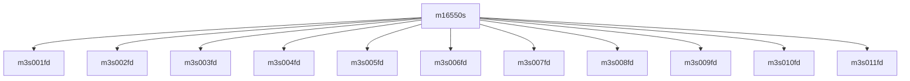

# 模块 `m16550s`

- **源文件**：`rtl\rtl\IONet\UART\m16550s.v`
- **职责（AI 推断）**：推测为16550 UART寄存器文件的组合地址解码与读数据通路模块。接口仅提供三个数据信号（`ADDRESS` 输入、`WDATA` 输入、`RDATA` 输出），无事件信号，亦未宣告复位和时钟依赖。模块可能依据地址进行组合读数据选择，但因缺少内部实例和赋值信息，实现方式尚无法确认。  
  > 证据不足，需要源码复核。

## 1. 层级位置

- **父模块**：`NoCUART0`, `NoCUART1`
- **子实例**：`m3s001fd`, `m3s002fd`, `m3s003fd`, `m3s004fd`, `m3s005fd`, `m3s006fd`, `m3s007fd`, `m3s008fd`, `m3s009fd`, `m3s010fd`, `m3s011fd`
- **组件子模块**：无
- **上游模块**：无记录
- **下游模块**：无记录

### 1.1 模块结构图



```text
m16550s
├── m3s001fd
├── m3s002fd
├── m3s003fd
├── m3s004fd
├── m3s005fd
├── m3s006fd
├── m3s007fd
├── m3s008fd
├── m3s009fd
├── m3s010fd
└── m3s011fd
```

## 2. 输入/输出接口

### 2.1 端口总览

**输入（共14个）**

| 功能域 | 端口名 | 说明 |
|--------|--------|------|
| 时钟与复位 | `RCLK`, `RCLK_BAUD`, `RESETN` | 主时钟、波特率时钟、复位 |
| 数据与控制 | `ADDRESS[2:0]`, `WDATA[7:0]`, `RD`, `BRGE`, `CLOCK`, `VAL` | 地址、写数据、读使能、波特率发生、时钟标志、数据有效 |
| Modem 状态 | `NCTS`, `NDCD`, `NDSR`, `NRI` | 清除发送、载波检测、数据就绪、振铃指示 |
| 串行接收 | `SIN` | 串行输入 |

**输出（共12个）**

| 功能域 | 端口名 | 说明 |
|--------|--------|------|
| 数据与状态 | `RDATA[7:0]`, `BAUD`, `IRQ`, `TXRDY`, `RXRDY`, `ACK` | 读数据、波特率输出、中断请求、发送就绪、接收就绪、应答 |
| Modem 控制 | `NDTR`, `NRTS`, `NDVL`, `NOUT1`, `NOUT2` | 数据终端就绪、请求发送、数据音量、输出1、输出2 |
| 串行发送 | `SOUT` | 串行输出 |

### 2.2 端口分组（按原分类）

| 端口组 | 方向计数 | 代表信号 |
| --- | --- | --- |
| `clock_reset_init` | 输入：3 | `RCLK`, `RCLK_BAUD`, `RESETN` |
| `other_ports` | 输入：11，输出：12 | `ADDRESS`, `WDATA`, `RDATA`, `BRGE`, `CLOCK`, `... +13` |

## 3. Drive/Data/Free 契约

| Interface | 方向 | 事件 | Payload | 反压/空闲 |
|-----------|------|------|---------|-----------|
| `data_inputs` | 输入 | - | `ADDRESS[2:0]`, `WDATA[7:0]` | 未记录 |
| `data_outputs` | 输出 | - | `RDATA[7:0]` | 未记录 |

## 4. 主要 Drive-centered Flow

- 证据不足：Manual Context 未提供本模块的 drive flow。

## 5. 内部组件与 assign 影响

### 5.1 内部组件

| 实例 | 类型 | 输入事件 | 输出事件 |
|------|------|----------|----------|
| - | - | - | Manual Context 未提供主要内部组件信息 |

### 5.2 assign 影响

| Assign | 影响区域 | LHS | RHS 摘要 | 解释状态 |
|--------|----------|-----|----------|----------|
| - | - | - | - | Manual Context 未提供主要 assign 影响 |
