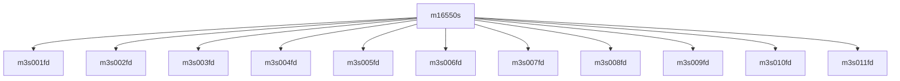

# 模块 `m16550s`

- 源文件：`rtl\rtl\IONet\UART\m16550s.v`。
- 职责：AI 推断：该模块是一个UART内部寄存器文件，用于存储配置、状态和数据，并通过地址和数据总线与外部交互。。
- 说明：模块具有地址输入ADDRESS[2:0]和数据输入WDATA[7:0]以及数据输出RDATA[7:0]，表明其作为寄存器文件的角色，通过地址选择寄存器进行读写操作。

## 1. 层级位置

- Parents：`NoCUART0`, `NoCUART1`。
- Children：`m3s001fd`, `m3s002fd`, `m3s003fd`, `m3s004fd`, `m3s005fd`, `m3s006fd`, `m3s007fd`, `m3s008fd`, `m3s009fd`, `m3s010fd`, `m3s011fd`。
- Component children：无。
- Upstream modules：无。
- Downstream modules：无。

### 1.1 本模块结构图



```text
m16550s
|-- m3s001fd
|-- m3s002fd
|-- m3s003fd
|-- m3s004fd
|-- m3s005fd
|-- m3s006fd
|-- m3s007fd
|-- m3s008fd
|-- m3s009fd
|-- m3s010fd
`-- m3s011fd
```

## 2. 输入/输出接口摘要

- 接收：数据输入：`ADDRESS`, `WDATA`；其他输入：`BRGE`, `CLOCK`, `NCTS`, `NDCD`, `... +8`。
- 输出：数据输出：`RDATA`；其他输出：`ACK`, `BAUD`, `IRQ`, `NDTR`, `... +7`。

### 2.1 端口分组

| 端口组 | 方向统计 | 代表信号 |
| --- | --- | --- |
| `clock_reset_init` | input:3 | `RCLK`, `RCLK_BAUD`, `RESETN` |
| `other_ports` | input:11, output:12 | `ADDRESS`, `WDATA`, `RDATA`, `BRGE`, `CLOCK`, `NCTS`, `NDCD`, `NDSR`, `NRI`, `RD`, `... +13` |

## 3. Drive/Data/Free 契约

| Interface | 方向 | Event | Payload | Free/backpressure |
| --- | --- | --- | --- | --- |
| `data_inputs` | input | - | `ADDRESS [2:0]`, `WDATA [7:0]` | 未记录 |
| `data_outputs` | output | - | `RDATA [7:0]` | 未记录 |

## 4. 主要 Drive-centered Flow

- 证据不足：Manual Context 未提供本模块 drive flow。

## 5. 内部组件与 assign 影响

### 5.1 内部组件

| 实例 | 类型 | 输入事件 | 输出事件 |
| --- | --- | --- | --- |
| - | - | - | Manual Context 未提供 primary internal component |

### 5.2 assign 影响

| Assign | Impact area | LHS | RHS 摘要 | 解释状态 |
| --- | --- | --- | --- | --- |
| - | - | - | - | Manual Context 未提供 primary assign 影响 |
