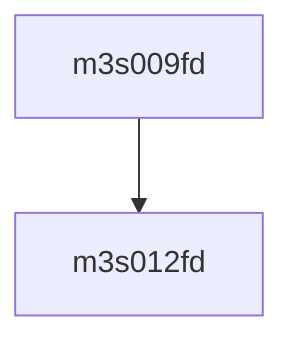

# 模块 `m3s009fd`

- **源文件**：`rtl\rtl\IONet\UART\m3s009fd.v`
- **职责**：**AI 推断**：该模块可能实现一种地址译码或多路选择功能，但其内部信号 OP0–OP15 的生成逻辑在上下文中缺失，无法确认实际意图。

**说明**：虽然端口包含 `CLOCK` 和 `RESETN`，但内部逻辑未使用时序或复位行为。核心数据通路仅有四个向量（`IP_A`, `IP_D`, `OP_A`, `OP_D`）。唯一赋值将 16 个未解释的信号（OP0–OP15）相或生成 `OP_D`，暗示这些信号可能是 `IP_A`/`OP_A` 与 `IP_D` 的部分解码结果。由于缺少内部赋值或可确认的子模块，该模块的角色只能视为待确认的组合逻辑块。

## 1. 层级位置

- **Parents**：`m16550s`
- **Children**：`m3s012fd`
- **Component children**：无
- **Upstream modules**：无
- **Downstream modules**：无

### 1.1 本模块结构图



```text
m3s009fd
`-- m3s012fd
```

## 2. 输入/输出接口摘要

| 端口组 | 方向统计 | 代表信号 |
| --- | --- | --- |
| `clock_reset_init` | input:1 | `RESETN` |
| `other_ports` | input:6, output:1 | `IP_A`, `IP_D`, `OP_A`, `OP_D`, `CLOCK`, `NVRD`, `NVWR` |

- 接收（输入）：数据输入：`IP_A`, `IP_D`, `OP_A`；其他输入：`CLOCK`, `NVRD`, `NVWR`, `RESETN`
- 输出：`OP_D`

## 3. Drive/Data/Free 契约

| Interface | 方向 | Event | Payload | Free/backpressure |
| --- | --- | --- | --- | --- |
| `data_inputs` | input | - | `IP_A [3:0]`, `IP_D [7:0]`, `OP_A [3:0]` | 未记录 |
| `data_outputs` | output | - | `OP_D [7:0]` | 未记录 |

## 4. 主要 Drive-centered Flow

- **证据不足**：Manual Context 未提供本模块 drive flow。

## 5. 内部组件与 assign 影响

### 5.1 内部组件

| 实例 | 类型 | 输入事件 | 输出事件 |
| --- | --- | --- | --- |
| - | - | - | Manual Context 未提供 primary internal component |

### 5.2 assign 影响

| Assign | Impact area | LHS | RHS 摘要 | 解释状态 |
| --- | --- | --- | --- | --- |
| `assign_0` | unknown | `OP_D` | OP0 \| OP1 \| OP2 \| OP3 \| OP4 \| OP5 \| OP6 \| OP7 \| OP8 \| OP9 \| OP10 \| OP11 \| OP12 \| OP13 \| OP14 … | **证据不足**：No Semantic Layer assignment interpretation is available. |
