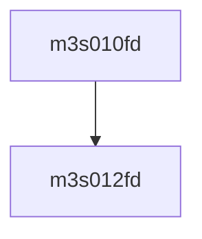

# 模块 `m3s010fd`

- **源文件**：`rtl\rtl\IONet\UART\m3s010fd.v`
- **职责**：AI 推断：组合逻辑模块，推测将 16 个内部信号进行逻辑或，生成单个输出数据，可能用于 UART 域的状态合并或中断汇总。
- **说明**：该模块位于 IONet/UART 路径下，其接口仅包含无事件的数据载荷输入与输出。唯一的赋值语句将 16 个内部信号（OP0 ~ OP15）归约至 `OP_D`，体现出纯组合逻辑的合并功能。无事件流与控制信号表明本模块不具备时序驱动，仅作为数据路径上的部件。

## 1. 层级位置

- **Parents**：`m16550s`
- **Children**：`m3s012fd`
- **Component children**：无
- **Upstream modules**：无
- **Downstream modules**：无

### 1.1 本模块结构图



```text
m3s010fd
`-- m3s012fd
```

## 2. 输入/输出接口摘要

- **接收**：数据输入 `IP_A`, `IP_D`, `OP_A`；其他输入 `CLOCK`, `NVRD`, `NVWR`, `RESETN`
- **输出**：数据输出 `OP_D`

### 2.1 端口分组

| 端口组 | 方向统计 | 代表信号 |
| --- | --- | --- |
| `clock_reset_init` | input:1 | `RESETN` |
| `other_ports` | input:6, output:1 | `IP_A`, `IP_D`, `OP_A`, `OP_D`, `CLOCK`, `NVRD`, `NVWR` |

## 3. Drive/Data/Free 契约

| Interface | 方向 | Event | Payload | Free/backpressure |
| --- | --- | --- | --- | --- |
| `data_inputs` | input | – | `IP_A [3:0]`, `IP_D [7:0]`, `OP_A [3:0]` | 未记录 |
| `data_outputs` | output | – | `OP_D [7:0]` | 未记录 |

## 4. 主要 Drive‑centered Flow

- 证据不足：Manual Context 未提供本模块 drive flow。

## 5. 内部组件与 assign 影响

### 5.1 内部组件

| 实例 | 类型 | 输入事件 | 输出事件 |
| --- | --- | --- | --- |
| – | – | – | Manual Context 未提供 primary internal component |

### 5.2 assign 影响

| Assign | Impact area | LHS | RHS 摘要 | 解释状态 |
| --- | --- | --- | --- | --- |
| `assign_0` | unknown | `OP_D` | OP0 \| OP1 \| OP2 \| OP3 \| OP4 \| OP5 \| OP6 \| OP7 \| OP8 \| OP9 \| OP10 \| OP11 \| OP12 \| OP13 \| OP14 \| OP15 | AI 推断：该赋值将 16 个内部信号按位或（OR）归约的结果驱动至输出 `OP_D`，可能用于集中多个状态或条件标志。 |
