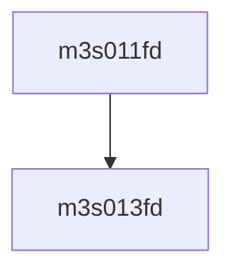

# 模块 `m3s011fd`

- 源文件：`rtl\rtl\IONet\UART\m3s011fd.v`。
- 职责：AI 推断：该模块是一个窄位宽数据组合转换单元，将两个4位输入数据合并为一个3位输出数据。。
- 说明：模块仅有三个数据端口（两个4位输入IP_A和OP_A，一个3位输出OP_D），无事件、控制或自由信号，表明其功能是纯组合逻辑的数据位宽压缩或选择。

## 1. 层级位置

- Parents：`m16550s`。
- Children：`m3s013fd`。
- Component children：无。
- Upstream modules：无。
- Downstream modules：无。

### 1.1 本模块结构图



```text
m3s011fd
`-- m3s013fd
```

## 2. 输入/输出接口摘要

- 接收：数据输入：`IP_A`, `OP_A`；其他输入：`ADD0`, `ADD5`, `BRI`, `CLOCK`, `... +8`。
- 输出：数据输出：`OP_D`；其他输出：`FERF`。

### 2.1 端口分组

| 端口组 | 方向统计 | 代表信号 |
| --- | --- | --- |
| `clock_reset_init` | input:2 | `RESETN`, `RRST` |
| `other_ports` | input:12, output:2 | `IP_A`, `OP_A`, `OP_D`, `ADD0`, `ADD5`, `BRI`, `CLOCK`, `CharEn`, `FRE`, `PTE`, `... +4` |

## 3. Drive/Data/Free 契约

| Interface | 方向 | Event | Payload | Free/backpressure |
| --- | --- | --- | --- | --- |
| `data_inputs` | input | - | `IP_A [3:0]`, `OP_A [3:0]` | 未记录 |
| `data_outputs` | output | - | `OP_D [2:0]` | 未记录 |

## 4. 主要 Drive-centered Flow

- 证据不足：Manual Context 未提供本模块 drive flow。

## 5. 内部组件与 assign 影响

### 5.1 内部组件

| 实例 | 类型 | 输入事件 | 输出事件 |
| --- | --- | --- | --- |
| - | - | - | Manual Context 未提供 primary internal component |

### 5.2 assign 影响

| Assign | Impact area | LHS | RHS 摘要 | 解释状态 |
| --- | --- | --- | --- | --- |
| - | - | - | - | Manual Context 未提供 primary assign 影响 |
