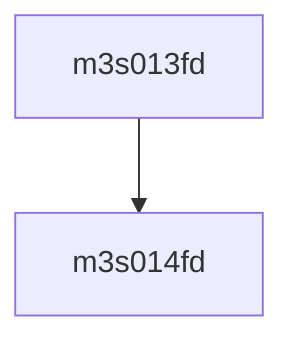

# 模块 `m3s013fd`

- 源文件：`rtl/rtl/IONet/UART/m3s013fd.v`。
- 职责：AI 推断：该模块是一个基于地址映射的多路选择器，用于从16个内部信号中选择一个输出到OP_D。。
- 说明：模块的输入IP_A和OP_A为4位地址，IP_D为3位数据输入，OP_D为3位数据输出。assign依赖显示OP_D由16个信号(OP0-OP15)按位或运算得到，表明模块内部通过地址选择将IP_D映射到对应的OPx信号，最终合并输出。

## 1. 层级位置

- Parents：`m3s011fd`。
- Children：`m3s014fd`。
- Component children：无。
- Upstream modules：无。
- Downstream modules：无。

### 1.1 本模块结构图



```text
m3s013fd
`-- m3s014fd
```

## 2. 输入/输出接口摘要

- 接收：数据输入：`IP_A`, `IP_D`, `OP_A`；其他输入：`CLOCK`, `NVWR`, `RESETN`。
- 输出：数据输出：`OP_D`。

### 2.1 端口分组

| 端口组 | 方向统计 | 代表信号 |
| --- | --- | --- |
| `clock_reset_init` | input:1 | `RESETN` |
| `other_ports` | input:5, output:1 | `IP_A`, `IP_D`, `OP_A`, `OP_D`, `CLOCK`, `NVWR` |

## 3. Drive/Data/Free 契约

| Interface | 方向 | Event | Payload | Free/backpressure |
| --- | --- | --- | --- | --- |
| `data_inputs` | input | - | `IP_A [3:0]`, `IP_D [2:0]`, `OP_A [3:0]` | 未记录 |
| `data_outputs` | output | - | `OP_D [2:0]` | 未记录 |

## 4. 主要 Drive-centered Flow

- 证据不足：Manual Context 未提供本模块 drive flow。

## 5. 内部组件与 assign 影响

### 5.1 内部组件

| 实例 | 类型 | 输入事件 | 输出事件 |
| --- | --- | --- | --- |
| - | - | - | Manual Context 未提供 primary internal component |

### 5.2 assign 影响

| Assign | Impact area | LHS | RHS 摘要 | 解释状态 |
| --- | --- | --- | --- | --- |
| `assign_0` | unknown | `OP_D` | OP0 \| OP1 \| OP2 \| OP3 \| OP4 \| OP5 \| OP6 \| OP7 \| OP8 \| OP9 \| OP10 \| OP11 \| OP12 \| OP13 \| OP14 ... | AI 推断：OP_D由16个内部信号(OP0-OP15)按位或合并而成，表明这些信号中最多只有一个有效，实现多路选择输出。 |
