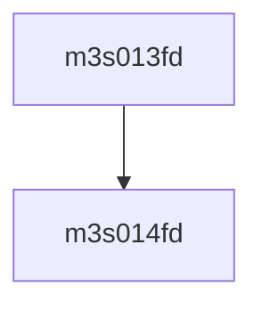

# 模块 `m3s013fd`

- 源文件：`rtl\rtl\IONet\UART\m3s013fd.v`
- 职责：**AI 推断**：模块 `m3s013fd` 是一个纯组合逻辑单元，将 16 个内部信号（`OP0`~`OP15`）按位逻辑或后汇聚为单一输出 `OP_D`。
- 说明：模块不含时序元件、无子实例；其唯一赋值语句将 `OP_D` 表达为 16 个内部信号的或，表明它本质上是一个多输入或门汇聚器。接口上出现的 `IP_A`、`IP_D`、`OP_A` 等信号可能参与生成内部信号 `OP0`~`OP15`，但当前上下文并未暴露这些内部信号的驱动逻辑，因此推测其设计意图可能是在 UART 通路中对多个状态或请求进行仲裁/合并。

## 1. 层级位置

- Parents：`m3s011fd`
- Children：`m3s014fd`
- Component children：无
- Upstream modules：无
- Downstream modules：无

### 1.1 本模块结构图



```text
m3s013fd
`-- m3s014fd
```

## 2. 输入/输出接口摘要

- 接收：数据输入：`IP_A`、`IP_D`、`OP_A`；其他输入：`CLOCK`、`NVWR`、`RESETN`
- 输出：数据输出：`OP_D`

### 2.1 端口分组

| 端口组 | 方向统计 | 代表信号 |
| --- | --- | --- |
| `clock_reset_init` | input:1 | `RESETN` |
| `other_ports` | input:5, output:1 | `IP_A`, `IP_D`, `OP_A`, `OP_D`, `CLOCK`, `NVWR` |

## 3. Drive/Data/Free 契约

| Interface | 方向 | Event | Payload | Free/backpressure |
| --- | --- | --- | --- | --- |
| `data_inputs` | input | - | `IP_A [3:0]`, `IP_D [2:0]`, `OP_A [3:0]` | 未记录 |
| `data_outputs` | output | - | `OP_D [2:0]` | 未记录 |

## 4. 主要 Drive-centered Flow

- **证据不足**：Manual Context 未提供本模块的 drive flow。

## 5. 内部组件与 assign 影响

### 5.1 内部组件

| 实例 | 类型 | 输入事件 | 输出事件 |
| --- | --- | --- | --- |
| - | - | - | Manual Context 未提供 primary internal component |

### 5.2 assign 影响

| Assign | Impact area | LHS | RHS 摘要 | 解释状态 |
| --- | --- | --- | --- | --- |
| `assign_0` | unknown | `OP_D` | `OP0` \| `OP1` \| … \| `OP15`（16 个内部信号的按位或） | **AI 推断**：该赋值将 16 个内部信号进行按位或，组合成输出 `OP_D`，表明 `OP_D` 是一个多来源的标志/数据汇总信号。 |
