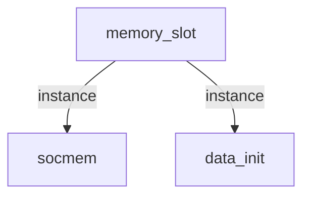

# 模块 `memory_slot`

- 源文件：`rtl\rtl\slot\memory_slot.v`。
- 职责：**AI 推断**：系统内存访问插槽，将外部指令和数据总线请求转发给内部 `socmem`，并支持通过 UART 进行内存初始化。
- 说明：模块包含 `socmem` 和 `data_init` 实例。当内部信号 `init_sig_temp2` 有效时，数据通路选择来自 `data_init` 的初始化数据；否则透传外部总线信号。事件驱动信号 `i_driveFrmIf` / `i_driveFrmLsu` 触发 `socmem` 操作，并输出下一级事件 `o_driveNextToIf` / `o_driveNextToLsu`。`free` 握手信号提供流水级背压控制。

## 1. 层级位置

- Parents：`cpu_slot`。
- Children：`data_init`, `socmem`。
- Component children：无。
- 上游模块：无。
- 下游模块：无。

### 1.1 本模块结构图



```
memory_slot
|-- socmem
|-- data_init
```

## 2. 输入/输出接口摘要

- 接收：drive 事件：`i_driveFrmIf`, `i_driveFrmLsu`；数据总线：`i_dbus_addr`, `i_dbus_data`, `i_dbus_we`, `i_ibus_addr`, `i_ibus_data`, `i_ibus_we`；free/背压：`i_freeNextFrmIf`, `i_freeNextFrmLsu`；其他：`UART_INIT_SEL`, `clk`, `init_rx`, `rst_finish`。
- 输出：drive 事件：`o_driveNextToIf`, `o_driveNextToLsu`；数据总线：`o_dbus_data`, `o_ibus_data`；free/背压：`o_freeToIf`, `o_freeToLsu`；其他：`init_sig`, `init_tx`。

### 2.1 端口分组

| 端口组 | 方向统计 | 代表信号 |
| --- | --- | --- |
| `clock_reset_init` | input:2 | `clk`, `rst_finish` |
| `drive_event` | input:2, output:2 | `i_driveFrmIf`, `i_driveFrmLsu`, `o_driveNextToIf`, `o_driveNextToLsu` |
| `free_backpressure` | input:2, output:2 | `i_freeNextFrmIf`, `i_freeNextFrmLsu`, `o_freeToIf`, `o_freeToLsu` |
| `other_ports` | input:8, output:4 | 输入：`i_dbus_addr`, `i_dbus_data`, `i_dbus_we`, `i_ibus_addr`, `i_ibus_data`, `i_ibus_we`, `UART_INIT_SEL`, `init_rx`<br/>输出：`o_dbus_data`, `o_ibus_data`, `init_sig`, `init_tx` |

## 3. Drive/Data/Free 契约

| Interface | 方向 | Event | Payload | Free/backpressure |
| --- | --- | --- | --- | --- |
| `i_driveFrmIf` | input | `i_driveFrmIf` | 未记录 | `o_freeToIf` |
| `i_driveFrmLsu` | input | `i_driveFrmLsu` | 未记录 | `o_freeToLsu` |
| `o_driveNextToIf` | output | `o_driveNextToIf` | 未记录 | `i_freeNextFrmIf` |
| `o_driveNextToLsu` | output | `o_driveNextToLsu` | 未记录 | `i_freeNextFrmLsu` |

## 4. 主要 Drive-centered Flow

### `i_driveFrmIf`

- 确定性事实：`i_driveFrmIf` → `o_driveNextToIf`, `o_driveNextToLsu`；flow_id = `flow_000_memory_slot_i_driveFrmIf`。
- Payload：未记录。
- 输出/影响：`o_driveNextToIf`, `o_driveNextToLsu`。
- 结构复杂度：branch=1，join=1，blocking=0。
- **AI 推断**：最终手册应突出 `socmem` 作为事件分发枢纽的角色，说明 `i_driveFrmIf` 如何触发两个输出，并强调背压信号与数据通路的关系尚未明确，避免过度承诺。

### `i_driveFrmLsu`

- 确定性事实：`i_driveFrmLsu` → `o_driveNextToIf`, `o_driveNextToLsu`；flow_id = `flow_001_memory_slot_i_driveFrmLsu`。
- Payload：未记录。
- 输出/影响：`o_driveNextToIf`, `o_driveNextToLsu`。
- 结构复杂度：branch=1，join=1，blocking=0。
- **AI 推断**：该流涉及 `free` 信号，构成潜在的反压或就绪协议：`o_freeToLsu` 指示可接收 LSU 驱动，`i_freeNextFrmIf` 和 `i_freeNextFrmLsu` 指示下游可接收输出驱动。

## 5. 内部组件与 assign 影响

### 5.1 内部组件

| 实例 | 类型 | 输入事件 | 输出事件 |
| --- | --- | --- | --- |
| `socmem` | `socmem` | `i_driveFrmIf`, `i_driveFrmLsu` | `o_driveNextToIf`, `o_driveNextToLsu` |

### 5.2 assign 影响

| Assign | Impact area | LHS | RHS 摘要 | 解释状态 |
| --- | --- | --- | --- | --- |
| `assign_1` | unknown | `memory_ibus_we` | `init_sig_temp2 ? {8{init_ibus_we}} : i_ibus_we` | **AI 推断**：实现初始化与正常模式之间的数据、地址和写使能选择，由 `init_sig_temp2` 控制。 |
| `assign_2` | unknown | `memory_ibus_addr_i` | `init_sig_temp2 ? {init_ibus_addr,1'b0} : i_ibus_addr` | **AI 推断**：实现初始化与正常模式之间的数据、地址和写使能选择，由 `init_sig_temp2` 控制。 |
| `assign_3` | data_path | `memory_ibus_data_i` | `init_sig_temp2 ? init_ibus_data : i_ibus_data` | **AI 推断**：实现初始化与正常模式之间的数据、地址和写使能选择，由 `init_sig_temp2` 控制。 |
| `assign_4` | unknown | `memory_dbus_we` | `init_sig_temp2 ? {8{init_dbus_we}} : i_dbus_we` | **AI 推断**：实现初始化与正常模式之间的数据、地址和写使能选择，由 `init_sig_temp2` 控制。 |
| `assign_5` | unknown | `memory_dbus_addr_i` | `init_sig_temp2 ? init_dbus_addr : i_dbus_addr` | **AI 推断**：实现初始化与正常模式之间的数据、地址和写使能选择，由 `init_sig_temp2` 控制。 |
| `assign_6` | data_path | `memory_dbus_data_i` | `init_sig_temp2 ? init_dbus_data : i_dbus_data` | **AI 推断**：实现初始化与正常模式之间的数据、地址和写使能选择，由 `init_sig_temp2` 控制。 |
| `assign_7` | data_path | `o_ibus_data` | `memory_ibus_data_o` | **AI 推断**：将 `socmem` 的读回数据透明传递到模块外部输出。 |
| `assign_8` | data_path | `o_dbus_data` | `memory_dbus_data_o` | **AI 推断**：将 `socmem` 的读回数据透明传递到模块外部输出。 |
| `assign_0` | unknown | `init_sig` | `init_sig_temp` | **证据不足**：No Semantic Layer assignment interpretation is available. |
