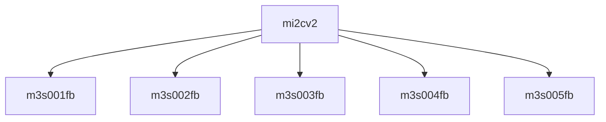

# 模块 `mi2cv2`

- 源文件：`rtl\rtl\IONet\IIC\mi2cv2.v`。
- 职责：AI 推断：I2C 总线接口宏，集成数字协议引擎、输入滤波、输出驱动和电源隔离控制，实现完整的 I2C 通信功能。
- 说明：内部通过逻辑单元 U2 对输入 `IFSDA`/`ISCL`/`ISDA` 进行同步滤波，U3 作为协议控制器提供寄存器读写和中断，U4 管理隔离和驱动使能信号 `CKISO`/`DAGND`/`DAISO`/`ENDRV`，U5 负责输出驱动 `OSCL`/`OSDA`，共同构成闭环 I2C 宏单元。

## 1. 层级位置

- Parents：`I2C2NoC`。
- Children：`m3s001fb`, `m3s002fb`, `m3s003fb`, `m3s004fb`, `m3s005fb`。
- Component children：无。
- Upstream modules：无。
- Downstream modules：无。

### 1.1 本模块结构图



```text
mi2cv2
|-- m3s001fb
|-- m3s002fb
|-- m3s003fb
|-- m3s004fb
`-- m3s005fb
```

## 2. 输入/输出接口摘要

- 输入信号：`ADDRESS[2:0]`, `WDATA[7:0]`, `CLOCK`, `FSEN`, `HSEN`, `IFSDA`, `ISCL`, `ISDA`, `RD`, `VAL`, `RESETN`
- 输出信号：`RDATA[7:0]`, `CKISO`, `DAGND`, `DAISO`, `ENDRV`, `INTR`, `OSCL`, `OSDA`

### 2.1 端口分组

| 端口组 | 方向统计 | 信号 |
| --- | --- | --- |
| `clock_reset_init` | input:1 | `RESETN` |
| `drive_event` | output:1 | `ENDRV` |
| `data_control` | input:10 | `ADDRESS[2:0]`, `CLOCK`, `FSEN`, `HSEN`, `IFSDA`, `ISCL`, `ISDA`, `RD`, `VAL`, `WDATA[7:0]` |
| `status_output` | output:7 | `CKISO`, `DAGND`, `DAISO`, `INTR`, `OSCL`, `OSDA`, `RDATA[7:0]` |

## 3. Drive/Data/Free 契约

| Interface | 方向 | Event | Payload | Free/backpressure |
| --- | --- | --- | --- | --- |
| `data_inputs` | input | - | `ADDRESS [2:0]`, `WDATA [7:0]` | 未记录 |
| `data_outputs` | output | - | `RDATA [7:0]` | 未记录 |

## 4. 主要 Drive-centered Flow

- 证据不足：Manual Context 未提供本模块 drive flow。

## 5. 内部组件与 assign 影响

### 5.1 内部组件

| 实例 | 类型 | 输入事件 | 输出事件 |
| --- | --- | --- | --- |
| - | - | - | Manual Context 未提供 primary internal component |

### 5.2 assign 影响

| Assign | Impact area | LHS | RHS 摘要 | 解释状态 |
| --- | --- | --- | --- | --- |
| - | - | - | - | Manual Context 未提供 primary assign 影响 |
