# 模块 `nodeTop`

- 源文件：`rtl\rtl\IONet\IONetwork_9.24\nodeTop.v`
- 职责：AI 推断：五方向（东、南、西、北、本地）片上网络路由节点，基于事件驱动‑消息载荷握手协议接收来自任一方向的输入包，通过 Route‑Arb 内部流水线将包转发至一个或多个输出方向。
- 说明：接口提供每个方向的驱动事件、51‑bit 消息数据以及释放反馈。内部实例为五个方向的 `routeMsg`（路由端）与 `arbMsg`（仲裁端），形成一个全连接矩阵。每个输入驱动事件在内部流程中均扇出到全部五个输出驱动端点，表明节点具备多播或全连接转发能力，最终由仲裁模块竞争输出。

## 1. 层级位置

- Parents：`IONetwork`
- Children：`arbMsg`, `routeMsg`
- Component children：无
- Upstream modules：无
- Downstream modules：无

### 1.1 本模块结构图

```mermaid
flowchart TB
  nodeTop["nodeTop"] -->|instance| eastArbMsg_arbMsg["eastArbMsg: arbMsg"]
  nodeTop["nodeTop"] -->|instance| eastRouteMsg_routeMsg["eastRouteMsg: routeMsg"]
  nodeTop["nodeTop"] -->|instance| localArbMsg_arbMsg["localArbMsg: arbMsg"]
  nodeTop["nodeTop"] -->|instance| localRouteMsg_routeMsg["localRouteMsg: routeMsg"]
  nodeTop["nodeTop"] -->|instance| northArbMsg_arbMsg["northArbMsg: arbMsg"]
  nodeTop["nodeTop"] -->|instance| northRouteMsg_routeMsg["northRouteMsg: routeMsg"]
  nodeTop["nodeTop"] -->|instance| southArbMsg_arbMsg["southArbMsg: arbMsg"]
  nodeTop["nodeTop"] -->|instance| southRouteMsg_routeMsg["southRouteMsg: routeMsg"]
  nodeTop["nodeTop"] -->|instance| westArbMsg_arbMsg["westArbMsg: arbMsg"]
  nodeTop["nodeTop"] -->|instance| westRouteMsg_routeMsg["westRouteMsg: routeMsg"]
  nodeTop["nodeTop"] --> arbMsg["arbMsg"]
  nodeTop["nodeTop"] --> routeMsg["routeMsg"]
```



```text
nodeTop
|-- eastArbMsg: arbMsg
|-- eastRouteMsg: routeMsg
|-- localArbMsg: arbMsg
|-- localRouteMsg: routeMsg
|-- northArbMsg: arbMsg
|-- northRouteMsg: routeMsg
|-- southArbMsg: arbMsg
|-- southRouteMsg: routeMsg
|-- westArbMsg: arbMsg
|-- westRouteMsg: routeMsg
|-- arbMsg
`-- routeMsg
```

## 2. 输入/输出接口摘要

- 接收  
  - drive 输入：`i_driveEast`, `i_driveLocal`, `i_driveNorth`, `i_driveSouth`, `i_driveWest`  
  - 数据输入：`i_eastInMsg_51`, `i_localInMsg_51`, `i_northInMsg_51`, `i_southInMsg_51`, `i_westInMsg_51`  
  - free 输入：`i_freeEast`, `i_freeLocal`, `i_freeNorth`, `i_freeSouth`, `i_freeWest`
- 输出  
  - drive 输出：`o_driveEast`, `o_driveLocal`, `o_driveNorth`, `o_driveSouth`, `o_driveWest`  
  - 数据输出：`o_eastMsg_51`, `o_localMsg_51`, `o_northMsg_51`, `o_southMsg_51`, `o_westMsg_51`  
  - free 输出：`o_freeEast`, `o_freeLocal`, `o_freeNorth`, `o_freeSouth`, `o_freeWest`

### 2.1 端口分组

| 端口组 | 方向统计 | 代表信号 |
| --- | --- | --- |
| `drive_event` | input:5, output:5 | `i_driveEast`, `i_driveLocal`, `i_driveNorth`, `i_driveSouth`, `i_driveWest`, `o_driveEast`, `o_driveLocal`, `o_driveNorth`, `o_driveSouth`, `o_driveWest` |
| `free_backpressure` | input:5, output:5 | `i_freeEast`, `i_freeLocal`, `i_freeNorth`, `i_freeSouth`, `i_freeWest`, `o_freeEast`, `o_freeLocal`, `o_freeNorth`, `o_freeSouth`, `o_freeWest` |
| `other_ports` | input:5, output:5 | `i_eastInMsg_51`, `i_localInMsg_51`, `i_northInMsg_51`, `i_southInMsg_51`, `i_westInMsg_51`, `o_eastMsg_51`, `o_localMsg_51`, `o_northMsg_51`, `o_southMsg_51`, `o_westMsg_51` |

## 3. Drive/Data/Free 契约

| Interface | 方向 | Event | Payload | Free/backpressure |
| --- | --- | --- | --- | --- |
| `i_driveEast` | input | `i_driveEast` | `i_eastInMsg_51 [50:0]` | `o_freeEast` |
| `i_driveLocal` | input | `i_driveLocal` | `i_localInMsg_51 [50:0]` | `o_freeLocal` |
| `i_driveNorth` | input | `i_driveNorth` | `i_northInMsg_51 [50:0]` | `o_freeNorth` |
| `i_driveSouth` | input | `i_driveSouth` | `i_southInMsg_51 [50:0]` | `o_freeSouth` |
| `i_driveWest` | input | `i_driveWest` | `i_westInMsg_51 [50:0]` | `o_freeWest` |
| `o_driveEast` | output | `o_driveEast` | `o_eastMsg_51 [50:0]` | `i_freeEast` |
| `o_driveLocal` | output | `o_driveLocal` | `o_localMsg_51 [50:0]` | `i_freeLocal` |
| `o_driveNorth` | output | `o_driveNorth` | `o_northMsg_51 [50:0]` | `i_freeNorth` |
| `o_driveSouth` | output | `o_driveSouth` | `o_southMsg_51 [50:0]` | `i_freeSouth` |
| `o_driveWest` | output | `o_driveWest` | `o_westMsg_51 [50:0]` | `i_freeWest` |

## 4. 主要 Drive-centered Flow

### `i_driveEast`

- **确定性事实**：`i_driveEast` 流向 `o_driveEast`, `o_driveLocal`, `o_driveNorth`（flow_id：`flow_000_nodeTop_i_driveEast`）。
- **Payload**：  
  - 输入：`i_driveEast` → `i_eastInMsg_51 [50:0]`  
  - 输出：`o_driveEast` → `o_eastMsg_51 [50:0]`，`o_driveLocal` → `o_localMsg_51 [50:0]`，`o_driveNorth` → `o_northMsg_51 [50:0]`，`o_driveSouth` → `o_southMsg_51 [50:0]`，`o_driveWest` → `o_westMsg_51 [50:0]`
- **输出/影响**：`o_driveEast`, `o_driveLocal`, `o_driveNorth`, `o_driveSouth`, `o_driveWest`
- **结构复杂度**：branch=1，join=5，blocking=0
- **AI 推断**：手册应突出该流展现的东向输入到多方向仲裁的拓扑结构，弱化具体路由算法和仲裁优先级，因为缺少内部逻辑证据。

### `i_driveLocal`

- **确定性事实**：`i_driveLocal` 流向 `o_driveEast`, `o_driveLocal`, `o_driveNorth`（flow_id：`flow_001_nodeTop_i_driveLocal`）。
- **Payload**：  
  - 输入：`i_driveLocal` → `i_localInMsg_51 [50:0]`  
  - 输出：`o_driveEast` → `o_eastMsg_51 [50:0]`，`o_driveLocal` → `o_localMsg_51 [50:0]`，`o_driveNorth` → `o_northMsg_51 [50:0]`，`o_driveSouth` → `o_southMsg_51 [50:0]`，`o_driveWest` → `o_westMsg_51 [50:0]`
- **输出/影响**：`o_driveEast`, `o_driveLocal`, `o_driveNorth`, `o_driveSouth`, `o_driveWest`
- **结构复杂度**：branch=1，join=5，blocking=0
- **AI 推断**：重点描述 i_driveLocal 通过 localRouteMsg 复制到各方向仲裁器，并驱动对应 o_drive* 输出，同时强调伴随的消息 payload 和就绪信号。应弱化仲裁器内部多路选择及与其他方向请求冲突的细节，因缺乏内部实现信息。

### `i_driveNorth`

- **确定性事实**：`i_driveNorth` 流向 `o_driveEast`, `o_driveLocal`, `o_driveNorth`（flow_id：`flow_002_nodeTop_i_driveNorth`）。
- **Payload**：  
  - 输入：`i_driveNorth` → `i_northInMsg_51 [50:0]`  
  - 输出：`o_driveEast` → `o_eastMsg_51 [50:0]`，`o_driveLocal` → `o_localMsg_51 [50:0]`，`o_driveNorth` → `o_northMsg_51 [50:0]`，`o_driveSouth` → `o_southMsg_51 [50:0]`，`o_driveWest` → `o_westMsg_51 [50:0]`
- **输出/影响**：`o_driveEast`, `o_driveLocal`, `o_driveNorth`, `o_driveSouth`, `o_driveWest`
- **结构复杂度**：branch=1，join=5，blocking=0
- **AI 推断**：应强调从北向输入到五种输出的全连接拓扑与角色映射，弱化内部仲裁算法与路由选择的细节。

### `i_driveSouth`

- **确定性事实**：`i_driveSouth` 流向 `o_driveEast`, `o_driveLocal`, `o_driveNorth`（flow_id：`flow_003_nodeTop_i_driveSouth`）。
- **Payload**：  
  - 输入：`i_driveSouth` → `i_southInMsg_51 [50:0]`  
  - 输出：`o_driveEast` → `o_eastMsg_51 [50:0]`，`o_driveLocal` → `o_localMsg_51 [50:0]`，`o_driveNorth` → `o_northMsg_51 [50:0]`，`o_driveSouth` → `o_southMsg_51 [50:0]`，`o_driveWest` → `o_westMsg_51 [50:0]`
- **输出/影响**：`o_driveEast`, `o_driveLocal`, `o_driveNorth`, `o_driveSouth`, `o_driveWest`
- **结构复杂度**：branch=1，join=5，blocking=0
- **AI 推断**：最终手册应突出南向驱动通过 southRouteMsg 扇出并进入各方向仲裁器的整体架构，弱化内部仲裁细节以防过度推断。

### `i_driveWest`

- **确定性事实**：`i_driveWest` 流向 `o_driveEast`, `o_driveLocal`, `o_driveNorth`（flow_id：`flow_004_nodeTop_i_driveWest`）。
- **Payload**：  
  - 输入：`i_driveWest` → `i_westInMsg_51 [50:0]`  
  - 输出：`o_driveEast` → `o_eastMsg_51 [50:0]`，`o_driveLocal` → `o_localMsg_51 [50:0]`，`o_driveNorth` → `o_northMsg_51 [50:0]`，`o_driveSouth` → `o_southMsg_51 [50:0]`，`o_driveWest` → `o_westMsg_51 [50:0]`
- **输出/影响**：`o_driveEast`, `o_driveLocal`, `o_driveNorth`, `o_driveSouth`, `o_driveWest`
- **结构复杂度**：branch=1，join=5，blocking=0
- **AI 推断**：手册应突出 i_driveWest 是 westRouteMsg 的唯一驱动源，westRouteMsg 执行扇出复制，五个 arbMsg 执行汇聚仲裁，以及 free 信号的流控作用。避免过度解释路由决策和仲裁算法。

## 5. 内部组件与 assign 影响

### 5.1 内部组件

| 实例 | 类型 | 输入事件 | 输出事件 |
| --- | --- | --- | --- |
| `eastArbMsg` | `arbMsg` | 无 | `o_driveEast` |
| `eastRouteMsg` | `routeMsg` | `i_driveEast` | 无 |
| `localArbMsg` | `arbMsg` | 无 | `o_driveLocal` |
| `localRouteMsg` | `routeMsg` | `i_driveLocal` | 无 |
| `northArbMsg` | `arbMsg` | 无 | `o_driveNorth` |
| `northRouteMsg` | `routeMsg` | `i_driveNorth` | 无 |
| `southArbMsg` | `arbMsg` | 无 | `o_driveSouth` |
| `southRouteMsg` | `routeMsg` | `i_driveSouth` | 无 |
| `westArbMsg` | `arbMsg` | 无 | `o_driveWest` |
| `westRouteMsg` | `routeMsg` | `i_driveWest` | 无 |

### 5.2 assign 影响

| Assign | Impact area | LHS | RHS 摘要 | 解释状态 |
| --- | --- | --- | --- | --- |
| - | - | - | - | Manual Context 未提供 primary assign 影响 |
