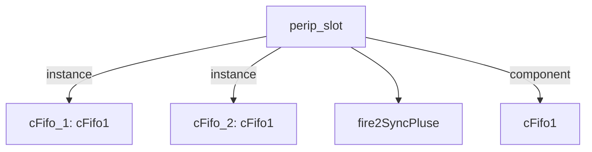

# 模块 `perip_slot`

- 源文件：`rtl\rtl\IONet\GPIO\perip_slot.v`
- 职责（AI 推断）：本模块作为 Mesh 互连与外设之间的槽位适配器，负责转发 Mesh 驱动事件和数据至外设，同时提供符合本地时序的访问信号并实现流控与缓冲。
- 结构说明：接口中包含 `i_driveFrmMesh` 与 `o_driveNextToMesh` 事件对；内部通过 `cFifo` 实例及延迟单元构建流水线；数据通道 `data_from`/`data_to` 对应 Mesh 数据输入/输出；此外还有 `addr_i`、`data_i`、`data_o`、`we` 等疑似外设总线信号，构成典型的适配器结构。

## 1. 层级位置

- Parents：`gpio_slot`
- Children：`fire2SyncPluse`
- Component children：`cFifo1`
- Upstream modules：无
- Downstream modules：无

### 1.1 本模块结构图



```text
perip_slot
|-- cFifo_1: cFifo1
|-- cFifo_2: cFifo1
|-- fire2SyncPluse
`-- cFifo1
```

## 2. 输入/输出接口摘要

- 输入信号：
  - 驱动事件：`i_driveFrmMesh`
  - 数据输入：`data_from`、`data_o`
  - 流控/反压：`i_freeNextFrmMesh`
  - 时钟与复位：`clk`、`rst_finish`
- 输出信号：
  - 驱动事件：`o_driveNextToMesh`
  - 数据输出：`addr_i`、`data_i`、`data_to`
  - 流控/反压：`o_freeToMesh`
  - 写使能：`we`

### 2.1 端口分组

| 端口组 | 方向统计 | 代表信号 |
| --- | --- | --- |
| `clock_reset_init` | input:2 | `clk`, `rst_finish` |
| `drive_event` | input:1, output:1 | `i_driveFrmMesh`, `o_driveNextToMesh` |
| `free_backpressure` | input:1, output:1 | `i_freeNextFrmMesh`, `o_freeToMesh` |
| `other_ports` | input:2, output:4 | `data_from`, `data_o`, `addr_i`, `data_i`, `data_to`, `we` |

## 3. Drive/Data/Free 契约

| Interface | 方向 | Event | Payload | Free/backpressure |
| --- | --- | --- | --- | --- |
| `i_driveFrmMesh` | input | `i_driveFrmMesh` | 未记录 | `o_freeToMesh` |
| `o_driveNextToMesh` | output | `o_driveNextToMesh` | 未记录 | `i_freeNextFrmMesh` |

## 4. 主要 Drive-centered Flow

### `i_driveFrmMesh`

- 确定性事实：`i_driveFrmMesh`→`o_driveNextToMesh`（flow_id: `flow_000_perip_slot_i_driveFrmMesh`）
- Payload：未记录
- 输出/影响：`o_driveNextToMesh`
- 结构复杂度：branch=0，join=0，blocking=2
- AI 推断：该流为单事件隧道，内部经过双重 FIFO 缓冲，固定总延迟为 96 个单位；free 信号在拥塞控制中起关键作用，手册中应重点说明这些特性。

## 5. 内部组件与 assign 影响

### 5.1 内部组件

| 实例 | 类型 | 输入事件 | 输出事件 |
| --- | --- | --- | --- |
| `cFifo_1` | `cFifo1` | `i_driveFrmMesh` | `w_drv2Fifo2` |
| `cFifo_2` | `cFifo1` | `w_drv2Fifo2_delay2` | `o_driveNextToMesh` |

### 5.2 assign 影响

| Assign | Impact area | LHS | RHS 摘要 | 解释状态 |
| --- | --- | --- | --- | --- |
| `assign_0` | unknown | `we` | (!we_r) & rise | AI 推断：该 assign 可能生成对外设的写使能脉冲，组合逻辑为(!we_r)&rise，其中 rise 可能来自 f2p_we 模块，用于在事件到达且未写使能时产生单周期写脉冲。 |
