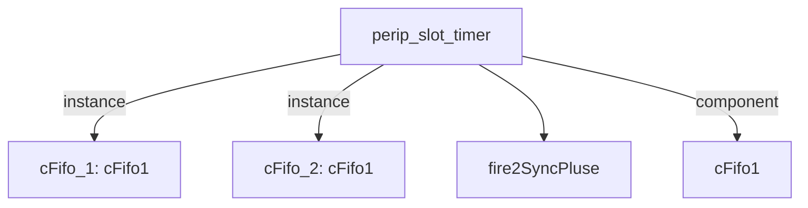

# 模块 `perip_slot_timer`

- 源文件：`rtl\rtl\IONet\IONetwork_9.24\perip_slot_timer.v`
- 职责：**AI 推断**：在 IO 网格中为外设访问提供固定延迟槽的异步事件驱动流水线，可能用于匹配外设时序或实现总线流水级。
- 说明：模块接收 `i_driveFrmMesh` 事件，经 `cFifo_1` 输入寄存、两级 delay 延迟、`cFifo_2` 输出寄存后产生 `o_driveNextToMesh`；同时用 `i_freeNextFrmMesh` 和 `o_freeToMesh` 构成反向流控。数据端口（`data_from`、`data_o`、`addr_i`、`data_i`、`data_to`）独立于事件路径，暗示数据旁路通过模块，不受事件 FIFO 控制。综合分析，该模块在网格互连中充当可编程延迟握手单元，适用于外设访问的时间槽分配。

## 1. 层级位置

- Parents：`timer_slot`
- Children：`fire2SyncPluse`
- Component children：`cFifo1`
- Upstream modules：无
- Downstream modules：无

### 1.1 本模块结构图



```text
perip_slot_timer
|-- cFifo_1: cFifo1
|-- cFifo_2: cFifo1
|-- fire2SyncPluse
`-- cFifo1
```

## 2. 输入/输出接口摘要

- 输入端口：
  - `clk`
  - `i_driveFrmMesh`
  - `i_freeNextFrmMesh`
  - `data_from`
  - `data_o`
- 输出端口：
  - `o_driveNextToMesh`
  - `o_freeToMesh`
  - `addr_i`
  - `data_i`
  - `data_to`
  - `we`

### 2.1 端口分组

| 端口组 | 方向统计 | 代表信号 |
| --- | --- | --- |
| `clock_reset_init` | input:1 | `clk` |
| `drive_event` | input:1, output:1 | `i_driveFrmMesh`, `o_driveNextToMesh` |
| `free_backpressure` | input:1, output:1 | `i_freeNextFrmMesh`, `o_freeToMesh` |
| `other_ports` | input:2, output:4 | `data_from`, `data_o`, `addr_i`, `data_i`, `data_to`, `we` |

## 3. Drive/Data/Free 契约

| Interface | 方向 | Event | Payload | Free/backpressure |
| --- | --- | --- | --- | --- |
| `i_driveFrmMesh` | input | `i_driveFrmMesh` | 未记录 | `o_freeToMesh` |
| `o_driveNextToMesh` | output | `o_driveNextToMesh` | 未记录 | `i_freeNextFrmMesh` |

## 4. 主要 Drive-centered Flow

### `i_driveFrmMesh`

- 确定性事实：`i_driveFrmMesh` → `o_driveNextToMesh`；flow_id = `flow_000_perip_slot_timer_i_driveFrmMesh`
- Payload：未记录
- 输出/影响：`o_driveNextToMesh`
- 结构复杂度：branch=0，join=0，blocking=2
- AI 推断：该流完全为控制事件传播，不携带任何数据载荷，所有接口 payload 为空。

## 5. 内部组件与 assign 影响

### 5.1 内部组件

| 实例 | 类型 | 输入事件 | 输出事件 |
| --- | --- | --- | --- |
| `cFifo_1` | `cFifo1` | `i_driveFrmMesh` | `w_drv2Fifo2` |
| `cFifo_2` | `cFifo1` | `w_drv2Fifo2_delay2` | `o_driveNextToMesh` |

### 5.2 assign 影响

| Assign | Impact area | LHS | RHS 摘要 | 解释状态 |
| --- | --- | --- | --- | --- |
| `assign_0` | data_path | `we` | (!we_r) & rise | AI 推断：产生单周期写使能脉冲，用于控制外设数据写入或 FIFO 写操作。 |
