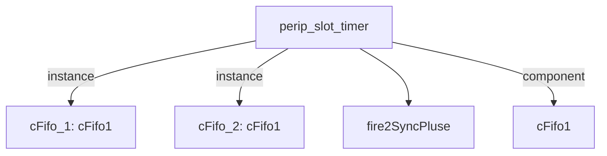

# 模块 `perip_slot_timer`

- 源文件：`rtl/rtl/IONet/IONetwork_9.24/perip_slot_timer.v`。
- 职责：AI 推断：该模块作为外围设备槽位定时器，负责在网格网络中延迟和转发驱动事件，并管理对应的释放信号。。
- 说明：模块接收来自网格的驱动事件 `i_driveFrmMesh`，通过两级 FIFO (`cFifo_1`, `cFifo_2`) 和两级延迟单元 (`delay0`, `delay1`) 进行流水线延迟处理后，输出驱动事件 `o_driveNextToMesh`。同时，它处理对应的释放信号 `i_freeNextFrmMesh` 和 `o_freeToMesh`，形成完整的驱动-释放握手协议。

## 1. 层级位置

- Parents：`timer_slot`。
- Children：`fire2SyncPluse`。
- Component children：`cFifo1`。
- Upstream modules：无。
- Downstream modules：无。

### 1.1 本模块结构图



```text
perip_slot_timer
|-- cFifo_1: cFifo1
|-- cFifo_2: cFifo1
|-- fire2SyncPluse
`-- cFifo1
```

## 2. 输入/输出接口摘要

- 接收：drive 输入：`i_driveFrmMesh`；数据输入：`data_from`, `data_o`；free 输入：`i_freeNextFrmMesh`；其他输入：`clk`。
- 输出：drive 输出：`o_driveNextToMesh`；数据输出：`addr_i`, `data_i`, `data_to`；free 输出：`o_freeToMesh`；其他输出：`we`。

### 2.1 端口分组

| 端口组 | 方向统计 | 代表信号 |
| --- | --- | --- |
| `clock_reset_init` | input:1 | `clk` |
| `drive_event` | input:1, output:1 | `i_driveFrmMesh`, `o_driveNextToMesh` |
| `free_backpressure` | input:1, output:1 | `i_freeNextFrmMesh`, `o_freeToMesh` |
| `other_ports` | input:2, output:4 | `data_from`, `data_o`, `addr_i`, `data_i`, `data_to`, `we` |

## 3. Drive/Data/Free 契约

| Interface | 方向 | Event | Payload | Free/backpressure |
| --- | --- | --- | --- | --- |
| `i_driveFrmMesh` | input | `i_driveFrmMesh` | 未记录 | `o_freeToMesh` |
| `o_driveNextToMesh` | output | `o_driveNextToMesh` | 未记录 | `i_freeNextFrmMesh` |

## 4. 主要 Drive-centered Flow

### `i_driveFrmMesh`

- 确定性事实：`i_driveFrmMesh to o_driveNextToMesh`；flow_id=`flow_000_perip_slot_timer_i_driveFrmMesh`。
- Payload：未记录。
- 输出/影响：`o_driveNextToMesh`。
- 结构复杂度：branch=0，join=0，blocking=2。
- AI 推断：文档应强调该流为纯事件传输，无数据负载，重点描述FIFO缓冲和固定延迟链的时序特性


## 5. 内部组件与 assign 影响

### 5.1 内部组件

| 实例 | 类型 | 输入事件 | 输出事件 |
| --- | --- | --- | --- |
| `cFifo_1` | `cFifo1` | `i_driveFrmMesh` | `w_drv2Fifo2` |
| `cFifo_2` | `cFifo1` | `w_drv2Fifo2_delay2` | `o_driveNextToMesh` |

### 5.2 assign 影响

| Assign | Impact area | LHS | RHS 摘要 | 解释状态 |
| --- | --- | --- | --- | --- |
| `assign_0` | unknown | `we` | (!we_r) & rise | AI 推断：该赋值生成一个写使能信号 `we`，用于控制数据写入。 |
