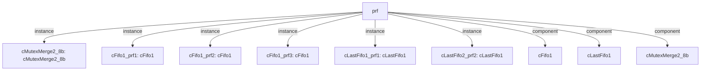

# 模块 `prf`

- 源文件：`rtl/rtl/PRF/prf.v`。
- 职责：AI 推断：物理寄存器文件模块，负责存储和转发通用寄存器（PRF）和程序状态寄存器（PSR）的值，并管理驱动事件与释放信号的握手。。
- 说明：模块通过多个Fifo1和MutexMerge组件，将来自发射、写回和异常阶段的驱动事件与对应的数据载荷（rdDataToPrf）同步，并输出驱动事件和数据到目标阶段。同时，模块管理释放信号，确保寄存器资源在消费后被正确回收。

## 1. 层级位置

- Parents：`cpu_top_all`。
- Children：无。
- Component children：`cFifo1`, `cLastFifo1`, `cMutexMerge2_8b`。
- Upstream modules：无。
- Downstream modules：无。

### 1.1 本模块结构图



```text
prf
|-- cMutexMerge2_8b: cMutexMerge2_8b
|-- cFifo1_prf1: cFifo1
|-- cFifo1_prf2: cFifo1
|-- cFifo1_prf3: cFifo1
|-- cLastFifo1_prf1: cLastFifo1
|-- cLastFifo2_prf2: cLastFifo1
|-- cFifo1
|-- cLastFifo1
`-- cMutexMerge2_8b
```

## 2. 输入/输出接口摘要

- 接收：drive 输入：`i_prfDriveFromLaunch_1`, `i_prfDriveFromWB_1`, `i_psrDriveFromExp_1`, `i_psrDriveFromLaunch_1`, `... +2`；数据输入：`i_expen_4`, `i_expnzcv_4`, `i_rdAddr_8`, `i_rdDataToPrf_32`, `... +3`；free 输入：`i_prfFreeFromLaunch_1`, `i_psrFreeFromExp_1`, `i_psrFreeFromLaunch_1`。
- 输出：drive 输出：`o_prfDriveToLaunch_1`, `o_psrDriveToExp_1`, `o_psrDriveToLaunch_1`；数据输出：`o_prfDataToLaunch_32`, `o_psrDataToExp_32`, `o_psrDataToLaunch_32`；free 输出：`o_prfFreeToLaunch_1`, `o_prfFreeToWB_1`, `o_psrFreeToExp_1`, `o_psrFreeToLaunch_1`, `... +2`。

### 2.1 端口分组

| 端口组 | 方向统计 | 代表信号 |
| --- | --- | --- |
| `drive_event` | input:6, output:3 | `i_prfDriveFromLaunch_1`, `i_prfDriveFromWB_1`, `i_psrDriveFromExp_1`, `i_psrDriveFromLaunch_1`, `i_psrDriveFromWB_1`, `i_psrwDriveFromExp_1`, `o_prfDriveToLaunch_1`, `o_psrDriveToExp_1`, `o_psrDriveToLaunch_1` |
| `free_backpressure` | input:3, output:6 | `i_prfFreeFromLaunch_1`, `i_psrFreeFromExp_1`, `i_psrFreeFromLaunch_1`, `o_prfFreeToLaunch_1`, `o_prfFreeToWB_1`, `o_psrFreeToExp_1`, `o_psrFreeToLaunch_1`, `o_psrFreeToWB_1`, `o_psrwFreeToExp_1` |
| `other_ports` | input:7, output:3 | `i_expen_4`, `i_expnzcv_4`, `i_rdAddr_8`, `i_rdDataToPrf_32`, `i_rsAddr_8`, `i_wben_4`, `i_wbnzcv_4`, `o_prfDataToLaunch_32`, `o_psrDataToExp_32`, `o_psrDataToLaunch_32` |

## 3. Drive/Data/Free 契约

| Interface | 方向 | Event | Payload | Free/backpressure |
| --- | --- | --- | --- | --- |
| `i_prfDriveFromLaunch_1` | input | `i_prfDriveFromLaunch_1` | `i_rdDataToPrf_32 [31:0]` | `o_prfFreeToLaunch_1` |
| `i_prfDriveFromWB_1` | input | `i_prfDriveFromWB_1` | `i_rdDataToPrf_32 [31:0]` | `o_prfFreeToWB_1` |
| `i_psrDriveFromExp_1` | input | `i_psrDriveFromExp_1` | `i_rdDataToPrf_32 [31:0]` | `o_psrFreeToExp_1` |
| `i_psrDriveFromLaunch_1` | input | `i_psrDriveFromLaunch_1` | `i_rdDataToPrf_32 [31:0]` | `o_prfFreeToLaunch_1` |
| `i_psrDriveFromWB_1` | input | `i_psrDriveFromWB_1` | `i_rdDataToPrf_32 [31:0]` | `o_prfFreeToWB_1` |
| `i_psrwDriveFromExp_1` | input | `i_psrwDriveFromExp_1` | `i_rdDataToPrf_32 [31:0]` | `o_psrFreeToExp_1` |
| `o_prfDriveToLaunch_1` | output | `o_prfDriveToLaunch_1` | `o_prfDataToLaunch_32 [31:0]`, `o_psrDataToLaunch_32 [31:0]` | `i_prfFreeFromLaunch_1` |
| `o_psrDriveToExp_1` | output | `o_psrDriveToExp_1` | `o_psrDataToExp_32 [31:0]` | `i_psrFreeFromExp_1` |
| `o_psrDriveToLaunch_1` | output | `o_psrDriveToLaunch_1` | `o_prfDataToLaunch_32 [31:0]`, `o_psrDataToLaunch_32 [31:0]` | `i_prfFreeFromLaunch_1` |

## 4. 主要 Drive-centered Flow

### `i_prfDriveFromLaunch_1`

- 确定性事实：`i_prfDriveFromLaunch_1 to o_prfDriveToLaunch_1`；flow_id=`flow_000_prf_i_prfDriveFromLaunch_1`。
- Payload：`i_prfDriveFromLaunch_1` -> `i_rdDataToPrf_32 [31:0]`, `o_prfDriveToLaunch_1` -> `o_prfDataToLaunch_32 [31:0]`, `o_prfDriveToLaunch_1` -> `o_psrDataToLaunch_32 [31:0]`。
- 输出/影响：`o_prfDriveToLaunch_1`。
- 结构复杂度：branch=0，join=0，blocking=1。
- AI 推断：事件驱动流o_prfDriveToLaunch_1携带两个数据载荷o_prfDataToLaunch_32和o_psrDataToLaunch_32，分别来自内部寄存器r_prfValue_32和r_psrValue_32。

### `i_prfDriveFromWB_1`

- 确定性事实：`prf flow from i_prfDriveFromWB_1`；flow_id=`flow_005_prf_i_prfDriveFromWB_1`。
- Payload：`i_prfDriveFromWB_1` -> `i_rdDataToPrf_32 [31:0]`。
- 输出/影响：证据不足：Knowledge IR did not find a module output endpoint for this flow.。
- 结构复杂度：branch=0，join=0，blocking=1。
- AI 推断：手册应强调该流是写回数据进入PRF的唯一起点，并说明FIFO缓冲器的角色

### `i_psrDriveFromExp_1`

- 确定性事实：`i_psrDriveFromExp_1 to o_psrDriveToExp_1`；flow_id=`flow_001_prf_i_psrDriveFromExp_1`。
- Payload：`i_psrDriveFromExp_1` -> `i_rdDataToPrf_32 [31:0]`, `o_psrDriveToExp_1` -> `o_psrDataToExp_32 [31:0]`。
- 输出/影响：`o_psrDriveToExp_1`。
- 结构复杂度：branch=0，join=0，blocking=1。
- AI 推断：最终手册应重点说明该驱动流是单级事件传递，并强调其数据载荷的来源（内部寄存器）与输入载荷不同，以及Fifo1实例可能引入的背压行为。

### `i_psrDriveFromLaunch_1`

- 确定性事实：`i_psrDriveFromLaunch_1 to o_psrDriveToLaunch_1`；flow_id=`flow_002_prf_i_psrDriveFromLaunch_1`。
- Payload：`i_psrDriveFromLaunch_1` -> `i_rdDataToPrf_32 [31:0]`, `o_psrDriveToLaunch_1` -> `o_prfDataToLaunch_32 [31:0]`, `o_psrDriveToLaunch_1` -> `o_psrDataToLaunch_32 [31:0]`。
- 输出/影响：`o_psrDriveToLaunch_1`。
- 结构复杂度：branch=0，join=0，blocking=1。
- AI 推断：事件信号i_psrDriveFromLaunch_1控制数据信号o_prfDataToLaunch_32和o_psrDataToLaunch_32的传递时机，但数据本身由独立寄存器驱动。

### `i_psrDriveFromWB_1`

- 确定性事实：`prf flow from i_psrDriveFromWB_1`；flow_id=`flow_003_prf_i_psrDriveFromWB_1`。
- Payload：`i_psrDriveFromWB_1` -> `i_rdDataToPrf_32 [31:0]`。
- 输出/影响：证据不足：Knowledge IR did not find a module output endpoint for this flow.。
- 结构复杂度：branch=0，join=1，blocking=2。
- AI 推断：写请求驱动携带写数据载荷，两者共同构成一次物理寄存器写操作

### `i_psrwDriveFromExp_1`

- 确定性事实：`prf flow from i_psrwDriveFromExp_1`；flow_id=`flow_004_prf_i_psrwDriveFromExp_1`。
- Payload：`i_psrwDriveFromExp_1` -> `i_rdDataToPrf_32 [31:0]`。
- 输出/影响：证据不足：Knowledge IR did not find a module output endpoint for this flow.。
- 结构复杂度：branch=0，join=1，blocking=2。
- AI 推断：事件驱动信号 i_psrwDriveFromExp_1 携带一个关联的32位写数据负载 i_rdDataToPrf_32，该负载在流中与事件并行传播。


## 5. 内部组件与 assign 影响

### 5.1 内部组件

| 实例 | 类型 | 输入事件 | 输出事件 |
| --- | --- | --- | --- |
| `cMutexMerge2_8b` | `cMutexMerge2_8b` | `i_psrDriveFromWB_1`, `i_psrwDriveFromExp_1` | `w_driveTopsr` |
| `cFifo1_prf1` | `cFifo1` | `i_prfDriveFromLaunch_1` | `o_prfDriveToLaunch_1` |
| `cFifo1_prf2` | `cFifo1` | `i_psrDriveFromLaunch_1` | `o_psrDriveToLaunch_1` |
| `cFifo1_prf3` | `cFifo1` | `i_psrDriveFromExp_1` | `o_psrDriveToExp_1` |
| `cLastFifo1_prf1` | `cLastFifo1` | `i_prfDriveFromWB_1` | 无 |
| `cLastFifo2_prf2` | `cLastFifo1` | `w_driveTopsr` | 无 |

### 5.2 assign 影响

| Assign | Impact area | LHS | RHS 摘要 | 解释状态 |
| --- | --- | --- | --- | --- |
| `assign_1` | data_path | `o_psrDataToLaunch_32` | r_psrValue_32 | AI 推断：将内部寄存器r_psrValue_32的值直接赋值给输出数据端口，用于向发射阶段提供PSR数据。 |
| `assign_2` | data_path | `o_psrDataToExp_32` | r_psrValue2_32 | AI 推断：将内部寄存器r_psrValue2_32的值直接赋值给输出数据端口，用于向异常阶段提供PSR数据。 |
| `assign_0` | data_path | `o_prfDataToLaunch_32` | r_prfValue_32 | AI 推断：将内部寄存器r_prfValue_32的值直接赋值给输出数据端口，用于向发射阶段提供PRF数据。 |
