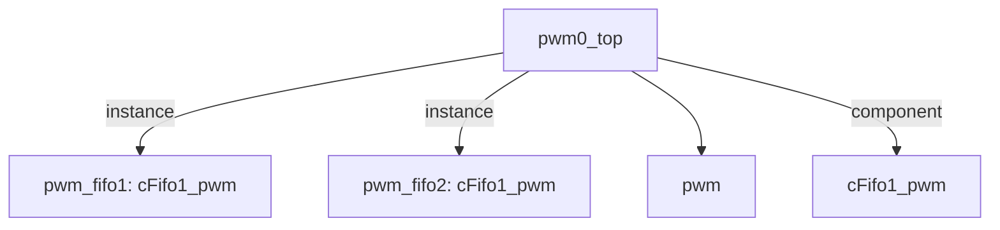

# 模块 `pwm0_top`

- 源文件：`rtl\rtl\IONet\PWM\pwm0_top.v`
- 职责：AI 推断：该模块作为 PWM 配置消息的流水线缓冲拓扑，通过两级 FIFO 在外部 handshake 接口与内部 PWM 生成模块之间实现解耦。
- 说明：模块例化了两个 `cFifo1_pwm` FIFO（`pwm_fifo1`、`pwm_fifo2`），将输入驱动事件 `i_drive` 与输出驱动事件 `o_drive` 串联，同时直接引出自身的 `pwm_out`。这种结构用于缓解配置消息传输的背压并适应时序要求，使上游能够连续发送配置字而不发生阻塞。

## 1. 层级位置

- Parents：`IONet_slot`
- Children：`pwm`
- Component children：`cFifo1_pwm`
- Upstream modules：无
- Downstream modules：无

### 1.1 本模块结构图



```text
pwm0_top
|-- pwm_fifo1: cFifo1_pwm
|-- pwm_fifo2: cFifo1_pwm
|-- pwm
`-- cFifo1_pwm
```

## 2. 输入/输出接口摘要

- 接收：驱动输入 `i_drive`；数据输入 `i_msg`；空闲指示输入 `i_free`；其他输入 `clk`、`rst_finish`。
- 输出：驱动输出 `o_drive`；数据输出 `o_msg`；空闲指示输出 `o_free`；其他输出 `pwm_out`。

### 2.1 端口分组

| 端口组 | 方向统计 | 代表信号 |
| --- | --- | --- |
| `clock_reset_init` | input: 2 | `clk`, `rst_finish` |
| `drive_event` | input: 1, output: 1 | `i_drive`, `o_drive` |
| `free_backpressure` | input: 1, output: 1 | `i_free`, `o_free` |
| `other_ports` | input: 1, output: 2 | `i_msg`, `o_msg`, `pwm_out` |

## 3. Drive/Data/Free 契约

| Interface | 方向 | Event | Payload | Free/backpressure |
| --- | --- | --- | --- | --- |
| `i_drive` | input | `i_drive` | `i_msg [50:0]` | 未记录 |
| `o_drive` | output | `o_drive` | `o_msg [50:0]` | 未记录 |

## 4. 主要 Drive‑centered Flow

### `i_drive`

- 确定性事实：`i_drive` 到 `o_drive` 的流向；flow_id：`flow_000_pwm0_top_i_drive`。
- Payload：`i_drive` → `i_msg [50:0]`，`o_drive` → `o_msg [50:0]`。
- 输出/影响：`o_drive`。
- 结构复杂度：branch=0，join=0，blocking=2。
- AI 推断：手册应当突出 `i_drive → pwm_fifo1 → pwm_fifo2 → o_drive` 的确定路径、两级缓冲可能引入的延迟，以及输出数据 `o_msg` 与驱动事件的时序关系；避免对 FIFO 满/空或反压行为进行猜测。

## 5. 内部组件与 assign 影响

### 5.1 内部组件

| 实例 | 类型 | 输入事件 | 输出事件 |
| --- | --- | --- | --- |
| `pwm_fifo1` | `cFifo1_pwm` | `i_drive` | `o_drive_in` |
| `pwm_fifo2` | `cFifo1_pwm` | `o_drive_in` | `o_drive` |

### 5.2 assign 影响

| Assign | Impact area | LHS | RHS 摘要 | 解释状态 |
| --- | --- | --- | --- | --- |
| `assign_0` | unknown | `o_msg` | o_msg_reg | 证据不足：No Semantic Layer assignment interpretation is available. |
