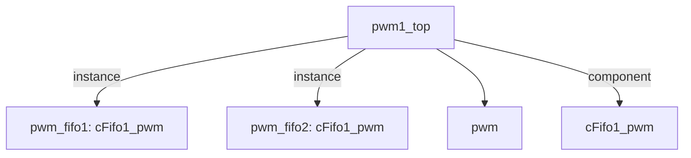

# 模块 `pwm1_top`

- 源文件：`rtl\rtl\IONet\PWM\pwm1_top.v`。
- 职责：AI 推断：该模块是一个基于事件驱动的PWM控制通路，通过两级FIFO流水线处理驱动事件并输出PWM波形。。
- 说明：模块通过i_drive事件输入触发，经过pwm_fifo1和pwm_fifo2两级FIFO流水线，最终由pwm_module产生pwm_out输出。i_msg和o_msg作为事件关联的载荷数据，表明模块在事件传递过程中携带配置或状态信息。

## 1. 层级位置

- Parents：`IONet_slot`。
- Children：`pwm`。
- Component children：`cFifo1_pwm`。
- Upstream modules：无。
- Downstream modules：无。

### 1.1 本模块结构图



```text
pwm1_top
|-- pwm_fifo1: cFifo1_pwm
|-- pwm_fifo2: cFifo1_pwm
|-- pwm
`-- cFifo1_pwm
```

## 2. 输入/输出接口摘要

- 接收：drive 输入：`i_drive`；数据输入：`i_msg`；free 输入：`i_free`；其他输入：`clk`, `rst_finish`。
- 输出：drive 输出：`o_drive`；数据输出：`o_msg`；free 输出：`o_free`；其他输出：`pwm_out`。

### 2.1 端口分组

| 端口组 | 方向统计 | 代表信号 |
| --- | --- | --- |
| `clock_reset_init` | input:2 | `clk`, `rst_finish` |
| `drive_event` | input:1, output:1 | `i_drive`, `o_drive` |
| `free_backpressure` | input:1, output:1 | `i_free`, `o_free` |
| `other_ports` | input:1, output:2 | `i_msg`, `o_msg`, `pwm_out` |

## 3. Drive/Data/Free 契约

| Interface | 方向 | Event | Payload | Free/backpressure |
| --- | --- | --- | --- | --- |
| `i_drive` | input | `i_drive` | `i_msg [50:0]` | 未记录 |
| `o_drive` | output | `o_drive` | `o_msg [50:0]` | 未记录 |

## 4. 主要 Drive-centered Flow

### `i_drive`

- 确定性事实：`i_drive to o_drive`；flow_id=`flow_000_pwm1_top_i_drive`。
- Payload：`i_drive` -> `i_msg [50:0]`, `o_drive` -> `o_msg [50:0]`。
- 输出/影响：`o_drive`。
- 结构复杂度：branch=0，join=0，blocking=2。
- AI 推断：手册应重点描述 i_drive 到 o_drive 的流水线传递，以及 FIFO 实例的阻塞行为。


## 5. 内部组件与 assign 影响

### 5.1 内部组件

| 实例 | 类型 | 输入事件 | 输出事件 |
| --- | --- | --- | --- |
| `pwm_fifo1` | `cFifo1_pwm` | `i_drive` | `o_drive_in` |
| `pwm_fifo2` | `cFifo1_pwm` | `o_drive_in` | `o_drive` |

### 5.2 assign 影响

| Assign | Impact area | LHS | RHS 摘要 | 解释状态 |
| --- | --- | --- | --- | --- |
| `assign_0` | unknown | `o_msg` | o_msg_reg | AI 推断：o_msg由内部寄存器o_msg_reg驱动，表明输出载荷数据在模块内部被寄存。 |
