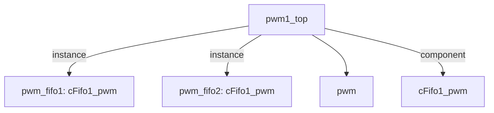

# 模块 `pwm1_top`

- 源文件：`rtl\rtl\IONet\PWM\pwm1_top.v`
- **职责（AI 推断）**：作为 PWM 外设的顶层流控包装模块，将输入配置数据的有效/就绪握手流水线化后驱动内部 PWM 发生器，并对外提供波形输出。
- 说明：模块内部例化了两个 `cFifo1_pwm` 实例，构成双级 FIFO 流水线。事件流从 `i_drive` 经过两级 FIFO 传递至 `o_drive`，反向的 `i_free` / `o_free` 链实现背压控制。此外还连接了一个 `pwm` 模块实例以产生 `pwm_out` 波形，推测 FIFO 缓冲后的数据最终提供给该模块用于生成 PWM 输出。

## 1. 层级位置

- Parents：`IONet_slot`
- Children：`pwm`
- Component children：`cFifo1_pwm`
- Upstream modules：无
- Downstream modules：无

### 1.1 本模块结构图



```text
pwm1_top
|-- pwm_fifo1: cFifo1_pwm
|-- pwm_fifo2: cFifo1_pwm
|-- pwm
`-- cFifo1_pwm
```

## 2. 输入/输出接口摘要

- **接收**：drive 输入 `i_drive`，数据输入 `i_msg`，free 输入 `i_free`，其他输入 `clk`、`rst_finish`。
- **输出**：drive 输出 `o_drive`，数据输出 `o_msg`，free 输出 `o_free`，其他输出 `pwm_out`。

### 2.1 端口分组

| 端口组 | 方向统计 | 代表信号 |
| --- | --- | --- |
| `clock_reset_init` | input:2 | `clk`、`rst_finish` |
| `drive_event` | input:1, output:1 | `i_drive`、`o_drive` |
| `free_backpressure` | input:1, output:1 | `i_free`、`o_free` |
| `other_ports` | input:1, output:2 | `i_msg`、`o_msg`、`pwm_out` |

## 3. Drive/Data/Free 契约

| Interface | 方向 | Event | Payload | Free/backpressure |
| --- | --- | --- | --- | --- |
| `i_drive` | input | `i_drive` | `i_msg [50:0]` | 未记录 |
| `o_drive` | output | `o_drive` | `o_msg [50:0]` | 未记录 |

## 4. 主要 Drive-centered Flow

### `i_drive`

- **确定性事实**：存在从 `i_drive` 到 `o_drive` 的流转（flow_id=`flow_000_pwm1_top_i_drive`）。
- **Payload**：`i_drive` 关联 `i_msg [50:0]`，`o_drive` 关联 `o_msg [50:0]`。
- **输出/影响**：驱动 `o_drive`。
- **结构复杂度**：branch=0，join=0，blocking=2。
- **AI 推断**：最终手册应突出两个同类型 FIFO 的级联用途，并谨慎描述数据转发能力。

## 5. 内部组件与 assign 影响

### 5.1 内部组件

| 实例 | 类型 | 输入事件 | 输出事件 |
| --- | --- | --- | --- |
| `pwm_fifo1` | `cFifo1_pwm` | `i_drive` | `o_drive_in` |
| `pwm_fifo2` | `cFifo1_pwm` | `o_drive_in` | `o_drive` |

### 5.2 assign 影响

| Assign | 影响范围 | LHS | RHS 摘要 | 解释状态 |
| --- | --- | --- | --- | --- |
| `assign_0` | unknown | `o_msg` | o_msg_reg | **证据不足**：缺少语义层赋值解释。 |
