# 模块 `routeMsg`

- 源文件：`rtl\rtl\IONet\IONetwork_9.24\routeMsg.v`
- 职责：**AI 推断**：`routeMsg` 是 NoC 二维网格中的一个消息路由节点，将单个入口消息根据外部方向有效性信号选择性地转发至东、西、北、南或本地端口。
- 说明：接口包含一个数据输入 `i_msg_51` 和五个方向的数据输出 (`o_eastMsg_51`, `o_localMsg_51`, `o_northMsg_51`, `o_southMsg_51`, `o_westMsg_51`)，一个事件输入 `i_drive` 和五个方向的事件输出 (`o_driveEArb`, `o_driveLArb`, `o_driveNArb`, `o_driveSArb`, `o_driveWArb`)；内部通过 `dirFork` 根据来自 `westToEast` / `eastToWest` 的有效性信号 `w_westVld` / `w_eastVld` 及派生的优先级逻辑 `w_northVld`、`w_southVld`、`w_localVld`，将接收驱动事件分配到各方向的延迟路径，最终触发发送 FIFO 产生输出事件；自由信号 `i_freeEArb` / `i_freeLArb` / `i_freeNArb` / `i_freeSArb` / `i_freeWArb` 提供下游流控反馈，`o_free` 源自 `receiveFifo` 表征接收能力。整体结构符合路由器功能。

## 1. 层级位置

- Parents：`nodeTop`
- Children：`routeMsgEW`, `routeMsgSN`, `subtr4b`
- Component children：`cCondFork5`, `cFifo1`
- Upstream modules：无
- Downstream modules：无

### 1.1 本模块结构图

```mermaid
flowchart TB
  routeMsg["routeMsg"] -->|instance| dirFork_cCondFork5["dirFork: cCondFork5"]
  routeMsg -->|instance| eastSendFifo_cFifo1["eastSendFifo: cFifo1"]
  routeMsg -->|instance| localSendFifo_cFifo1["localSendFifo: cFifo1"]
  routeMsg -->|instance| northSendFifo_cFifo1["northSendFifo: cFifo1"]
  routeMsg -->|instance| receiveFifo_cFifo1["receiveFifo: cFifo1"]
  routeMsg -->|instance| southSendFifo_cFifo1["southSendFifo: cFifo1"]
  routeMsg -->|instance| westSendFifo_cFifo1["westSendFifo: cFifo1"]
  routeMsg --> routeMsgEW["routeMsgEW"]
  routeMsg --> routeMsgSN["routeMsgSN"]
  routeMsg --> subtr4b["subtr4b"]
  routeMsg -->|component| cCondFork5["cCondFork5"]
  routeMsg -->|component| cFifo1["cFifo1"]
```



```text
routeMsg
|-- dirFork: cCondFork5
|-- eastSendFifo: cFifo1
|-- localSendFifo: cFifo1
|-- northSendFifo: cFifo1
|-- receiveFifo: cFifo1
|-- southSendFifo: cFifo1
|-- westSendFifo: cFifo1
|-- routeMsgEW
|-- routeMsgSN
|-- subtr4b
|-- cCondFork5
`-- cFifo1
```

## 2. 输入/输出接口摘要

- **接收**  
  - 驱动事件：`i_drive`  
  - 数据：`i_msg_51`  
  - 自由/背压：`i_freeEArb`, `i_freeLArb`, `i_freeNArb`, `i_freeSArb`, `i_freeWArb`
- **输出**  
  - 驱动事件：`o_driveEArb`, `o_driveLArb`, `o_driveNArb`, `o_driveSArb`, `o_driveWArb`  
  - 数据：`o_eastMsg_51`, `o_localMsg_51`, `o_northMsg_51`, `o_southMsg_51`, `o_westMsg_51`  
  - 自由/背压：`o_free`

### 2.1 端口分组

| 端口组 | 方向统计 | 代表信号 |
| --- | --- | --- |
| `drive_event` | input:1, output:5 | `i_drive`, `o_driveEArb`, `o_driveLArb`, `o_driveNArb`, `o_driveSArb`, `o_driveWArb` |
| `free_backpressure` | input:5, output:1 | `i_freeEArb`, `i_freeLArb`, `i_freeNArb`, `i_freeSArb`, `i_freeWArb`, `o_free` |
| `data_ports` | input:1, output:5 | `i_msg_51`, `o_eastMsg_51`, `o_localMsg_51`, `o_northMsg_51`, `o_southMsg_51`, `o_westMsg_51` |

## 3. Drive/Data/Free 契约

| Interface | 方向 | Event | Payload | Free/backpressure |
| --- | --- | --- | --- | --- |
| `i_drive` | input | `i_drive` | `i_msg_51 [50:0]` | 未记录 |
| `o_driveEArb` | output | `o_driveEArb` | 未记录 | `i_freeEArb` |
| `o_driveLArb` | output | `o_driveLArb` | 未记录 | `i_freeLArb` |
| `o_driveNArb` | output | `o_driveNArb` | 未记录 | `i_freeNArb` |
| `o_driveSArb` | output | `o_driveSArb` | 未记录 | `i_freeSArb` |
| `o_driveWArb` | output | `o_driveWArb` | 未记录 | `i_freeWArb` |

## 4. 主要 Drive‑centered Flow

### `i_drive`

- **确定性事实**：`i_drive` → `o_driveEArb`, `o_driveLArb`, `o_driveNArb` （以及 `o_driveSArb`, `o_driveWArb`）  
  flow_id=`flow_000_routeMsg_i_drive`
- **Payload**：`i_drive` 触发时，数据取自 `i_msg_51 [50:0]`
- **输出/影响**：`o_driveEArb`, `o_driveLArb`, `o_driveNArb`, `o_driveSArb`, `o_driveWArb`
- **结构复杂度**：branch=1, join=0, blocking=6
- **AI 推断**：将输入驱动事件 `i_drive` 经过缓冲、延迟和方向分叉后，分发至五个方向（东/本地/北/南/西）的输出仲裁器。

## 5. 内部组件与 assign 影响

### 5.1 内部组件

| 实例 | 类型 | 输入事件 | 输出事件 |
| --- | --- | --- | --- |
| `dirFork` | `cCondFork5` | `w_driveFork_delay` | `w_driveEFifo_t`, `w_driveLFifo_t`, `w_driveNFifo_t`, `w_driveSFifo_t`, `w_driveWFifo_t` |
| `eastSendFifo` | `cFifo1` | `w_driveEFifo` | `o_driveEArb` |
| `localSendFifo` | `cFifo1` | `w_driveLFifo` | `o_driveLArb` |
| `northSendFifo` | `cFifo1` | `w_driveNFifo` | `o_driveNArb` |
| `receiveFifo` | `cFifo1` | `i_drive` | `w_driveFork` |
| `southSendFifo` | `cFifo1` | `w_driveSFifo` | `o_driveSArb` |
| `westSendFifo` | `cFifo1` | `w_driveWFifo` | `o_driveWArb` |

### 5.2 assign 影响

> 以下 assign 均为 **AI 推断**，可能存在误差，需要源码复核。

| Assign | 影响范围 | LHS | RHS 摘要 | 解释 |
| --- | --- | --- | --- | --- |
| `assign_6` | unknown | `w_northVld` | `w_northVldSN & ~(w_eastVld \| w_westVld)` | AI 推断：北向有效信号，在东西向均无效且北向次级信号 `w_northVldSN` 有效时置位，实现方向优先级。 |
| `assign_8` | unknown | `w_southVld` | `w_southVldNS & ~(w_eastVld \| w_westVld)` | AI 推断：南向有效信号，在东西向均无效且南向次级信号 `w_southVldNS` 有效时置位。 |
| `assign_9` | unknown | `w_localVld` | `~(w_westVld \| w_eastVld \| w_southVld \| w_northVld)` | AI 推断：本地有效信号，在所有外部方向都无效时置位，确保消息最终被本地消费。 |
| `assign_16` | unknown | `o_westMsg_51` | `r_wMsg_51` | AI 推断：将内部寄存器 `r_wMsg_51` 直连到输出端口，提供西向消息数据。 |
| `assign_17` | unknown | `o_localMsg_51` | `r_lMsg_51` | AI 推断：将内部寄存器 `r_lMsg_51` 直连到输出，提供本地消息数据。 |
| `assign_18` | unknown | `o_eastMsg_51` | `r_eMsg_51` | AI 推断：将内部寄存器 `r_eMsg_51` 直连到输出，提供东向消息数据。 |
| `assign_19` | unknown | `o_northMsg_51` | `r_nMsg_51` | AI 推断：将内部寄存器 `r_nMsg_51` 直连到输出，提供北向消息数据。 |
| `assign_20` | unknown | `o_southMsg_51` | `r_sMsg_51` | AI 推断：将内部寄存器 `r_sMsg_51` 直连到输出，提供南向消息数据。 |
