# 模块 `routeMsg`

- 源文件：`rtl\rtl\IONet\IONetwork_9.24\routeMsg.v`。
- 职责：AI 推断：路由模块，将输入消息根据方向选择分发到五个输出方向（东、本地、北、南、西）。。
- 说明：模块接收一个输入驱动事件和关联的51位消息负载，通过内部组件（接收FIFO、方向分叉、延迟单元、发送FIFO）处理后，生成五个方向的事件输出和对应的消息输出。方向选择由内部仲裁逻辑（基于w_eastVld、w_westVld等信号）决定。

## 1. 层级位置

- Parents：`nodeTop`。
- Children：`routeMsgEW`, `routeMsgSN`, `subtr4b`。
- Component children：`cCondFork5`, `cFifo1`。
- Upstream modules：无。
- Downstream modules：无。

### 1.1 本模块结构图

```mermaid
flowchart TB
  routeMsg["routeMsg"] -->|instance| dirFork_cCondFork5["dirFork: cCondFork5"]
  routeMsg -->|instance| eastSendFifo_cFifo1["eastSendFifo: cFifo1"]
  routeMsg -->|instance| localSendFifo_cFifo1["localSendFifo: cFifo1"]
  routeMsg -->|instance| northSendFifo_cFifo1["northSendFifo: cFifo1"]
  routeMsg -->|instance| receiveFifo_cFifo1["receiveFifo: cFifo1"]
  routeMsg -->|instance| southSendFifo_cFifo1["southSendFifo: cFifo1"]
  routeMsg -->|instance| westSendFifo_cFifo1["westSendFifo: cFifo1"]
  routeMsg --> routeMsgEW["routeMsgEW"]
  routeMsg --> routeMsgSN["routeMsgSN"]
  routeMsg --> subtr4b["subtr4b"]
  routeMsg -->|component| cCondFork5["cCondFork5"]
  routeMsg -->|component| cFifo1["cFifo1"]
```



```text
routeMsg
|-- dirFork: cCondFork5
|-- eastSendFifo: cFifo1
|-- localSendFifo: cFifo1
|-- northSendFifo: cFifo1
|-- receiveFifo: cFifo1
|-- southSendFifo: cFifo1
|-- westSendFifo: cFifo1
|-- routeMsgEW
|-- routeMsgSN
|-- subtr4b
|-- cCondFork5
`-- cFifo1
```

## 2. 输入/输出接口摘要

- 接收：drive 输入：`i_drive`；数据输入：`i_msg_51`；free 输入：`i_freeEArb`, `i_freeLArb`, `i_freeNArb`, `i_freeSArb`, `... +1`。
- 输出：drive 输出：`o_driveEArb`, `o_driveLArb`, `o_driveNArb`, `o_driveSArb`, `... +1`；数据输出：`o_eastMsg_51`, `o_localMsg_51`, `o_northMsg_51`, `o_southMsg_51`, `... +1`；free 输出：`o_free`。

### 2.1 端口分组

| 端口组 | 方向统计 | 代表信号 |
| --- | --- | --- |
| `drive_event` | input:1, output:5 | `i_drive`, `o_driveEArb`, `o_driveLArb`, `o_driveNArb`, `o_driveSArb`, `o_driveWArb` |
| `free_backpressure` | input:5, output:1 | `i_freeEArb`, `i_freeLArb`, `i_freeNArb`, `i_freeSArb`, `i_freeWArb`, `o_free` |
| `other_ports` | input:1, output:5 | `i_msg_51`, `o_eastMsg_51`, `o_localMsg_51`, `o_northMsg_51`, `o_southMsg_51`, `o_westMsg_51` |

## 3. Drive/Data/Free 契约

| Interface | 方向 | Event | Payload | Free/backpressure |
| --- | --- | --- | --- | --- |
| `i_drive` | input | `i_drive` | `i_msg_51 [50:0]` | 未记录 |
| `o_driveEArb` | output | `o_driveEArb` | 未记录 | `i_freeEArb` |
| `o_driveLArb` | output | `o_driveLArb` | 未记录 | `i_freeLArb` |
| `o_driveNArb` | output | `o_driveNArb` | 未记录 | `i_freeNArb` |
| `o_driveSArb` | output | `o_driveSArb` | 未记录 | `i_freeSArb` |
| `o_driveWArb` | output | `o_driveWArb` | 未记录 | `i_freeWArb` |

## 4. 主要 Drive-centered Flow

### `i_drive`

- 确定性事实：`i_drive to o_driveEArb, o_driveLArb, o_driveNArb`；flow_id=`flow_000_routeMsg_i_drive`。
- Payload：`i_drive` -> `i_msg_51 [50:0]`。
- 输出/影响：`o_driveEArb`, `o_driveLArb`, `o_driveNArb`, `o_driveSArb`, `o_driveWArb`。
- 结构复杂度：branch=1，join=0，blocking=6。
- AI 推断：手册应强调事件从输入到五个方向的分发路径、FIFO缓冲点和延迟单元


## 5. 内部组件与 assign 影响

### 5.1 内部组件

| 实例 | 类型 | 输入事件 | 输出事件 |
| --- | --- | --- | --- |
| `dirFork` | `cCondFork5` | `w_driveFork_delay` | `w_driveEFifo_t`, `w_driveLFifo_t`, `w_driveNFifo_t`, `w_driveSFifo_t`, `w_driveWFifo_t` |
| `eastSendFifo` | `cFifo1` | `w_driveEFifo` | `o_driveEArb` |
| `localSendFifo` | `cFifo1` | `w_driveLFifo` | `o_driveLArb` |
| `northSendFifo` | `cFifo1` | `w_driveNFifo` | `o_driveNArb` |
| `receiveFifo` | `cFifo1` | `i_drive` | `w_driveFork` |
| `southSendFifo` | `cFifo1` | `w_driveSFifo` | `o_driveSArb` |
| `westSendFifo` | `cFifo1` | `w_driveWFifo` | `o_driveWArb` |

### 5.2 assign 影响

| Assign | Impact area | LHS | RHS 摘要 | 解释状态 |
| --- | --- | --- | --- | --- |
| `assign_6` | unknown | `w_northVld` | w_northVldSN & ~(w_eastVld \| w_westVld) | AI 推断：方向仲裁逻辑，根据东/西方向有效信号优先级决定北、南、本地方向的有效性。 |
| `assign_8` | unknown | `w_southVld` | w_southVldNS & ~(w_eastVld \| w_westVld) | AI 推断：方向仲裁逻辑，根据东/西方向有效信号优先级决定北、南、本地方向的有效性。 |
| `assign_9` | unknown | `w_localVld` | ~(w_westVld \| w_eastVld \| w_southVld \| w_northVld) | AI 推断：方向仲裁逻辑，根据东/西方向有效信号优先级决定北、南、本地方向的有效性。 |
| `assign_16` | unknown | `o_westMsg_51` | r_wMsg_51 | AI 推断：消息输出赋值，将内部寄存器信号直接连接到模块输出端口。 |
| `assign_17` | unknown | `o_localMsg_51` | r_lMsg_51 | AI 推断：消息输出赋值，将内部寄存器信号直接连接到模块输出端口。 |
| `assign_18` | unknown | `o_eastMsg_51` | r_eMsg_51 | AI 推断：消息输出赋值，将内部寄存器信号直接连接到模块输出端口。 |
| `assign_19` | unknown | `o_northMsg_51` | r_nMsg_51 | AI 推断：消息输出赋值，将内部寄存器信号直接连接到模块输出端口。 |
| `assign_20` | unknown | `o_southMsg_51` | r_sMsg_51 | AI 推断：消息输出赋值，将内部寄存器信号直接连接到模块输出端口。 |
