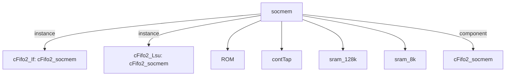

# 模块 `socmem`

- 源文件：`rtl\rtl\memory\socmem.v`
- 职责：AI 推断——作为SoC内存子系统，集成指令与数据缓存、堆栈及ROM，通过双通道流水线握手协议管理访问请求与响应。
- 说明：基于接口中独立的驱动/释放线对（`i_driveFrmIf`/`o_driveNextToIf` 与 `i_driveFrmLsu`/`o_driveNextToLsu`）及两个方向的数据路径，该模块同时服务于取指（IF）与加载存储（LSU）两条独立流水线通道。内部 FIFO 和延迟链实现访问握手流水化；地址译码将 D 侧数据读出来源在 DCache 与栈之间选择，I 侧数据读出来源在 ICache 与 ROM 之间切换。

## 1. 层级位置

- 父模块：`memory_slot`
- 子模块：`ROM`、`contTap`、`sram_128k`、`sram_8k`
- 组件子模块：`cFifo2_socmem`
- 上游模块：无
- 下游模块：无

### 1.1 本模块结构图



```text
socmem
|-- cFifo2_If: cFifo2_socmem
|-- cFifo2_Lsu: cFifo2_socmem
|-- ROM
|-- contTap
|-- sram_128k
|-- sram_8k
`-- cFifo2_socmem
```

## 2. 输入/输出接口摘要

- 接收：  
  - drive 输入：`i_driveFrmIf`、`i_driveFrmLsu`  
  - 数据输入：`i_daddress_32`、`i_ddataW_64`、`i_iaddress_33`、`i_idataW_64`  
  - 控制输入：`i_dwen_8`、`i_iwen_8`  
  - free 输入：`i_freeNextFrmIf`、`i_freeNextFrmLsu`  
  - 其他输入：`clk`、`init_sig`
- 输出：  
  - drive 输出：`o_driveNextToIf`、`o_driveNextToLsu`  
  - 数据输出：`o_ddataR_64`、`o_idataR_65`  
  - free 输出：`o_freeToIf`、`o_freeToLsu`

### 2.1 端口分组

| 端口组 | 方向统计 | 代表信号 |
| --- | --- | --- |
| `clock_reset_init` | input:1 | `clk` |
| `drive_event` | input:2, output:2 | `i_driveFrmIf`, `i_driveFrmLsu`, `o_driveNextToIf`, `o_driveNextToLsu` |
| `free_backpressure` | input:2, output:2 | `i_freeNextFrmIf`, `i_freeNextFrmLsu`, `o_freeToIf`, `o_freeToLsu` |
| `other_ports` | input:7, output:2 | `i_daddress_32`, `i_ddataW_64`, `i_iaddress_33`, `i_idataW_64`, `o_ddataR_64`, `o_idataR_65`, `i_dwen_8`, `i_iwen_8`, `init_sig` |

## 3. Drive/Data/Free 契约

| Interface | 方向 | Event | Payload | Free/backpressure |
| --- | --- | --- | --- | --- |
| `i_driveFrmIf` | input | `i_driveFrmIf` | 未记录 | `o_freeToIf` |
| `i_driveFrmLsu` | input | `i_driveFrmLsu` | 未记录 | `o_freeToLsu` |
| `o_driveNextToIf` | output | `o_driveNextToIf` | 未记录 | `i_freeNextFrmIf` |
| `o_driveNextToLsu` | output | `o_driveNextToLsu` | 未记录 | `i_freeNextFrmLsu` |

## 4. 主要 Drive-centered Flow

### `i_driveFrmIf`

- 确定性事实：`i_driveFrmIf → o_driveNextToIf`；flow_id=`flow_000_socmem_i_driveFrmIf`
- Payload：未记录
- 输出/影响：`o_driveNextToIf`
- 结构复杂度：branch=0，join=0，blocking=1
- AI 推断：最终手册应突出 `i_driveFrmIf` 到 `o_driveNextToIf` 的固定延迟构成，并说明其无反压设计。

### `i_driveFrmLsu`

- 确定性事实：`i_driveFrmLsu → o_driveNextToLsu`；flow_id=`flow_001_socmem_i_driveFrmLsu`
- Payload：未记录
- 输出/影响：`o_driveNextToLsu`
- 结构复杂度：branch=0，join=0，blocking=1
- AI 推断：该驱动流将来自 LSU 的输入事件 `i_driveFrmLsu` 经过 FIFO 缓冲和两级透明延迟后传播到输出 `o_driveNextToLsu`，形成一条带有反压能力的同步驱动流水线。

## 5. 内部组件与 assign 影响

### 5.1 内部组件

| 实例 | 类型 | 输入事件 | 输出事件 |
| --- | --- | --- | --- |
| `cFifo2_If` | `cFifo2_socmem` | `w_driveFrmIfDelay_1` | `w_driveNextToIf[0]` |
| `cFifo2_Lsu` | `cFifo2_socmem` | `i_driveFrmLsu` | `w_driveNextToLsu[0]` |

### 5.2 assign 影响

| Assign | 影响区域 | LHS | RHS 摘要 | 解释状态 |
| --- | --- | --- | --- | --- |
| `assign_2` | control_path | `o_freeToIf` | `o_driveNextToIf` | 证据不足：No Semantic Layer assignment interpretation is available. |
| `assign_3` | control_path | `o_idataR_65` | `(routeSelect==1) ? {o_idataR_t_64,r_iaddrcarry} : {w_idataROM_64,r_iaddrcarry}` | 证据不足：No Semantic Layer assignment interpretation is available. |
| `assign_4` | control_path | `o_freeToLsu` | `o_driveNextToLsu` | 证据不足：No Semantic Layer assignment interpretation is available. |
| `assign_5` | data_path | `o_ddataR_64` | `(r_daddress_32<32'h00041200) ? o_ddataR_t_64 : o_ddataR_tStack_64` | 证据不足：No Semantic Layer assignment interpretation is available. |
