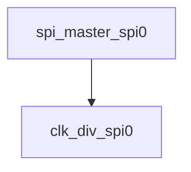

# 模块 `spi_master_spi0`

- 源文件：`rtl\rtl\IONet\SPI\SPI0\spi_master_spi0.v`。
- 职责：AI 推断：SPI主控制器模块，负责将并行数据转换为串行SPI协议输出，并接收串行数据转换为并行输出。。
- 说明：模块具有数据输入(data_in)和数据输出(data_out)接口，以及控制寄存器(CR)和时钟分频输出(sclk_cnt_div)，表明其核心功能是SPI协议的数据收发与控制。内部连接了时钟分频器实例(clk_div_u)，用于生成SPI时钟。

## 1. 层级位置

- Parents：`flash_state`。
- Children：`clk_div_spi0`。
- Component children：无。
- Upstream modules：无。
- Downstream modules：无。

### 1.1 本模块结构图



```text
spi_master_spi0
`-- clk_div_spi0
```

## 2. 输入/输出接口摘要

- 接收：数据输入：`CR`, `data_in`；其他输入：`DR_r`, `DR_w`, `clk`, `rst_n`, `... +2`。
- 输出：数据输出：`data_out`, `sclk_cnt_div`；其他输出：`RXNE`, `TXE`, `nss_out`, `rx_done`, `... +3`。

### 2.1 端口分组

| 端口组 | 方向统计 | 代表信号 |
| --- | --- | --- |
| `clock_reset_init` | input:2, output:2 | `sclk_cnt_div`, `clk`, `rst_n`, `sclk_out` |
| `serial_boot_uart` | output:2 | `rx_done`, `tx_done` |
| `other_ports` | input:6, output:5 | `CR`, `data_in`, `data_out`, `DR_r`, `DR_w`, `rx`, `w_en`, `RXNE`, `TXE`, `nss_out`, `... +1` |

## 3. Drive/Data/Free 契约

| Interface | 方向 | Event | Payload | Free/backpressure |
| --- | --- | --- | --- | --- |
| `data_inputs` | input | - | `CR [7:0]`, `data_in [31:0]` | 未记录 |
| `data_outputs` | output | - | `data_out [31:0]`, `sclk_cnt_div [5:0]` | 未记录 |

## 4. 主要 Drive-centered Flow

- 证据不足：Manual Context 未提供本模块 drive flow。

## 5. 内部组件与 assign 影响

### 5.1 内部组件

| 实例 | 类型 | 输入事件 | 输出事件 |
| --- | --- | --- | --- |
| - | - | - | Manual Context 未提供 primary internal component |

### 5.2 assign 影响

| Assign | Impact area | LHS | RHS 摘要 | 解释状态 |
| --- | --- | --- | --- | --- |
| `assign_1` | unknown | `rx_done` | (~rx_cnt[5]) & cnt_buf_rx | AI 推断：指示SPI接收完成，由接收计数器高位和缓冲控制信号共同判定。 |
| `assign_2` | unknown | `tx_done` | CPHA ? (~tx_cnt[5]) & cnt_buf_tx : (~tx_cnt[4]) & cnt_buf_tx | AI 推断：指示SPI发送完成，其判定条件受CPHA模式影响，不同相位下使用不同的计数器高位。 |
| `assign_0` | unknown | `sclk_out` | CPOL ? ~sclk_out_div : sclk_out_div | AI 推断：根据CPOL极性选择输出时钟极性，实现SPI时钟极性的可配置性。 |
