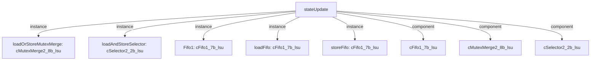

# 模块 `stateUpdate`

- 源文件：`rtl\rtl\Lsu\stateUpdate.v`
- 职责：AI 推断：管理 LSU 中 load/store 指令的状态序列，接收更新触发，对指令进行分类后推动状态迁移，并对外输出当前状态有效向量和错位指示。
- 说明：该模块由 `i_driveFromUpdateSplitter_1` 事件驱动，携带 7 位数据。数据首先进入 FIFO 进行缓冲，随后由 `loadAndStoreSelector` 根据指令类型分流至 load FIFO 或 store FIFO，最终通过 `loadOrStoreMutexMerge` 合并后触发下游的状态选择器。组合逻辑同时产生 `o_stateValid_12` 和 `o_misaligned_1`，且内部依赖 idle 等状态信号，表明模块的核心功能为状态更新控制，而非单纯的数据通路。

## 1. 层级位置

- Parents：`lsu`
- Children：无
- Component children：`cFifo1_7b_lsu`、`cMutexMerge2_8b_lsu`、`cSelector2_2b_lsu`
- Upstream modules：无
- Downstream modules：无

### 1.1 本模块结构图



```text
stateUpdate
|-- loadOrStoreMutexMerge: cMutexMerge2_8b_lsu
|-- loadAndStoreSelector: cSelector2_2b_lsu
|-- Fifo1: cFifo1_7b_lsu
|-- loadFifo: cFifo1_7b_lsu
|-- storeFifo: cFifo1_7b_lsu
|-- cFifo1_7b_lsu
|-- cMutexMerge2_8b_lsu
`-- cSelector2_2b_lsu
```

## 2. 输入/输出接口摘要

- 接收：drive 输入 `i_driveFromUpdateSplitter_1`；数据输入 `i_fromUpdateSplitterData_7`；free 输入 `i_freeFromStateUpdateSelector_1`
- 输出：drive 输出 `o_driveToStateUpdateSelector_1`；控制输出 `o_stateValid_12`；free 输出 `o_freeToUpdateSplitter_1`；其他输出 `o_misaligned_1`

### 2.1 端口分组

| 端口组 | 方向统计 | 代表信号 |
| --- | --- | --- |
| `drive_event` | input:1, output:1 | `i_driveFromUpdateSplitter_1`、`o_driveToStateUpdateSelector_1` |
| `free_backpressure` | input:1, output:1 | `i_freeFromStateUpdateSelector_1`、`o_freeToUpdateSplitter_1` |
| `other_ports` | input:1, output:2 | `i_fromUpdateSplitterData_7`、`o_stateValid_12`、`o_misaligned_1` |

## 3. Drive/Data/Free 契约

| Interface | 方向 | Event | Payload | Free/backpressure |
| --- | --- | --- | --- | --- |
| `i_driveFromUpdateSplitter_1` | input | `i_driveFromUpdateSplitter_1` | `i_fromUpdateSplitterData_7 [6:0]` | `o_freeToUpdateSplitter_1` |
| `o_driveToStateUpdateSelector_1` | output | `o_driveToStateUpdateSelector_1` | 未记录 | `i_freeFromStateUpdateSelector_1` |

## 4. 主要 Drive‑centered Flow

### `i_driveFromUpdateSplitter_1`

- 确定性事实：`i_driveFromUpdateSplitter_1` → `o_driveToStateUpdateSelector_1`；flow_id=`flow_000_stateUpdate_i_driveFromUpdateSplitter_1`
- Payload：`i_driveFromUpdateSplitter_1` → `i_fromUpdateSplitterData_7 [6:0]`
- 输出/影响：`o_driveToStateUpdateSelector_1`
- 结构复杂度：branch=1，join=1，blocking=4
- AI 推断：手册应强调 splitter 的选择机理以及 merge 的仲裁规则，并阐明 7 位数据的字段定义。

## 5. 内部组件与 assign 影响

### 5.1 内部组件

| 实例 | 类型 | 输入事件 | 输出事件 |
| --- | --- | --- | --- |
| `loadOrStoreMutexMerge` | `cMutexMerge2_8b_lsu` | `w_loadFifoDrive_1`、`w_storeFifoDrive_1` | `o_driveToStateUpdateSelector_1` |
| `loadAndStoreSelector` | `cSelector2_2b_lsu` | `w_driveToLoadAndStoreSelector_1` | 无 |
| `Fifo1` | `cFifo1_7b_lsu` | `i_driveFromUpdateSplitter_1` | `w_driveToLoadAndStoreSelector_1` |
| `loadFifo` | `cFifo1_7b_lsu` | 无 | `w_loadFifoDrive_1` |
| `storeFifo` | `cFifo1_7b_lsu` | 无 | `w_storeFifoDrive_1` |

### 5.2 assign 影响

| Assign | 影响范围 | LHS | RHS 摘要 | 解释状态 |
| --- | --- | --- | --- | --- |
| `assign_12` | control_path | `LoadIdleValid` | w_isLoad_1 & idle | AI 推断：多路选择计算下一状态编码，综合指令类型及当前状态条件。 |
| `assign_13` | control_path | `StoreIdleValid` | w_isStore_1 & idle | AI 推断：多路选择计算下一状态编码，综合指令类型及当前状态条件。 |
| `assign_16` | control_path | `w_stateUpdateFire` | w_loadAndStoreSelectorToLoadFifo_1 \| w_loadAndStoreSelectorToStoreFifo_1 | AI 推断：多路选择计算下一状态编码，综合指令类型及当前状态条件。 |
| `assign_17` | unknown | `o_misaligned_1` | w_misaligned_1 | 证据不足：No Semantic Layer assignment interpretation is available. |
| `assign_18` | control_path | `o_stateValid_12` | r_stateValid_12 | AI 推断：多路选择计算下一状态编码，综合指令类型及当前状态条件。 |
