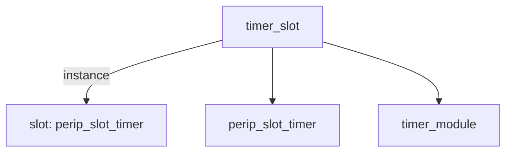

# 模块 `timer_slot`

- 源文件：`rtl\rtl\IONet\Timer\timer_slot.v`
- 职责：AI 推断：作为外部 Mesh 事件驱动接口与内部定时器模块之间的适配封装层。
- 说明：模块将 `i_driveFrmMesh` 事件与 `data_from` 负载传入 `slot` 实例，`slot` 通过 `o_driveNextToMesh` 链式传递驱动事件，并利用 `i_freeNextFrmMesh` / `o_freeToMesh` 完成释放握手，同时将 `timer_module` 产生的中断信号 `int_sig_o` 输出，起到信号路由与协议转换的结构角色。上下文实例化两个子模块并直接连接边界信号，表明其作用是插槽适配而非功能实现。

## 1. 层级位置

- Parents：`IONet_slot`
- Children：`perip_slot_timer`, `timer_module`
- Component children：无
- Upstream modules：无
- Downstream modules：无

### 1.1 本模块结构图



```text
timer_slot
|-- slot: perip_slot_timer
|-- perip_slot_timer
`-- timer_module
```

## 2. 输入/输出接口摘要

- 接收：
  - 驱动事件输入：`i_driveFrmMesh`
  - 数据输入：`data_from`
  - 释放/反压输入：`i_freeNextFrmMesh`
  - 其他输入：`clk`, `rst_finish`
- 输出：
  - 驱动事件输出：`o_driveNextToMesh`
  - 数据输出：`data_to`
  - 中断输出：`int_sig_o`
  - 释放/反压输出：`o_freeToMesh`

### 2.1 端口分组

| 端口组 | 方向统计 | 代表信号 |
| --- | --- | --- |
| `clock_reset_init` | input: 2 | `clk`, `rst_finish` |
| `drive_event` | input: 1, output: 1 | `i_driveFrmMesh`, `o_driveNextToMesh` |
| `free_backpressure` | input: 1, output: 1 | `i_freeNextFrmMesh`, `o_freeToMesh` |
| `other_ports` | input: 1, output: 2 | `data_from`, `data_to`, `int_sig_o` |

## 3. Drive/Data/Free 契约

| Interface | 方向 | Event | Payload | Free/backpressure |
| --- | --- | --- | --- | --- |
| `i_driveFrmMesh` | input | `i_driveFrmMesh` | `data_from [50:0]` | `o_freeToMesh` |
| `o_driveNextToMesh` | output | `o_driveNextToMesh` | 未记录 | `i_freeNextFrmMesh` |

## 4. 主要 Drive-centered Flow

### `i_driveFrmMesh`

- 确定性事实：`i_driveFrmMesh` → `o_driveNextToMesh`；flow_id = `flow_000_timer_slot_i_driveFrmMesh`
- Payload：`i_driveFrmMesh` → `data_from [50:0]`
- 输出 / 影响：`o_driveNextToMesh`
- 结构复杂度：branch = 0，join = 0，blocking = 0
- **AI 推断**：最终手册应重点说明该流是一次简单的驱动事件转发，数据线与事件解耦，反压需额外查阅时序规范。

## 5. 内部组件与 assign 影响

### 5.1 内部组件

| 实例 | 类型 | 输入事件 | 输出事件 |
| --- | --- | --- | --- |
| `slot` | `perip_slot_timer` | `i_driveFrmMesh` | `o_driveNextToMesh` |

### 5.2 assign 影响

| Assign | Impact area | LHS | RHS 摘要 | 解释状态 |
| --- | --- | --- | --- | --- |
| - | - | - | - | Manual Context 未提供 primary assign 影响 |
