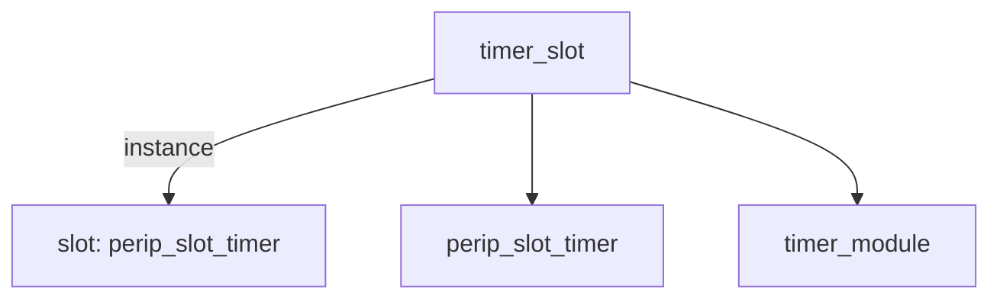

# 模块 `timer_slot`

- 源文件：`rtl/rtl/IONet/Timer/timer_slot.v`。
- 职责：AI 推断：作为片上网络(NoC)中定时器外设的槽位封装模块，负责将定时器模块接入Mesh网络的事件驱动与数据通道。。
- 说明：模块通过事件驱动接口(i_driveFrmMesh/o_driveNextToMesh)和数据接口(data_from/data_to)与Mesh网络交互，内部实例化perip_slot_timer和timer_module，构成定时器外设在Mesh中的标准槽位。

## 1. 层级位置

- Parents：`IONet_slot`。
- Children：`perip_slot_timer`, `timer_module`。
- Component children：无。
- Upstream modules：无。
- Downstream modules：无。

### 1.1 本模块结构图



```text
timer_slot
|-- slot: perip_slot_timer
|-- perip_slot_timer
`-- timer_module
```

## 2. 输入/输出接口摘要

- 接收：drive 输入：`i_driveFrmMesh`；数据输入：`data_from`；free 输入：`i_freeNextFrmMesh`；其他输入：`clk`, `rst_finish`。
- 输出：drive 输出：`o_driveNextToMesh`；数据输出：`data_to`, `int_sig_o`；free 输出：`o_freeToMesh`。

### 2.1 端口分组

| 端口组 | 方向统计 | 代表信号 |
| --- | --- | --- |
| `clock_reset_init` | input:2 | `clk`, `rst_finish` |
| `drive_event` | input:1, output:1 | `i_driveFrmMesh`, `o_driveNextToMesh` |
| `free_backpressure` | input:1, output:1 | `i_freeNextFrmMesh`, `o_freeToMesh` |
| `other_ports` | input:1, output:2 | `data_from`, `data_to`, `int_sig_o` |

## 3. Drive/Data/Free 契约

| Interface | 方向 | Event | Payload | Free/backpressure |
| --- | --- | --- | --- | --- |
| `i_driveFrmMesh` | input | `i_driveFrmMesh` | `data_from [50:0]` | `o_freeToMesh` |
| `o_driveNextToMesh` | output | `o_driveNextToMesh` | 未记录 | `i_freeNextFrmMesh` |

## 4. 主要 Drive-centered Flow

### `i_driveFrmMesh`

- 确定性事实：`i_driveFrmMesh to o_driveNextToMesh`；flow_id=`flow_000_timer_slot_i_driveFrmMesh`。
- Payload：`i_driveFrmMesh` -> `data_from [50:0]`。
- 输出/影响：`o_driveNextToMesh`。
- 结构复杂度：branch=0，join=0，blocking=0。
- AI 推断：最终手册应强调该流为简单的直通驱动事件路径，无数据处理或控制逻辑，并指出数据载荷 data_from 的路径需单独说明。


## 5. 内部组件与 assign 影响

### 5.1 内部组件

| 实例 | 类型 | 输入事件 | 输出事件 |
| --- | --- | --- | --- |
| `slot` | `perip_slot_timer` | `i_driveFrmMesh` | `o_driveNextToMesh` |

### 5.2 assign 影响

| Assign | Impact area | LHS | RHS 摘要 | 解释状态 |
| --- | --- | --- | --- | --- |
| - | - | - | - | Manual Context 未提供 primary assign 影响 |
