# 模块 `wb`

- **源文件**：`rtl\rtl\WB\wb.v`
- **职责**：AI 推断：写回结果分发模块，将来自 LSU 和互斥合并通道的写回事件及数据路由至 GRF、PC、PRF、XPSR 等目标寄存器组，并协调写使能握手。
- **说明**：模块接收两个事件驱动输入（`i_driveMutexMerge2` 与 `i_lsuDriveToWB`），生成五个事件驱动输出，分别连接不同的寄存器组。内部通过 Splitter、Selector、MutexMerge 和 FIFO 等实例通道化并仲裁多来源事件；payload 数据在 assign 阶段被提取并重组，符合 CPU 写回阶段设计。

## 1. 层级与结构

- **Parents**：`cpu_top_all`
- **Children**：无
- **Component children**：`cFifo1`, `cMutexMerge2_64b_wb`, `cMutexMerge3_74b_wb`, `cSelector2_5b_wb`, `cSelector6_101b_wb`, `cSplitter2_103b_wb`, `cSplitter2_1b`
- **Upstream modules**：无
- **Downstream modules**：无

### 1.1 内部实例与组件

```mermaid
flowchart TB
  wb -->|instance| MutexMerge1_cMutexMerge3_74b_wb["MutexMerge1: cMutexMerge3_74b_wb"]
  wb -->|instance| MutexMerge2_cMutexMerge2_64b_wb["MutexMerge2: cMutexMerge2_64b_wb"]
  wb -->|instance| Selector1_cSelector6_101b_wb["Selector1: cSelector6_101b_wb"]
  wb -->|instance| Selector2_cSelector2_5b_wb["Selector2: cSelector2_5b_wb"]
  wb -->|instance| Splitter_cSplitter2_103b_wb["Splitter: cSplitter2_103b_wb"]
  wb -->|instance| wbSplitter_cSplitter2_1b["wbSplitter: cSplitter2_1b"]
  wb -->|instance| cFifo1_cFifo1["cFifo1: cFifo1"]
  wb -->|component| cFifo1
  wb -->|component| cMutexMerge2_64b_wb
  wb -->|component| cMutexMerge3_74b_wb
  wb -->|component| cSelector2_5b_wb
  wb -->|component| cSelector6_101b_wb
  wb -->|component| cSplitter2_103b_wb
  wb -->|component| cSplitter2_1b
```



```text
wb
|-- MutexMerge1: cMutexMerge3_74b_wb
|-- MutexMerge2: cMutexMerge2_64b_wb
|-- Selector1: cSelector6_101b_wb
|-- Selector2: cSelector2_5b_wb
|-- Splitter: cSplitter2_103b_wb
|-- wbSplitter: cSplitter2_1b
|-- cFifo1: cFifo1
|-- cFifo1
|-- cMutexMerge2_64b_wb
|-- cMutexMerge3_74b_wb
|-- cSelector2_5b_wb
|-- cSelector6_101b_wb
|-- cSplitter2_103b_wb
`-- cSplitter2_1b
```

## 2. 端口摘要

- **驱动事件输入**（2个）：`i_driveMutexMerge2`, `i_lsuDriveToWB`
- **数据输入**（2个）：`i_dataFromGRF_64`, `i_data_103`
- **反压/空闲输入**（5个）：`i_wbFreeFROMPrf`, `i_wbFreeFromGRF`, `i_wbFreeFromIF`, `i_wbFreeFromReadGRF`, `i_wbFreeFromXpsr`
- **驱动事件输出**（5个）：`o_drive_grf`, `o_drive_pc`, `o_drive_prf`, `o_drive_xpsr`, `o_wbDriveReadGRF`
- **数据输出**（6个）：`o_WBdataToGRF_8`, `o_grfData_74`, `o_pcData_32`, `o_prfData_40`, `o_xpsrData_4`, `o_bitOpOver_1`
- **空闲输出**（2个）：`o_WBfreeGRF`, `o_free`

### 2.1 按功能分组

| 端口组 | 方向统计 | 代表性信号 |
| --- | --- | --- |
| `drive_event` | 输入:2，输出:5 | `i_driveMutexMerge2`, `i_lsuDriveToWB`, `o_drive_grf`, `o_drive_pc`, `o_drive_prf`, `o_drive_xpsr`, `o_wbDriveReadGRF` |
| `free_backpressure` | 输入:5，输出:2 | `i_wbFreeFROMPrf`, `i_wbFreeFromGRF`, `i_wbFreeFromIF`, `i_wbFreeFromReadGRF`, `i_wbFreeFromXpsr`, `o_WBfreeGRF`, `o_free` |
| `other_ports` | 输入:2，输出:6 | `i_dataFromGRF_64`, `i_data_103`, `o_WBdataToGRF_8`, `o_grfData_74`, `o_pcData_32`, `o_prfData_40`, `o_xpsrData_4`, `o_bitOpOver_1` |

## 3. Drive/Data/Free 契约

| 接口 | 方向 | 驱动事件 | Payload | Free/反压 |
| --- | --- | --- | --- | --- |
| `i_driveMutexMerge2` | 输入 | `i_driveMutexMerge2` | 未记录 | 未记录 |
| `i_lsuDriveToWB` | 输入 | `i_lsuDriveToWB` | 未记录 | 未记录 |
| `o_drive_grf` | 输出 | `o_drive_grf` | `o_WBdataToGRF_8 [7:0]`, `o_grfData_74 [73:0]` | `i_wbFreeFromGRF` |
| `o_drive_pc` | 输出 | `o_drive_pc` | `o_pcData_32 [31:0]` | 未记录 |
| `o_drive_prf` | 输出 | `o_drive_prf` | `o_prfData_40 [39:0]` | 未记录 |
| `o_drive_xpsr` | 输出 | `o_drive_xpsr` | `o_xpsrData_4 [3:0]` | `i_wbFreeFromXpsr` |
| `o_wbDriveReadGRF` | 输出 | `o_wbDriveReadGRF` | `o_WBdataToGRF_8 [7:0]`, `o_grfData_74 [73:0]` | `i_wbFreeFromReadGRF` |

## 4. 主要驱动流

### 流：`i_driveMutexMerge2` → `o_drive_grf`

- **确定性事实**：`i_driveMutexMerge2` 驱动 `o_drive_grf`；flow_id=`flow_001_wb_i_driveMutexMerge2`
- **Payload**：`o_drive_grf` → `o_WBdataToGRF_8 [7:0]`，`o_drive_grf` → `o_grfData_74 [73:0]`
- **输出/影响**：`o_drive_grf`
- **结构复杂度**：分支=0，汇合=2，阻塞=3
- **AI 推断**：当 `o_drive_grf` 活动时，`o_grfData_74` 和 `o_WBdataToGRF_8` 应当已经有效，但这些数据并非在此驱动流内产生，而是由 MutexMerge1 和 Splitter 等多路逻辑汇合形成。

### 流：`i_lsuDriveToWB` → `o_drive_prf`, `o_wbDriveReadGRF`, `o_drive_xpsr`

- **确定性事实**：`i_lsuDriveToWB` 驱动 `o_drive_prf`、`o_wbDriveReadGRF`、`o_drive_xpsr`；flow_id=`flow_000_wb_i_lsuDriveToWB`
- **Payload**：`o_drive_grf` → `o_WBdataToGRF_8 [7:0]`, `o_drive_grf` → `o_grfData_74 [73:0]`, `o_drive_pc` → `o_pcData_32 [31:0]`, `o_drive_prf` → `o_prfData_40 [39:0]`, `o_drive_xpsr` → `o_xpsrData_4 [3:0]`, `o_wbDriveReadGRF` → `o_WBdataToGRF_8 [7:0]`, `o_wbDriveReadGRF` → `o_grfData_74 [73:0]`
- **输出/影响**：`o_drive_prf`, `o_wbDriveReadGRF`, `o_drive_xpsr`, `o_drive_pc`, `o_drive_grf`
- **结构复杂度**：分支=4，汇合=2，阻塞=3
- **AI 推断**：手册应详细说明 LSU 写回驱动如何通过多出口分发逻辑、Selector 的选择依据、MutexMerge1 的汇聚规则以及 GRF 数据组装；可忽略延迟元件的具体周期数。

## 5. 内部组件与 assign

### 5.1 内部组件

| 实例 | 类型 | 输入事件 | 输出事件 |
| --- | --- | --- | --- |
| `MutexMerge1` | `cMutexMerge3_74b_wb` | `w_driveMutexMerge11`, `w_driveMutexMerge12Delay_1`, `w_wbSplitterDriveToMutexMerge1_1` | `w_drive_grf` |
| `MutexMerge2` | `cMutexMerge2_64b_wb` | `i_driveMutexMerge2`, `w_driveMutexMerge2` | `w_drivecFifo1` |
| `Selector1` | `cSelector6_101b_wb` | `w_drive1Selector1` | `o_drive_prf`, `o_wbDriveReadGRF`, `w_driveMutexMerge11`, `w_driveMutexMerge2`, `w_drive_pc` |
| `Selector2` | `cSelector2_5b_wb` | `w_drive1Selector2` | `o_drive_xpsr` |
| `Splitter` | `cSplitter2_103b_wb` | `i_lsuDriveToWB` | `w_driveSelector1`, `w_driveSelector2` |
| `wbSplitter` | `cSplitter2_1b` | `w_drive_pc` | `o_drive_pc`, `w_wbSplitterDriveToMutexMerge1_1` |
| `cFifo1` | `cFifo1` | `w_drivecFifo1` | `w_driveMutexMerge12` |

### 5.2 assign 影响

| Assign | 影响区域 | LHS | RHS 摘要 | 解释状态 |
| --- | --- | --- | --- | --- |
| `assign_11` | 数据路径 | `o_WBdataToGRF_8` | w_dataReadGRF_87[85:78] | 证据不足：No Semantic Layer assignment interpretation is available. |
| `assign_23` | 数据路径 | `w_dataToMutexMerge2_64` | {i_dataFromGRF_64[63:32],w_data1_64[63:32]} | 证据不足：No Semantic Layer assignment interpretation is available. |
| `assign_25` | 控制路径 | `o_bitOpOver_1` | w_driveMutexMerge12Delay_1 | 证据不足：No Semantic Layer assignment interpretation is available. |
