# 模块 `wb`

- 源文件：`rtl/rtl/WB/wb.v`。
- 职责：AI 推断：写回阶段模块，负责将执行结果分发并写入通用寄存器组、程序计数器、谓词寄存器、XPSR等架构状态单元。。
- 说明：模块接收来自互斥合并单元和加载存储单元的两个驱动事件，通过内部的分发、选择、延迟和互斥合并组件，将数据路由到五个不同的写回目标，并管理对应的释放信号。

## 1. 层级位置

- Parents：`cpu_top_all`。
- Children：无。
- Component children：`cFifo1`, `cMutexMerge2_64b_wb`, `cMutexMerge3_74b_wb`, `cSelector2_5b_wb`, `cSelector6_101b_wb`, `cSplitter2_103b_wb`, `cSplitter2_1b`。
- Upstream modules：无。
- Downstream modules：无。

### 1.1 本模块结构图



```mermaid
flowchart TB
  wb -->|instance| MutexMerge1_cMutexMerge3_74b_wb["MutexMerge1: cMutexMerge3_74b_wb"]
  wb -->|instance| MutexMerge2_cMutexMerge2_64b_wb["MutexMerge2: cMutexMerge2_64b_wb"]
  wb -->|instance| Selector1_cSelector6_101b_wb["Selector1: cSelector6_101b_wb"]
  wb -->|instance| Selector2_cSelector2_5b_wb["Selector2: cSelector2_5b_wb"]
  wb -->|instance| Splitter_cSplitter2_103b_wb["Splitter: cSplitter2_103b_wb"]
  wb -->|instance| wbSplitter_cSplitter2_1b["wbSplitter: cSplitter2_1b"]
  wb -->|instance| cFifo1_cFifo1["cFifo1: cFifo1"]
  wb -->|component| cFifo1
  wb -->|component| cMutexMerge2_64b_wb
  wb -->|component| cMutexMerge3_74b_wb
  wb -->|component| cSelector2_5b_wb
  wb -->|component| cSelector6_101b_wb
  wb -->|component| cSplitter2_103b_wb
  wb -->|component| cSplitter2_1b
```

```text
wb
|-- MutexMerge1: cMutexMerge3_74b_wb
|-- MutexMerge2: cMutexMerge2_64b_wb
|-- Selector1: cSelector6_101b_wb
|-- Selector2: cSelector2_5b_wb
|-- Splitter: cSplitter2_103b_wb
|-- wbSplitter: cSplitter2_1b
|-- cFifo1: cFifo1
|-- cFifo1
|-- cMutexMerge2_64b_wb
|-- cMutexMerge3_74b_wb
|-- cSelector2_5b_wb
|-- cSelector6_101b_wb
|-- cSplitter2_103b_wb
`-- cSplitter2_1b
```

## 2. 输入/输出接口摘要

- 接收：drive 输入：`i_driveMutexMerge2`, `i_lsuDriveToWB`；数据输入：`i_dataFromGRF_64`, `i_data_103`；free 输入：`i_wbFreeFROMPrf`, `i_wbFreeFromGRF`, `i_wbFreeFromIF`, `i_wbFreeFromReadGRF`, `... +1`。
- 输出：drive 输出：`o_drive_grf`, `o_drive_pc`, `o_drive_prf`, `o_drive_xpsr`, `... +1`；数据输出：`o_WBdataToGRF_8`, `o_grfData_74`, `o_pcData_32`, `o_prfData_40`, `... +1`；free 输出：`o_WBfreeGRF`, `o_free`；其他输出：`o_bitOpOver_1`。

### 2.1 端口分组

| 端口组 | 方向统计 | 代表信号 |
| --- | --- | --- |
| `drive_event` | input:2, output:5 | `i_driveMutexMerge2`, `i_lsuDriveToWB`, `o_drive_grf`, `o_drive_pc`, `o_drive_prf`, `o_drive_xpsr`, `o_wbDriveReadGRF` |
| `free_backpressure` | input:5, output:2 | `i_wbFreeFROMPrf`, `i_wbFreeFromGRF`, `i_wbFreeFromIF`, `i_wbFreeFromReadGRF`, `i_wbFreeFromXpsr`, `o_WBfreeGRF`, `o_free` |
| `other_ports` | input:2, output:6 | `i_dataFromGRF_64`, `i_data_103`, `o_WBdataToGRF_8`, `o_grfData_74`, `o_pcData_32`, `o_prfData_40`, `o_xpsrData_4`, `o_bitOpOver_1` |

## 3. Drive/Data/Free 契约

| Interface | 方向 | Event | Payload | Free/backpressure |
| --- | --- | --- | --- | --- |
| `i_driveMutexMerge2` | input | `i_driveMutexMerge2` | 未记录 | 未记录 |
| `i_lsuDriveToWB` | input | `i_lsuDriveToWB` | 未记录 | 未记录 |
| `o_drive_grf` | output | `o_drive_grf` | `o_WBdataToGRF_8 [7:0]`, `o_grfData_74 [73:0]` | `i_wbFreeFromGRF` |
| `o_drive_pc` | output | `o_drive_pc` | `o_pcData_32 [31:0]` | 未记录 |
| `o_drive_prf` | output | `o_drive_prf` | `o_prfData_40 [39:0]` | 未记录 |
| `o_drive_xpsr` | output | `o_drive_xpsr` | `o_xpsrData_4 [3:0]` | `i_wbFreeFromXpsr` |
| `o_wbDriveReadGRF` | output | `o_wbDriveReadGRF` | `o_WBdataToGRF_8 [7:0]`, `o_grfData_74 [73:0]` | `i_wbFreeFromReadGRF` |

## 4. 主要 Drive-centered Flow

### `i_driveMutexMerge2`

- 确定性事实：`i_driveMutexMerge2 to o_drive_grf`；flow_id=`flow_001_wb_i_driveMutexMerge2`。
- Payload：`o_drive_grf` -> `o_WBdataToGRF_8 [7:0]`, `o_drive_grf` -> `o_grfData_74 [73:0]`。
- 输出/影响：`o_drive_grf`。
- 结构复杂度：branch=0，join=2，blocking=3。
- AI 推断：最终手册应重点描述该流如何通过两级MutexMerge实现多源事件的仲裁，以及事件与数据载荷的同步关系。

### `i_lsuDriveToWB`

- 确定性事实：`i_lsuDriveToWB to o_drive_prf, o_wbDriveReadGRF, o_drive_xpsr`；flow_id=`flow_000_wb_i_lsuDriveToWB`。
- Payload：`o_drive_grf` -> `o_WBdataToGRF_8 [7:0]`, `o_drive_grf` -> `o_grfData_74 [73:0]`, `o_drive_pc` -> `o_pcData_32 [31:0]`, `o_drive_prf` -> `o_prfData_40 [39:0]`, `o_drive_xpsr` -> `o_xpsrData_4 [3:0]`, `o_wbDriveReadGRF` -> `o_WBdataToGRF_8 [7:0]`, `o_wbDriveReadGRF` -> `o_grfData_74 [73:0]`。
- 输出/影响：`o_drive_prf`, `o_wbDriveReadGRF`, `o_drive_xpsr`, `o_drive_pc`, `o_drive_grf`。
- 结构复杂度：branch=4，join=2，blocking=3。
- AI 推断：文档应重点描述 LSU 驱动事件如何通过 Splitter、Selector 和 MutexMerge 分发至多个写回目标，以及 FIFO 反馈路径的作用。


## 5. 内部组件与 assign 影响

### 5.1 内部组件

| 实例 | 类型 | 输入事件 | 输出事件 |
| --- | --- | --- | --- |
| `MutexMerge1` | `cMutexMerge3_74b_wb` | `w_driveMutexMerge11`, `w_driveMutexMerge12Delay_1`, `w_wbSplitterDriveToMutexMerge1_1` | `w_drive_grf` |
| `MutexMerge2` | `cMutexMerge2_64b_wb` | `i_driveMutexMerge2`, `w_driveMutexMerge2` | `w_drivecFifo1` |
| `Selector1` | `cSelector6_101b_wb` | `w_drive1Selector1` | `o_drive_prf`, `o_wbDriveReadGRF`, `w_driveMutexMerge11`, `w_driveMutexMerge2`, `w_drive_pc` |
| `Selector2` | `cSelector2_5b_wb` | `w_drive1Selector2` | `o_drive_xpsr` |
| `Splitter` | `cSplitter2_103b_wb` | `i_lsuDriveToWB` | `w_driveSelector1`, `w_driveSelector2` |
| `wbSplitter` | `cSplitter2_1b` | `w_drive_pc` | `o_drive_pc`, `w_wbSplitterDriveToMutexMerge1_1` |
| `cFifo1` | `cFifo1` | `w_drivecFifo1` | `w_driveMutexMerge12` |

### 5.2 assign 影响

| Assign | Impact area | LHS | RHS 摘要 | 解释状态 |
| --- | --- | --- | --- | --- |
| `assign_11` | control_path | `o_WBdataToGRF_8` | w_dataReadGRF_87[85:78] | AI 推断：从读GRF数据中提取8位数据，用于写回GRF的读回路径。 |
| `assign_23` | data_path | `w_dataToMutexMerge2_64` | {i_dataFromGRF_64[63:32],w_data1_64[63:32]} | AI 推断：组合来自GRF的高32位数据和来自w_data1_64的高32位数据，形成64位数据输入给MutexMerge2。 |
| `assign_25` | control_path | `o_bitOpOver_1` | w_driveMutexMerge12Delay_1 | 证据不足：No Semantic Layer assignment interpretation is available. |
