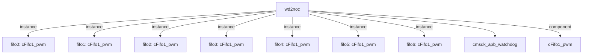

# 模块 `wd2noc`

- 源文件：`rtl\rtl\IONet\Watchdog\wd2noc.v`
- 职责：AI 推断：看门狗到 NoC 的跨时钟域桥接与封装模块，集成 CMSDK APB 看门狗，将其事件、状态通过 FIFO 链同步输出。
- 说明：内部实例化 `utt_wd`（`cmsdk_apb_watchdog`），并通过 7 级 `cFifo1_pwm` 事件链将驱动事件从 `i_drive` 传递至 `o_drive`；同时将消息、中断、复位经同步后输出到 NoC 接口。信号命名包含看门狗时钟（`wd_clk`）和复位（`rst_finish`），接口提供事件驱动握手，支持桥接功能。

## 1. 层级位置

- **Parents**：`IONet_slot`
- **Children**：`cmsdk_apb_watchdog`
- **Component children**：`cFifo1_pwm`
- **Upstream / Downstream modules**：无

### 1.1 本模块结构图



```text
wd2noc
|-- fifo0: cFifo1_pwm
|-- fifo1: cFifo1_pwm
|-- fifo2: cFifo1_pwm
|-- fifo3: cFifo1_pwm
|-- fifo4: cFifo1_pwm
|-- fifo5: cFifo1_pwm
|-- fifo6: cFifo1_pwm
|-- cmsdk_apb_watchdog
`-- cFifo1_pwm
```

## 2. 输入 / 输出接口摘要

### 端口列表

| 方向 | 端口名 | 组别 |
|------|--------|------|
| 输入 | `Noc_RES` | other_ports |
| 输入 | `i_drive` | drive_event |
| 输入 | `i_free` | free_backpressure |
| 输入 | `i_msg` | other_ports |
| 输出 | `o_INT` | other_ports |
| 输出 | `o_RES` | other_ports |
| 输出 | `o_drive` | drive_event |
| 输出 | `o_free` | free_backpressure |
| 输出 | `o_msg` | other_ports |
| 输入 | `rst_finish` | clock_reset_init |
| 输入 | `wd_clk` | clock_reset_init |

### 2.1 端口分组

| 端口组 | 方向统计 | 代表信号 |
| --- | --- | --- |
| `clock_reset_init` | input:2 | `rst_finish`, `wd_clk` |
| `drive_event` | input:1, output:1 | `i_drive`, `o_drive` |
| `free_backpressure` | input:1, output:1 | `i_free`, `o_free` |
| `other_ports` | input:2, output:3 | `i_msg`, `o_msg`, `Noc_RES`, `o_INT`, `o_RES` |

## 3. Drive / Data / Free 契约

| Interface | 方向 | Event | Payload | Free / Backpressure |
| --- | --- | --- | --- | --- |
| `i_drive` | input | `i_drive` | `i_msg [50:0]` | 未记录 |
| `o_drive` | output | `o_drive` | `o_msg [50:0]` | 未记录 |

## 4. 主要 Drive‑Centered Flow

### `i_drive` 流

- **确定性事实**：`wd2noc flow from i_drive`；flow_id = `flow_000_wd2noc_i_drive`
- **Payload**：`i_drive` → `i_msg [50:0]`
- **输出 / 影响**：证据不足：Knowledge IR 未找到该流的模块输出端点。
- **结构复杂度**：branch = 0，join = 0，blocking = 0
- **AI 推断**：手册应突出 `i_drive` 作为独立输入事件的存在，避免猜测其内部处理或功能。

## 5. 内部组件与 assign 影响

### 5.1 内部 FIFO 链

| 实例 | 类型 | 输入事件 | 输出事件 |
| --- | --- | --- | --- |
| `fifo0` | `cFifo1_pwm` | 无 | `o_driveNext[0]` |
| `fifo1` | `cFifo1_pwm` | `o_driveNext[0]` | `o_driveNext[1]` |
| `fifo2` | `cFifo1_pwm` | `o_driveNext[1]` | `o_driveNext[2]` |
| `fifo3` | `cFifo1_pwm` | `o_driveNext[2]` | `o_driveNext[3]` |
| `fifo4` | `cFifo1_pwm` | `o_driveNext[3]` | `o_driveNext[4]` |
| `fifo5` | `cFifo1_pwm` | `o_driveNext[4]` | `o_driveNext[5]` |
| `fifo6` | `cFifo1_pwm` | `o_driveNext[5]` | `o_drive` |

### 5.2 Assign 影响

| Assign | 影响区域 | LHS | RHS 摘要 | 解释状态 |
| --- | --- | --- | --- | --- |
| `assign_2` | unknown | `o_msg` | o_msg_reg | 证据不足：No Semantic Layer assignment interpretation is available. |
| `assign_3` | unknown | `o_INT` | wdogint | 证据不足：No Semantic Layer assignment interpretation is available. |
| `assign_4` | unknown | `o_RES` | ~o_res_sync2 | 证据不足：No Semantic Layer assignment interpretation is available. |
