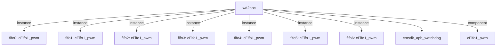

# 模块 `wd2noc`

- 源文件：`rtl\rtl\IONet\Watchdog\wd2noc.v`。
- 职责：AI 推断：看门狗事件到NoC的同步与转发模块，将看门狗中断和复位事件通过7级Fifo1链传递到NoC域。
- 说明：模块接收i_drive事件及其关联的i_msg载荷，通过fifo0到fifo6的级联Fifo1链逐级传递，最终从o_drive输出，同时o_msg输出对应的载荷数据。i_free/o_free构成独立的释放握手通道，用于控制事件流的释放。utt_wd实例(cmsdk_apb_watchdog)提供看门狗中断(wdogint)和复位(o_RES)信号。

## 1. 层级位置

- Parents：`IONet_slot`。
- Children：`cmsdk_apb_watchdog`。
- Component children：`cFifo1_pwm`。
- Upstream modules：无。
- Downstream modules：无。

### 1.1 本模块结构图



```text
wd2noc
|-- fifo0: cFifo1_pwm
|-- fifo1: cFifo1_pwm
|-- fifo2: cFifo1_pwm
|-- fifo3: cFifo1_pwm
|-- fifo4: cFifo1_pwm
|-- fifo5: cFifo1_pwm
|-- fifo6: cFifo1_pwm
|-- cmsdk_apb_watchdog
`-- cFifo1_pwm
```

## 2. 输入/输出接口摘要

- 接收：drive 输入：`i_drive`；数据输入：`i_msg`；free 输入：`i_free`；其他输入：`Noc_RES`, `rst_finish`, `wd_clk`。
- 输出：drive 输出：`o_drive`；数据输出：`o_msg`；free 输出：`o_free`；其他输出：`o_INT`, `o_RES`。

### 2.1 端口分组

| 端口组 | 方向统计 | 代表信号 |
| --- | --- | --- |
| `clock_reset_init` | input:2 | `rst_finish`, `wd_clk` |
| `drive_event` | input:1, output:1 | `i_drive`, `o_drive` |
| `free_backpressure` | input:1, output:1 | `i_free`, `o_free` |
| `other_ports` | input:2, output:3 | `i_msg`, `o_msg`, `Noc_RES`, `o_INT`, `o_RES` |

## 3. Drive/Data/Free 契约

| Interface | 方向 | Event | Payload | Free/backpressure |
| --- | --- | --- | --- | --- |
| `i_drive` | input | `i_drive` | `i_msg [50:0]` | 未记录 |
| `o_drive` | output | `o_drive` | `o_msg [50:0]` | 未记录 |

## 4. 主要 Drive-centered Flow

### `i_drive`

- 确定性事实：`wd2noc flow from i_drive`；flow_id=`flow_000_wd2noc_i_drive`。
- Payload：`i_drive` -> `i_msg [50:0]`。
- 输出/影响：证据不足：Knowledge IR did not find a module output endpoint for this flow.。
- 结构复杂度：branch=0，join=0，blocking=0。
- AI 推断：最终手册应强调该流图不完整，并指出需要 RTL 源审查来填充缺失的内部步骤和端点。


## 5. 内部组件与 assign 影响

### 5.1 内部组件

| 实例 | 类型 | 输入事件 | 输出事件 |
| --- | --- | --- | --- |
| `fifo0` | `cFifo1_pwm` | 无 | `o_driveNext[0]` |
| `fifo1` | `cFifo1_pwm` | `o_driveNext[0]` | `o_driveNext[1]` |
| `fifo2` | `cFifo1_pwm` | `o_driveNext[1]` | `o_driveNext[2]` |
| `fifo3` | `cFifo1_pwm` | `o_driveNext[2]` | `o_driveNext[3]` |
| `fifo4` | `cFifo1_pwm` | `o_driveNext[3]` | `o_driveNext[4]` |
| `fifo5` | `cFifo1_pwm` | `o_driveNext[4]` | `o_driveNext[5]` |
| `fifo6` | `cFifo1_pwm` | `o_driveNext[5]` | `o_drive` |

### 5.2 assign 影响

| Assign | Impact area | LHS | RHS 摘要 | 解释状态 |
| --- | --- | --- | --- | --- |
| `assign_2` | control_path | `o_msg` | o_msg_reg | AI 推断：将内部寄存器o_msg_reg直接驱动到模块输出o_msg，构成事件载荷的数据路径 |
| `assign_3` | unknown | `o_INT` | wdogint | AI 推断：将看门狗中断信号wdogint直接连接到模块输出o_INT |
| `assign_4` | unknown | `o_RES` | ~o_res_sync2 | AI 推断：将看门狗复位信号o_res_sync2反相后输出到模块o_RES |
